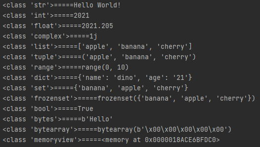

# Python数据类型

- 在编程中，数据类型是一个重要的概念。  
- 变量可以存储不同类型的数据，并且不同类型可以执行不同的操作。  
- 在这些类别中，Python默认拥有一下内置类型数据：
    - 文本类型
        - str
    - 数值类型
        - int, float, complex
    - 序列类型
        - list, tuple, range
    - 映射类型
        - dict
    - 集合类型
        - set, frozenset
    - 布尔类型
        - bool
    - 二进制类型
        - bytes, bytearray, memoryview

## str

```python
s0 = "Hello World!"
```

## int

```python
s1 = 2021
```

## float

```python
s2 = 2021.205
```

## complex

```python
s3 = 1j
```

## list

```python
s4 = ["apple", "banana", "cherry"]
```

## tuple

```python
s5 = ("apple", "banana", "cherry")
```

## range

```python
s6 = range(10)
```

## dict

```python
s7 = {"name": "dino", "age": "21"}
```

## set

```python
s8 = {"apple", "banana", "cherry"}
```

## frozenset

```python
s9 = frozenset({"apple", "banana", "cherry"})
```

## bool

```python
s10 = True
```

## bytes

```python
s11 = b"Hello"
```

## bytearray

```python
s12 = bytearray(5)
```

## memoryview

```python
s13 = memoryview(bytes(5))
```

## 获取数据类型

你可以使用 `type()` 函数获取任何对象的数据类型：
```python
x = 10
print(type(x))
```
我们可以使用下面的语句对上面所有的数据类型进行遍历输出：
```python
dataList = [s0, s1, s2, s3, s4, s5, s6, s7, s8, s9, s10, s11, s12, s13]
for i in dataList:
    print(type(i), i, sep='=====')
```

**输出结果如下:**  
