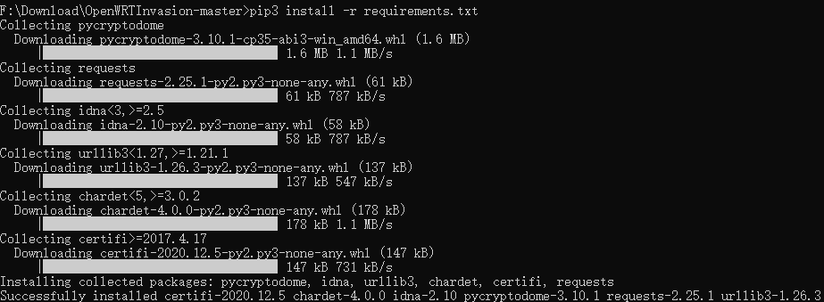
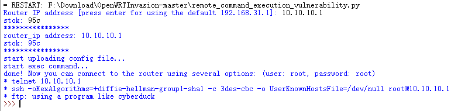
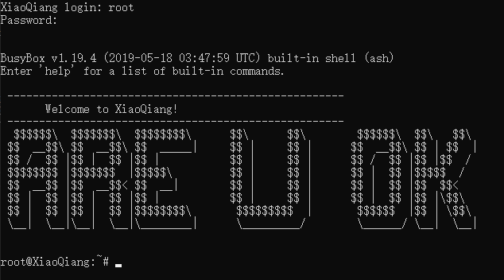
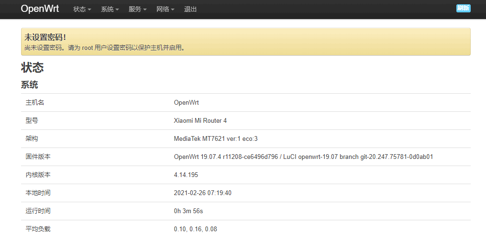

# 小米路由器4不拆机刷OpenWRT

## 准备事项

使用开源方案[OpenWRTInvasion](https://github.com/acecilia/OpenWRTInvasion)进行 `root`
- 小米路由器4
- Root Shell：<https://github.com/acecilia/OpenWRTInvasion>
- 固件：<https://github.com/ioiotor/mir4-ss/releases>
- python3 & pip3
- telnet

## Root Shell

1. 首先将 [Root Shell](https://github.com/acecilia/OpenWRTInvasion) `git` 或者下载到本地
2. 切换到 `OpenWRTInvasion` 目录并使用 `pip3` 安装必备运行库
    ```
    cd OpenWRTInvasion
    pip3 install -r requirements.txt
    ```
    
3. 使用命令运行
    ```
    python3 remote_command_execution_vulnerability.py
    ```
4. 然后会让你输入 `Router IP` 和 `stok` ，执行过程需要联网  
    1. `stok` 查看:
        
    2. 按要求输入 `IP` 和 `stok` ：
        
5. 使用 `telnet`连接至路由器
    ```
    telnet <Router IP>
    ```
    

## 刷入 OpenWRT

6. 在<https://github.com/ioiotor/mir4-ss/releases>下载大佬编译好的固件：
    ```
    openwrt-ramips-mt7621-xiaomi_mir4-squashfs-kernel1.bin
    openwrt-ramips-mt7621-xiaomi_mir4-squashfs-rootfs0.bin
    ```
7. 将这两个文件上传到你的对象存储中，方便 `wget`
8. 然后依次输入下列代码
    ```
    cd /tmp
    wget http://你的对象存储/openwrt-ramips-mt7621-xiaomi_mir4-squashfs-kernel1.bin
    wget http://你的对象存储/openwrt-ramips-mt7621-xiaomi_mir4-squashfs-rootfs0.bin
    mtd write openwrt-ramips-mt7621-xiaomi_mir4-squashfs-kernel1.bin kernel1
    mtd write openwrt-ramips-mt7621-xiaomi_mir4-squashfs-rootfs0.bin rootfs0
    nvram set flag_try_sys1_failed=1
    nvram commit
    reboot
    ```
9. 等待路由器重启

## 刷入成功

10. 重启路由器后浏览器输入 `http://192.168.1.1`，用户为 `root`，密码为空或者 `password`  
    