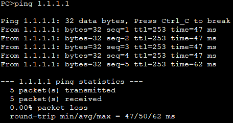

# NAT

## 什么是NAT？

> NAT（Network Address Translation，网络地址转换）是1994年提出的。当在专用网内部的一些主机本来已经分配到了本地IP地址（即仅在本专用网内使用的专用地址），但现在又想和因特网上的主机通信（并不需要加密）时，可使用NAT方法。

> 这种方法需要在专用网（私网IP）连接到因特网（公网IP）的路由器上安装NAT软件。装有NAT软件的路由器叫做NAT路由器，它至少有一个有效的外部全球IP地址（公网IP地址）。这样，所有使用本地地址（私网IP地址）的主机在和外界通信时，都要在NAT路由器上将其本地地址转换成全球IP地址，才能和因特网连接。

> 另外，这种通过使用少量的全球IP地址（公网IP地址）代表较多的私有IP地址的方式，将有助于减缓可用的IP地址空间的枯竭。

> 2019年11月26日，全球所有43亿个IPv4地址已分配完毕。

### 保留的IP地址块

| CIDR地址块 | <div style="text-align:center">描述</div> | 参考资料 |
| :--: | :-- | :--: |
| 0.0.0.0/8 | 本网络（仅作为源地址时合法） | RFC 5735 |
| 10.0.0.0/8 | 专用地址 | RFC 1918 |
| 100.64.0.0/10 | 电信级NAT | RFC 6598 |
| 127.0.0.0/8 | 环回 | RFC 5735 |
| 169.254.0.0/16 | 链路本地 | RFC 3927 |
| 172.16.0.0/12 | 专用地址 | RFC 1918 |
| 192.0.0.0/24 | 保留（IANA） | RFC 5735 |
| 192.0.2.0/24 | TEST-NET-1，文档和示例 | RFC 5735 |
| 192.88.99.0/24 | 6to4中继 | RFC 3068 |
| 192.168.0.0/16 | 专用网络 | RFC 1918 |
| 198.18.0.0/15 | 网络基准测试 | RFC 2544 |
| 198.51.100.0/24 | TEST-NET-2，文档和示例 | RFC 5737 |
| 203.0.113.0/24 | TEST-NET-3，文档和示例 | RFC 5737 |
| 224.0.0.0/4 | 多播（之前的D类网络） | RFC 3171 |
| 240.0.0.0/4 | 保留（之前的E类网络） | RFC 1700 |
| 255.255.255.255 | 受限广播 | RFC 919 |

## 配置实例（ensp）

### 拓扑搭建

- SW为VLAN10、VLAN20、VLAN99的网关
- Server的公网IP为8.8.8.8
- PC通过EasyIP的方式访问公网


### 配置

#### SW配置

```
<Huawei>system-view
[Huawei]sysname SW
[SW]vlan batch 10 20 99
[SW]interface Vlanif 10
[SW-Vlanif10]ip address 192.168.10.1 24
[SW-Vlanif10]interface Vlanif 20
[SW-Vlanif20]ip address 192.168.20.1 24
[SW-Vlanif20]interface Vlanif 99
[SW-Vlanif99]ip address 172.16.0.1 24
[SW-Vlanif99]interface Vlanif 1
[SW-Vlanif1]ip address 10.0.0.1 24
[SW-Vlanif1]quit
[SW]interface GigabitEthernet 0/0/1
[SW-GigabitEthernet0/0/1]port link-type access
[SW-GigabitEthernet0/0/1]port default vlan 10
[SW-GigabitEthernet0/0/1]interface GigabitEthernet 0/0/11
[SW-GigabitEthernet0/0/11]port link-type access
[SW-GigabitEthernet0/0/11]port default vlan 20
[SW-GigabitEthernet0/0/11]interface GigabitEthernet 0/0/23
[SW-GigabitEthernet0/0/23]port link-type access
[SW-GigabitEthernet0/0/23]port default vlan 99
[SW-GigabitEthernet0/0/23]quit
[SW]ip route-static 0.0.0.0 0 10.0.0.2
```

#### Router配置

```
<Huawei>system-view
[Huawei]sysname Router
[Router]acl 2000
[Router-acl-basic-2000]rule permit source 192.168.0.0 0.0.255.255
[Router-acl-basic-2000]quit
[Router]acl 3000
[Router-acl-adv-3000]rule permit ip source 192.168.0.0 0.0.255.255 destination 8.8.8.8 0
[Router-acl-adv-3000]quit
[Router]interface GigabitEthernet 0/0/0
[Router-GigabitEthernet0/0/0]ip address 1.1.1.2 30
[Router-GigabitEthernet0/0/0]nat server global 8.8.8.8 inside 172.16.0.10
[Router-GigabitEthernet0/0/0]nat outbound 2000
[Router-GigabitEthernet0/0/0]interface GigabitEthernet 0/0/1
[Router-GigabitEthernet0/0/1]ip address 10.0.0.2 24
[Router-GigabitEthernet0/0/1]nat server global 8.8.8.8 inside 172.16.0.10
[Router-GigabitEthernet0/0/1]nat outbound 3000
[Router-GigabitEthernet0/0/1]quit
[Router]ip route-static 0.0.0.0 0 1.1.1.1
[Router]ip route-static 172.16.0.0 24 10.0.0.1
[Router]ip route-static 192.168.0.0 16 10.0.0.1
```

#### ISP配置

```
<Huawei>system-view
[Huawei]sysname ISP
[ISP]interface GigabitEthernet 0/0/0
[ISP-GigabitEthernet0/0/0]ip address 1.1.1.1 30
[ISP-GigabitEthernet0/0/0]quit
[ISP]ip route-static 8.8.8.8 32 1.1.1.2
```

### 验证

1. PC1 ping ISP并在Router和ISP中间抓包查看  
      
    
2. PC1 ping 8.8.8.8并在Router和SW中间抓包查看  
      
    
3. ISP ping 8.8.8.8  
    