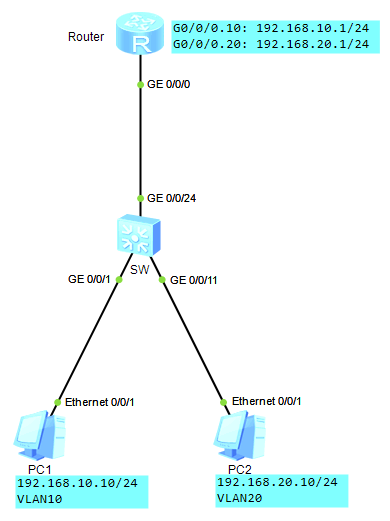
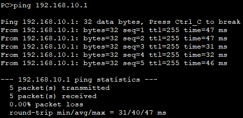
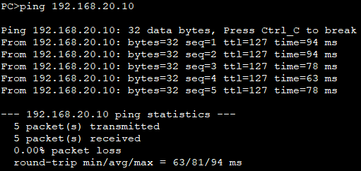

# 单臂路由

## 什么是单臂路由？

> 单臂路由（router-on-a-stick）是指在路由器的一个接口上通过配置子接口（或“逻辑接口”，并不存在真正物理接口）的方式，实现原来相互隔离的不同VLAN（虚拟局域网）之间的互联互通。

## 单臂路由的优缺点

### 优点

- 实现不同vlan之间的通信
- 有助理解、学习VLAN原理和子接口概念

### 缺点

- 容易成为网络单点故障
- 配置稍有复杂
- 现实意义不大

## 配置实例（ensp）

### 拓扑搭建

- 交换机为二层交换机
- G0/0/1口所属VLAN10
- G0/0/11口所属VLAN20
- G0/0/24为Trunk口
- 两个VLAN的网关均在Router的G0/0/0上



### 配置

#### SW配置

```
<Huawei>system-view
[Huawei]sysname SW
[SW]vlan batch 10 20
[SW]interface GigabitEthernet 0/0/1
[SW-GigabitEthernet0/0/1]port link-type access
[SW-GigabitEthernet0/0/1]port default vlan 10
[SW-GigabitEthernet0/0/1]quit
[SW]interface GigabitEthernet 0/0/11
[SW-GigabitEthernet0/0/11]port link-type access
[SW-GigabitEthernet0/0/11]port default vlan 20
[SW-GigabitEthernet0/0/11]quit
[SW]interface GigabitEthernet 0/0/24
[SW-GigabitEthernet0/0/24]port link-type trunk
[SW-GigabitEthernet0/0/24]port trunk all
[SW-GigabitEthernet0/0/24]port trunk allow-pass vlan 10 20
```

#### Router配置

```
<Huawei>system-view
[Huawei]sysname Router
[Router]interface GigabitEthernet 0/0/0.10
[Router-GigabitEthernet0/0/0.10]dot1q termination vid 10    // 封装dot1q协议，并将接口加入VLAN 10
[Router-GigabitEthernet0/0/0.10]arp broadcast enable        // 开启子接口ARP广播
[Router-GigabitEthernet0/0/0.10]ip address 192.168.10.1 24
[Router-GigabitEthernet0/0/0.10]quit
[Router]interface GigabitEthernet 0/0/0.20
[Router-GigabitEthernet0/0/0.20]dot1q termination vid 20
[Router-GigabitEthernet0/0/0.20]arp broadcast enable
[Router-GigabitEthernet0/0/0.20]ip address 192.168.20.1 24
```

### 验证

1. PC1 ping 路由器的G0/0/0.10接口  
    
2. PC1 ping PC2  
    