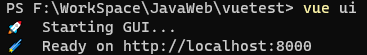
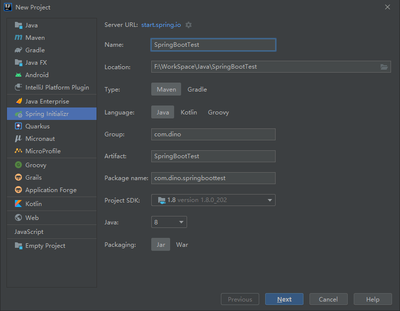

# SpringBoot + Vue.js简单案例

## 前后端分离

- 前端只需要独立编写客户端代码，后端也只需要独立编写服务端代码提供数据接口即可
- 前端通过AJAX请求来访问后端的数据接口，将Model展示到View中即可
- 前后端开发者只需要提前约定好数据接口文档（URL、参数、数据类型...），然后分别独立开发即可，前端可以造假数据进行测试，完全不需要依赖后端，最后完成前后端集成即可，真正实现了前后端应用的解耦合，极大地提升了开发效率
- 单体 ==> 前端应用 + 后端应用
    - 前端应用：负责数据展示和用户交互
    - 后端应用：负责提供数据处理接口
- 前端 ==> AJAX ==> RESTful后端数据接口
- 前后端分离就是将一个单体应用拆分成两个独立的应用，前端应用和后端应用以JSON格式进行数据交互

## 实现技术

- Sping Boot + Vue.js
- 使用Spring Boot进行后端应用开发，使用Vue进行前端应用开发

## 练习

### 数据库

| id | name | author |
| -- | -- | -- |
| 1 | 解忧杂货店 | 东野圭吾 |
| 2 | 追风筝的人 | 卡勒德·胡赛尼 |
| 3 | 人间失格 | 太宰治 |
| 4 | 水浒传 | 施耐庵 |
| 5 | 三国演义 | 罗贯中 |
| 6 | 西游记 | 吴承恩 |
| 7 | 红楼梦 | 曹雪芹 |

### 创建Vue.js项目

1. 安装Node.js：<http://nodejs.cn/download/>
2. 在Node.js安装目录下新建 *node_global* 和 *node_cache* 两个文件夹
3. 在CMD命令行中设置global和cache
    ```dos
    npm config set prefix "node_global的绝对路径"
    npm config set cache "node_cache的绝对路径"
    ```
4. 安装cnpm
    ```dos
    npm install -g cnpm --registry=https://registry.npm.taobao.org
    ```
5. 设置环境变量
    1. 在系统变量PATH中添加 *node_global* 的路径
    2. 新增系统变量 *NODE_PATH* 并添加 *node_modules* 的路径
6. 安装
    ```dos
    cnpm install -g @vue/cli
    ```
    - 如遇到 cnpm : 无法加载文件 D:\node.js\node_global\cnpm.ps1，因为在此系统上禁止运行脚本。 这种情况在有管理员权限下的CMD命令窗口输入 `set-ExecutionPolicy RemoteSigned` 即可
7. 通过命令行进入Vue ui
    ```dos
    vue ui
    ```
    - 显示以下界面就算成功  
        
8. 浏览器访问 <http://localhost:8000> 进入到 *Vue 项目管理器* 中
9. 选择路径后点击 **在此创建新项目**
10. 开始创建新项目
    1. 输入项目文件夹名称
    2. 关闭Git
    3. 在预设中选择 **手动**
    4. 功能中添加 **Router** 和 **Vuex**，并关闭 **Linter/Formatter**
    5. 配置中打开 **Use history for router?**
11. 关闭 *Vue ui*
12. 使用IDEA打开Vue项目
    - 如IDEA中没有安装Vue.js插件请在 *File ==> Settings ==> Plugins* 中找到 **Vue.js** 插件并安装
13. 在 *Vue 项目管理器* 中安装 **axios**
14. 在src中views文件夹下新建 **Books.vue**
    ```js
    <template>
        <div>
            <table>
                <tr>
                    <td>id</td>
                    <td>书籍</td>
                    <td>作者</td>
                </tr>
                <tr v-for="item in books">
                    <td>{{item.id}}</td>
                    <td>{{item.name}}</td>
                    <td>{{item.author}}</td>
                </tr>
            </table>
        </div>
    </template>

    <script>
    export default {
        name: "Books",
        data() {
            return {
                books: [
                    {
                        id: 1,
                        name: "三国演义",
                        author: "罗贯中"
                    },
                    {
                        id: 2,
                        name: "水浒传",
                        author: "施耐庵"
                    },
                    {
                        id: 3,
                        name: "西游记",
                        author: "吴承恩"
                    },
                    {
                        id: 4,
                        name: "红楼梦",
                        author: "曹雪芹"
                    }
                ]
            }
        },
        // 初始化操作
        created() {
            const that = this
            // 访问后端接口并将data返回给books
            axios.get("http://localhost:8181/books/findAll").then(function (resp) {
                that.books = resp.data
            })
        }
    }
    </script>

    <style scoped>

    </style>
    ```
15. 在src中router中 *index.js* 中添加以下代码
    ```js
    import Books from '../views/Books'

    // 在routes变量中添加
    {
        path: '/books',
        component: Books
    }
    ```
16. 在Vue项目目录下使用npm启动服务
    ```dos
    npm run serve
    ```
17. 效果如下图：  
    

### 创建Spring Boot项目

1. 在IDEA中创建一个新 **Spring Initializr** 项目
    
2. 在src ==> main ==> resources文件夹下创建 **application.yml**
    ```yml
    spring:
        datasource:
            url: jdbc:mysql:///library
            username: root
            password: root
            driver-class-name: com.mysql.jdbc.Driver
        jpa:
            show-sql: true
            properties:
                hibernate:
                    format_sql: true
    server:
        port: 8181
    ```
3. 创建实体类
    ```java
    package com.dino.springboottest.entity;

    import lombok.Data;

    import javax.persistence.Entity;
    import javax.persistence.Id;

    // 绑定数据表，根据表名类名的映射关系绑定
    @Entity
    @Data
    public class Books {
        @Id
        private Integer id;
        private String name;
        private String author;
    }
    ```
4. 创建接口
    ```java
    package com.dino.springboottest.repository;

    import com.dino.springboottest.entity.Books;
    import org.springframework.data.jpa.repository.JpaRepository;

    public interface BooksRepository extends JpaRepository<Books, Integer> {
    }
    ```
5. 创建前端调用类
    ```java
    package com.dino.springboottest.controller;

    import com.dino.springboottest.entity.Books;
    import com.dino.springboottest.repository.BooksRepository;
    import org.springframework.beans.factory.annotation.Autowired;
    import org.springframework.web.bind.annotation.GetMapping;
    import org.springframework.web.bind.annotation.RequestMapping;
    import org.springframework.web.bind.annotation.RestController;

    import java.util.List;

    @RestController
    @RequestMapping("/books")
    public class BooksHandler {
        @Autowired
        private BooksRepository booksRepository;

        @GetMapping("/findAll")
        public List<Books> findAll() {
            return booksRepository.findAll();
        }
    }
    ```
6. 跨域问题解决
    ```java
    package com.dino.springboottest.config;

    import org.springframework.context.annotation.Configuration;
    import org.springframework.web.servlet.config.annotation.CorsRegistry;
    import org.springframework.web.servlet.config.annotation.WebMvcConfigurer;

    // 跨域问题解决
    @Configuration
    public class CrossConfig implements WebMvcConfigurer {
        @Override
        public void addCorsMappings (CorsRegistry registry) {
            registry.addMapping("/**")
                    .allowedOrigins("*")
                    .allowedMethods("GET", "HEAD", "POST", "DELETE", "OPTIONS")
                    .maxAge(3600)
                    .allowedHeaders("*");
        }
    }
    ```
7. 启动项目

### 结果


## Vue + Element UI

- Vue 集成Element UI
- Element UI后台管理系统主要的标签：
    - `el-container`：构建整个页面框架
    - `el-aside`：构建左侧菜单
    - `el-menu`：左侧菜单内容，常用属性：
        - `:default-openeds`：默认展开的菜单，通过菜单的index值来关联
        - `:default-active`：默认选中的菜单，通过菜单的index值来关联
    - `el-submenu`：可展开的菜单，常用属性：
        - `index`：菜单的下标，文本类型，不能是数值类型
    - `template`：对应 `el-submenu` 的菜单名
    - `i`：设置菜单图标，通过class属性设置
        - 图标集合：<https://element.eleme.cn/#/zh-CN/component/icon>
    - `el-menu-item`：菜单的子节点，不可展开
- 安装插件
    - 在 *Vue 项目管理器* 中安装 **vue-cli-plugin-element** 插件
    - 使用cnpm安装element-ui
        ```dos
        cnpm install element-ui --save
        ```

### 练习

#### Vue Router来动态构建菜单

- 导航1
    - 页面1
    - 页面2
- 导航2
    - 页面3
    - 页面4

1. Router ==> index.js
    ```js
    import Vue from 'vue'
    import VueRouter from 'vue-router'
    import Page1 from '../views/Page1'
    import Page2 from '../views/Page2'
    import Page3 from '../views/Page3'
    import Page4 from '../views/Page4'
    import index from '../views/index'

    Vue.use(VueRouter)

    const routes = [
        {
            path: '/',
            name: '导航1',
            component: index,
            redirect: '/page1',
            children: [
            {
                path: '/page1',
                name: '页面1',
                component: Page1
            },
            {
                path: '/page2',
                name: '页面2',
                component: Page2
            }
            ]
        },
        {
            path: '/navigation',
            name: '导航2',
            component: index,
            children: [
            {
                path: '/page3',
                name: '页面3',
                component: Page3
            },
            {
                path: '/page4',
                name: '页面4',
                component: Page4
            }
            ]
        },
    ]

    const router = new VueRouter({
    mode: 'history',
    base: process.env.BASE_URL,
    routes
    })

    export default router
    ```
2. App.vue
    ```js
    <template>
        <div id="app">
            <router-view></router-view>
        </div>
    </template>
    ```
3. index.vue
    ```js
    <template>
        <el-container style="height: 95vh; border: 1px solid #eee">
            <el-aside width="200px" style="background-color: rgb(238, 241, 246)">
                <el-menu router :default-openeds="['0', '1']">
                    <el-submenu v-for="(item, index) in $router.options.routes" :index="index+''">
                        <template slot="title"><i class="el-icon-menu"></i>{{item.name}}</template>
                        <el-menu-item v-for="(item2, index2) in item.children" :index="item2.path" :class="$route.path == item2.path? ' is-active' : ''">{{item2.name}}</el-menu-item>
                    </el-submenu>
                </el-menu>
            </el-aside>
            <el-container>
                <el-main>
                    <router-view></router-view>
                </el-main>
            </el-container>
        </el-container>
    </template>
    ```
    - menu与Router的绑定
        1. `<el-menu>` 标签添加 `router` 属性
        2. 在页面中添加 `<router-view>` 标签，它是一个容器，动态渲染你选择的 *router*