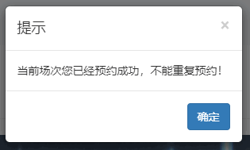
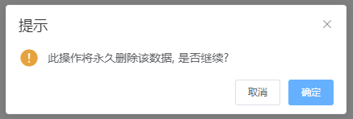

# 票影 - 电影场次预定系统

## 介绍

### 课程设计名称

《票影 - 电影场次预定系统》

### 工具软件介绍

- Windows 10 Pro Workstation(64bit)
- MySQL 5.7.26
- Tomcat 10.0.5
- IDEA 2021.1(64bit)
- jQuery.js 3.6.0
- Bootstrap v3
- Vue.js 2.6.11
- Element UI 2.15.2
- Axios 0.21.1
- Spring Boot 2.5.2
    - Lombok
    - Spring Web
    - Spring Data JPA
    - MySQL Driver

## 课程设计内容

### 功能设计

- 网站首页
    - 轮播图
    - 首页显示数据库中包含的电影信息
    - 首页可点击登录注册进行跳转到相应页面
    - 登录成功后网站右上角显示用户名，同时隐藏登录和注册按钮
    - 只有登录成功才可跳转到影片详情页
- 登录页
    - 登录时如忘记密码点击 *忘记密码* 按钮可跳转到找回密码界面
    - 登录成功后弹框提示并3秒自动跳转到首页
    - 账号密码错误弹框提示
- 注册页
    - 注册已存在的用户名会弹框提示
    - 注册成功后3秒自动跳转到登录页
- 影片详情页
    - 显示影片图片
    - 显示影片介绍
    - 显示场次安排
    - 用户可点击场次进行预定
        - 用户第一次预约可成功
        - 用户重复预约会弹框提示
- 管理后台
    - 用户管理
        - 显示所有用户的所有信息
        - 可修改用户的邮箱和密码
        - 可删除用户
    - 电影管理
        - 显示所有影片信息
        - 可修改影片除ID外的所有信息
        - 可删除影片
    - 订单管理
        - 显示所有预约信息
        - 可删除预约

### 技术选型

- 网站前台（前后端半分离）
    - JSP
    - JDBC
    - Servlet
    - jQuery
    - Bootstrap
- 后台管理界面（前后端分离）
    - Spring Boot
    - Vue
    - Element UI
    - Axios

### 数据库设计

1. 用户表（存储用户信息）
    | 名称 | 类型 | 是否空 |
    | -- | -- | -- |
    | id | INT(5) | PRIMARY |
    | username | VARCHAR(10) | UNIQUE |
    | email | VARCHAR(30) | NOT NULL |
    | password | VARCHAR(15) | NOT NULL |
2. 影片信息表（存储影片信息）
    | 名称 | 类型 | 是否空 |
    | -- | -- | -- |
    | id | BIGINT(14) | PRIMARY |
    | name | VARCHAR(20) | NOT NULL |
    | name2 | VARCHAR(30) | NULL |
    | thumbnail | VARCHAR(100) | NULL |
    | image | VARCHAR(100) | NULL |
    | round | VARCHAR(100) | NULL |
    | info | VARCHAR(500) | NULL |
3. 订单表（存储预约信息）
    | 名称 | 类型 | 是否空 |
    | -- | -- | -- |
    | id | BIGINT(14) | PRIMARY |
    | user_id | int(5) | NOT NULL |
    | film_id | BIGINT(14) | NOT NULL |
    | round | VARCHAR(20) | NOT NULL |

### 前端设计

- 网站前台
    - 使用JQuery + Bootstrap做页面设计
    - 图片展示分辨率要求
        - BANNER图：1200px * 600px
        - 首页缩略图：250px * 250px
        - 影片详情页展示图不要求
    - 首页
        - 导航栏
            - 如已登录，导航栏隐藏登录和注册按钮，显示用户名并且出现个人中心、修改密码和退出登录三个按钮  
                
            - 如未登录，导航栏右侧显示登录和注册两个按钮  
                
        - 展示BANNER轮播图
        - 首页所有影片的缩略图和影片名
            - 只有在已登录的情况下点击可跳转到详情页，否则弹框提示
            
    - 影片详情页
        - 显示点击的影片的所有信息
        - 点击场次按钮可预约  
            
    - 个人中心页
        - 显示当前登录的用户预约的场次以表格形式展示
    - 登录页
        - 如登录成功，弹框提示并3秒返回首页  
            
        - 如登录失败，弹框提示并提供重试按钮  
            
    - 修改密码页
        - 当从导航栏点击注册按钮进入
            - 可输入用户名、邮箱和密码
            - 如注册成功，弹框提示并3秒跳转到登录页
            - 如注册失败，弹框提示并提供重试按钮
        - 当从导航栏点击修改密码进入
            - 只可输入邮箱和密码
            - 如修改成功，弹框提示并3秒自动退出并跳转到登录页
            - 如修改失败，弹框提示并提供重试按钮
- 管理界面
    - 使用Vue + Element UI做页面设计
    - 用户管理
        - 用户信息页
            - 展示所有用户信息并以表格形式展示  
                
            - 点击编辑按钮后会弹出模态框修改资料  
                
            - 点击删除按钮删除当前用户
        - 添加用户页
            - 可在此页面添加新用户
    - 影片管理
        - 影片信息页
            - 展示所有影片简略信息并以表格形式展示，点击左边的按钮可展开显示全部信息  
                
            - 点击编辑按钮后会弹出模态框框修改资料  
                
            - 点击删除按钮删除当前影片
        - 添加影片页
            - 可在此页面添加新影片
    - 订单管理
        - 预约信息页
            - 展示所有预约的信息并以表格形式展示
            - 点击删除按钮后删除当前预约信息

### 后端接口

- JDBC工具类
    - 用于方便快捷连接数据库
    - 方便快捷释放连接
    - 部分代码
        ```java
        static {
            // 创建Properties集合类
            Properties pro = new Properties();
            try {
                // 获取src路径下的文件的方式 ==> ClassLoader类加载器
                ClassLoader classloader = JDBCUtils.class.getClassLoader();
                URL res = classloader.getResource("jdbc.properties");
                String path = res.getPath();
                // 加载文件
                pro.load(new FileReader(path));
                // 获取数据并赋值
                url = pro.getProperty("url");
                user = pro.getProperty("user");
                password = pro.getProperty("password");
                driver = pro.getProperty("driver");
                // 注册驱动
                Class.forName(driver);
            } catch (IOException e) {
                e.printStackTrace();
            } catch (ClassNotFoundException e) {
                e.printStackTrace();
            }
        }
        public static Connection getConnection() throws SQLException {
            return DriverManager.getConnection(url, user, password);
        }
        // 释放资源
        public static void close(ResultSet rs, Statement stmt, Connection conn) {
            if(rs != null) {
                try {
                    rs.close();
                } catch (SQLException e) {
                    e.printStackTrace();
                }
            }
            if(stmt != null) {
                try {
                    stmt.close();
                } catch (SQLException e) {
                    e.printStackTrace();
                }
            }
            if(conn != null) {
                try {
                    conn.close();
                } catch (SQLException e) {
                    e.printStackTrace();
                }
            }
        }
        ```
- 网站前台
    - 网站登录，注册，修改密码均使用Servlet
    - 影片展示的所有信息均使用JSP内嵌的JAVA代码实现，连接数据库使用JDBC
    - SignupServlet
        - 将用户名、邮箱和密码传入此Servlet
        - 如果数据库中没有此用户，则注册成功
            - 返回Session值并再次跳转到此页，此页通过此Session值进行弹框提示
        - 如果数据库中有此用户，则注册失败
            - 返回Session值并再次跳转到此页，此页通过此Session值进行弹框提示
        - 如果数据库发生错误，则返回一个HTML页面
        - 部分代码
            ```java
            @Override
            protected void doPost(HttpServletRequest req, HttpServletResponse resp) throws ServletException, IOException {
                String username = req.getParameter("userName");
                String email = req.getParameter("emAil");
                String password = req.getParameter("passWord");
                int userid = 0;
                Connection conn = null;
                PreparedStatement pstmt = null;
                ResultSet rs = null;
                PrintWriter pw = resp.getWriter();
                HttpSession session = req.getSession(true);
                try {
                    conn = JDBCUtils.getConnection();
                    String sql = "SELECT MAX(id) FROM user";
                    pstmt = conn.prepareStatement(sql);
                    rs = pstmt.executeQuery();
                    if(rs.next()) {
                        userid = rs.getInt("MAX(id)") + 1;
                    }
                    sql = "SELECT * FROM user WHERE username = ?";
                    pstmt = conn.prepareStatement(sql);
                    pstmt.setString(1, username);
                    rs = pstmt.executeQuery();
                    if(rs.next()) {
                        session.setAttribute("signUpExists", "true");
                        String html = "<script>location.replace('/signup.jsp')</script>";
                        pw.println(html);
                    } else {
                        sql = "INSERT INTO user VALUES (?, ?, ?, ?)";
                        pstmt = conn.prepareStatement(sql);
                        pstmt.setInt(1, userid);
                        pstmt.setString(2, username);
                        pstmt.setString(3, email);
                        pstmt.setString(4, password);
                        int rs1 = pstmt.executeUpdate();
                        if(rs1 == 1) {
                            session.setAttribute("signUpSuccess", "true");
                            String html = "<script>location.replace('/signup.jsp')</script>";
                            pw.println(html);
                        } else {
                            String html = "<a href='/signup.jsp'>Database Error!</a>";
                            pw.println(html);
                        }
                    }
                } catch (SQLException e) {
                    e.printStackTrace();
                } finally {
                    JDBCUtils.close(rs, pstmt, conn);
                }
            }
            ```
    - SigninServlet
        - 将用户名和密码传入此Servlet
        - 如果数据库中匹配用户名和密码存在，则登录成功
            - 返回Session值并再次跳转到此页，此页通过此Session值进行弹框提示
        - 如果数据库中匹配用户名和密码不存在，则登录失败
            - 返回Session值并再次跳转到此页，此页通过此Session值进行弹框提示
        - 部分代码
            ```java
            @Override
            protected void doPost(HttpServletRequest req, HttpServletResponse resp) throws ServletException, IOException {
                String username = req.getParameter("userName");
                String password = req.getParameter("passWord");
                Connection conn = null;
                PreparedStatement pstmt = null;
                ResultSet rs = null;
                PrintWriter pw = resp.getWriter();
                HttpSession session = req.getSession(true);
                try {
                    conn = JDBCUtils.getConnection();
                    String sql = "SELECT * FROM user WHERE username = ? AND password = ?";
                    pstmt = conn.prepareStatement(sql);
                    pstmt.setString(1, username);
                    pstmt.setString(2, password);
                    rs = pstmt.executeQuery();
                    if(rs.next()) {
                        int userid = rs.getInt("id");
                        session.setAttribute("username", username);
                        session.setAttribute("userid", userid);
                        String html = "<script>location.replace('/signin.jsp')</script>";
                        pw.println(html);
                    } else {
                        session.setAttribute("signinFaild", "true");
                        String html = "<script>location.replace('/signin.jsp')</script>";
                        pw.println(html);
                    }
                } catch (SQLException e) {
                    e.printStackTrace();
                } finally {
                    JDBCUtils.close(rs, pstmt, conn);
                }
            }
            ```
    - RetrieveServlet
        - 将用户名、邮箱和密码传入此Servlet
        - 如果数据库中匹配用户名和邮箱存在，则修改密码成功
            - 返回Session值并再次跳转到此页，此页通过此Session值进行弹框提示
        - 如果数据库中匹配用户名和邮箱不存在，则修改密码失败
            - 返回Session值并再次跳转到此页，此页通过此Session值进行弹框提示
        - 部分代码
            ```java
            @Override
            protected void doPost(HttpServletRequest req, HttpServletResponse resp) throws ServletException, IOException {
                HttpSession session = req.getSession(true);
                String username = req.getParameter("userName");
                if(username == null) {
                    username = (String) req.getSession().getAttribute("username");
                }
                String email = req.getParameter("emAil");
                String password = req.getParameter("passWord");
                Connection conn = null;
                PreparedStatement pstmt = null;
                ResultSet rs = null;
                PrintWriter pw = resp.getWriter();
                try {
                    conn = JDBCUtils.getConnection();
                    String sql = "SELECT * FROM user WHERE username = ? AND email = ?";
                    pstmt = conn.prepareStatement(sql);
                    pstmt.setString(1, username);
                    pstmt.setString(2, email);
                    rs = pstmt.executeQuery();
                    if(rs.next()) {
                        sql = "UPDATE user SET password = ? WHERE username = ? AND email = ?";
                        pstmt = conn.prepareStatement(sql);
                        pstmt.setString(1, password);
                        pstmt.setString(2, username);
                        pstmt.setString(3, email);
                        int rs1 = pstmt.executeUpdate();
                        if(rs1 == 1) {
                            session.setAttribute("retrieveStatus", "success");
                            String html = "<script>location.replace('/retrieve.jsp')</script>";
                            pw.println(html);
                        } else {
                            String html = "<a href='/index.jsp'>Error!</a>";
                            pw.println(html);
                        }
                    } else {
                        session.setAttribute("retrieveStatus", "error");
                        String html = "<script>location.replace('/retrieve.jsp')</script>";
                        pw.println(html);
                    }
                } catch (SQLException e) {
                    e.printStackTrace();
                } finally {
                    JDBCUtils.close(rs, pstmt, conn);
                }
            }
            ```
- 网站管理界面
    - 后端搭建使用Spring Boot
    - 数据库接口使用JPA
    - `/user`：用户接口
        - `/findAll`：查询所有用户信息并返回
        - `/add`：添加用户
        - `/del/{id}`：通过用户ID来删除此用户
        - `/update`：更新用户信息
        - `/findById/{id}`：通过用户ID来查找用户信息
        - 部分代码
            ```java
            @RestController
            @RequestMapping("/user")
            public class UserHandler {
                @Autowired
                private UserRespository userRespository;
                @GetMapping("/findAll")
                public List<User> findAll() {
                    return userRespository.findAll();
                }
                @PostMapping("/add")
                public String add(@RequestBody User user) {
                    User result = userRespository.save(user);
                    if(result != null) {
                        return "success";
                    } else {
                        return "error";
                    }
                }
                @DeleteMapping("/del/{id}")
                public void userDel(@PathVariable("id") Integer id) {
                    userRespository.deleteById(id);
                }
                @PostMapping("/update")
                public String update(@RequestBody User user) {
                    User result = userRespository.save(user);
                    if(result != null) {
                        return "success";
                    } else {
                        return "error";
                    }
                }
                @GetMapping("/findById/{id}")
                public User findById(@PathVariable("id") Integer id) {
                    return userRespository.findById(id).get();
                }
            }
            ```
    - `/film`：影片接口
        - `/findAll`：查询所有影片信息并返回
        - `/add`：添加影片信息
        - `/del/{id}`：通过影片ID来删除此影片数据
        - `/update`：更新影片信息
        - `/findById/{id}`：通过影片ID来查找影片信息
        - 部分代码
            ```java
            @RestController
            @RequestMapping("/film")
            public class FilmHandler {
                @Autowired
                private FilmRespository filmRespository;
                @GetMapping("/findAll")
                public List<Film> findAll() {
                    return filmRespository.findAll();
                }
                @PostMapping("/add")
                public String add(@RequestBody Film film) {
                    Film result = filmRespository.save(film);
                    if(result != null) {
                        return "success";
                    } else {
                        return "error";
                    }
                }
                @DeleteMapping("/del/{id}")
                public void filmDel(@PathVariable("id") Long id) {
                    filmRespository.deleteById(id);
                }
                @PostMapping("update")
                public String update(@RequestBody Film film) {
                    Film result = filmRespository.save(film);
                    if(result != null) {
                        return "success";
                    } else {
                        return "error";
                    }
                }
                @GetMapping("/findById/{id}")
                public Film findById(@PathVariable("id") Long id) {
                    return filmRespository.findById(id).get();
                }
            }
            ```
    - `/order`：订单接口
        - `/findAll`：查询所有订单信息并返回
        - `/del/{id}`：通过订单ID来删除此订单数据
        - 部分代码
            ```java
            @RestController
            @RequestMapping("/order")
            public class AppointmentHandler {
                @Autowired
                private AppointmentRespository appointmentRespository;
                @GetMapping("/findAll")
                public List<Appointment> findAll() {
                    return appointmentRespository.findAll();
                }
                @DeleteMapping("/del/{id}")
                public void orderDel(@PathVariable("id") Long id) {
                    appointmentRespository.deleteById(id);
                }
            }
            ```

## 效果测试

### 网站前台

#### 注册

- 页面设计  
    
- 如果用户名存在  
    
- 注册成功  
    

#### 登录

- 页面设计  
    
- 如果登录失败  
    
- 如果登录成功  
    

#### 首页

- 页面设计  
    

#### 详情页

- 页面设计  
    
- 如果预约成功  
    
- 如果预约失败  
    

#### 个人中心

- 页面设计  
    

### 网站管理后台

#### 用户信息

- 页面设计  
    
- 删除用户  
    

#### 添加用户

- 页面设计  
    
- 添加成功  
    

#### 影片信息

- 页面设计  
    
- 编辑影片信息  
    

#### 订单信息

- 页面设计  
    
- 删除预约  
    

## 课程设计总结

### 不足

- 网站首页BANNER图不能通过后台更换
- 由于页面功能不断累加，导致页面JSP代码过多繁杂
- 网站前台采用前后端半分离，导致开发不便
- 影片场次信息不完善，没有日期
- 订单系统不完善，不会根据时间动态修改
- 用户目前只能查看预约信息，不能进行下一步操作
- 如果删除用户或者影片，订单中的预约信息并不能自动删除

### 总结

- 对JSP页面的编写有了更深了理解
- 学会了JDBC接口的使用以及扩展
- 会使用SpringBoot和Vue搭建后台
- 会使用Bootstrap设计前端
- 会使用Element UI设计前端