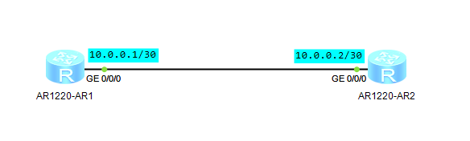
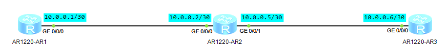

# BFD

## 概念

### 定义

> 双向转发检测BFD（Bidirectional Forwarding Detection）是一种全网统一的检测机制，用于快速检测、监控网络中链路或者IP路由的转发连通状况。

### 目的

> 为了减小设备故障对业务的影响，提高网络的可靠性，网络设备需要能够尽快检测到与相邻设备间的通信故障，以便及时采取措施，保证业务继续进行。在现有网络中，有些链路通常通过硬件检测信号，如SDH告警，检测链路故障，但并不是所有的介质都能够提供硬件检测。此时，应用就要依靠上层协议自身的Hello报文机制来进行故障检测。上层协议的检测时间都在1秒以上，这样的故障检测时间对某些应用来说是不能容忍的。在三层网络中，Hello报文检测机制无法针对所有路由来检测故障，如：静态路由。这对系统间互联互通定位故障造成困难。

> BFD协议就是在这种背景下产生的，BFD提供了一个通用的标准化的介质无关和协议无关的快速故障检测机制。具有以下优点：
> - 对相邻转发引擎之间的通道提供轻负
> - BFD可以实现快速检测并监控网络中链路或IP路由的转发连通状态，改善网络性能。相邻系统之间通过快速检测发现通信故障，可以更快地帮助用户建立起备份通道以便恢复通信，保证网络可靠性。

## 实验

### 单跳检测实例



**R1配置**
```
[R1]bfd
[R1-bfd]quit
[R1]bfd toR1 bind peer-ip 10.0.0.2
[R1-bfd-session-tor1]discriminator local 1
[R1-bfd-session-tor1]discriminator remote 2
[R1-bfd-session-tor1]commit
```

**R2配置**
```
[R2]bfd
[R2-bfd]quit
[R2]bfd toR1 bind peer-ip 10.0.0.1
[R2-bfd-session-tor1]discriminator local 2
[R2-bfd-session-tor1]discriminator remote 1
[R2-bfd-session-tor1]commit
```

**结果查询**
```
[R1]display bfd session all
```

### 多条检测实例



**R1配置**
```
[R1]ip route-static 10.0.0.4 30 10.0.0.2
[R1]bfd
[R1-bfd]quit
[R1]bfd toR1 bind peer-ip 10.0.0.6
[R1-bfd-session-tor1]discriminator local 1
[R1-bfd-session-tor1]discriminator remote 3
[R1-bfd-session-tor1]commit
```

**R3配置**
```
[R3]ip route-static 10.0.0.0 30 10.0.0.5
[R3]bfd
[R3-bfd]quit
[R3]bfd toR1 bind peer-ip 10.0.0.1
[R3-bfd-session-tor1]discriminator local 3
[R3-bfd-session-tor1]discriminator remote 1
[R3-bfd-session-tor1]commit
```

**结果查询**
```
[R1]display bfd session all
```