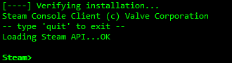
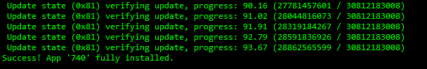

# CSGO服务器搭建

## 环境

- 系统：CentOS7.6
- CPU：1核
- 内存：2G
- 带宽：5M

## 搭建服务器

### 安装steamcmd

1. 安装依赖
```shell
yum install -y glibc.i686 libstdc++.i686
```
2. 添加一个用户
```shell
adduser csgoserver
```
3. 修改用户密码
```shell
passwd csgoserver
```
4. 进入到csgoserver用户下
```shell
su csgoserver
cd
```
5. 下载steamcmd
```shell
wget https://steamcdn-a.akamaihd.net/client/installer/steamcmd_linux.tar.gz
```
6. 解压steamcmd
```shell
tar zxvf steamcmd_linux.tar.gz
```
7. 安装steamcmd
```shell
./steamcmd.sh
```
8. 安装完成  


### 在steamcmd中安装CSGO服务端

1. 匿名身份登录steamcmd
```shell
login anonymous
```
2. 创建CSGO服务端文件夹
```shell
force_install_dir ./csgoserver
```
3. 开始下载CSGO服务端
```shell
app_update 740 validate
```
4. 如果出现下图，表明CSGO服务端安装完成  

5. 安装完成后，`quit`即可
6. 创建更新服务端脚本
```shell
vi csgoserver/update.txt

login anonymous
force_install_dir ./csgoserver
app_update 740
quit
```

### 配置并运行CSGO服务端

1. 前往[steam](https://steamcommunity.com/dev/managegameservers)注册steam服务器登录令牌
2. 下载服务器配置文件server.cfg
```shell
cd csgoserver/csgo/cfg/
wget http://www.csgodev.com/downloads/server.cfg
vi server.cfg
```
3. 修改部分参数
```
sv_setsteamaccount "4FXXXXXXXXXXXXXXXXXXXXXXXXX"     // steam account，修改为自己刚刚申请的登陆令牌
hostname "TEST SERVER"     // 服务器在社区服务器浏览器上显示的名称，自行修改为喜欢的名字
rcon_password "12345678"     // CS:GO远程控制台密码，修改为自己定义的密码
sv_password ""     // 服务器连接密码，在连接服务器时输入，不要密码可以留空
sv_maxrate "128000"     // 服务器最大带宽使用量，默认值非常小，因此会造成choke值异常，此处建议改为128000
sv_minrate "80000"     // 服务器最小带宽使用量，与上面同理，此处建议改为80000
sv_accelerate "5.5"     // 人物移动速度，默认值为10，此处建议修改为5.5
sv_staminajumpcost ".08"     //跳跃的体魄惩罚。默认值.1
sv_staminalandcost ".05"     //着陆的耐力惩罚。默认值.1
```
4. 服务端启动参数
- 休闲模式：`+game_type 0 +game_mode0`
- 竞技模式：`+game_type 0 +game_mode1`
- 军备竞赛：`+game_type 1 +game_mode0`
- 爆破模式：`+game_type 1 +game_mode1`
- 死亡竞赛：`+game_type 1 +game_mode2`
5. 运行CSGO服务端
```shell
./srcds_run -debug -game csgo -console -port 27015 -usercon -nomaster -perfectworld -tickrate 128 -steamcmd_script /home/csgoserver/steamcmd/update.txt -steam_dir /home/csgoserver/steamcmd/ +map de_dust2 +game_type 1 +game_mode 2
```