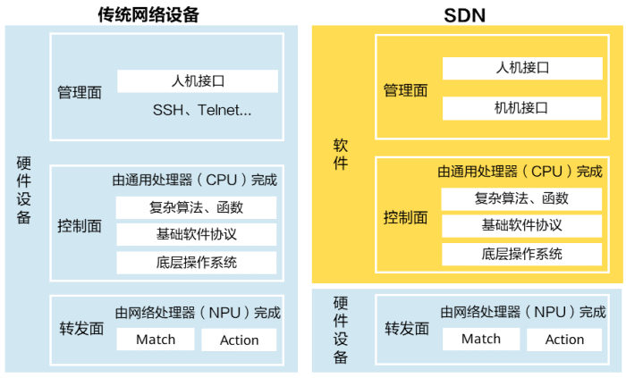
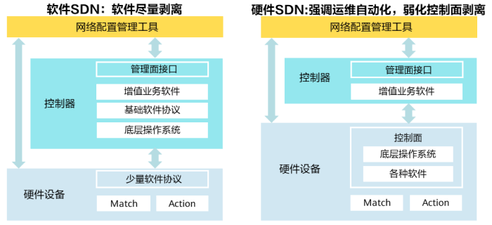

# SDN学习

## 什么是SDN？

> 软件定义网络（Software-defined Networking，简称SDN）技术是一种网络管理方法，它支持动态可编程的网络配置，提高了网络性能和管理效率，使网络服务能够像云计算一样提供灵活的定制能力。SDN将网络设备的转发面与控制面解耦，通过控制器负责网络设备的管理、网络业务的编排和业务流量的调度，具有成本低、集中管理、灵活调度等优点。

## 为什么要有SDN？

> 传统网络是一个分布式的网络，在二层网络中，设备通过广播的方式传递设备间的可达信息。在三层网络中，设备间通过标准路由协议传递拓扑信息。这些模式要求每台设备必须使用相同的网络协议，保证各厂商的设备可以实现相互通信。随着业务的飞速发展，用户对网络的需求日新月异，一旦原有的基础网络无法满足新需求，就需要上升到协议制定与修改的层面，这样就会导致网络设备升级十分缓慢。

> 传统网络为了适应不同的需求和场景，发展也越来越复杂。部署一个传统网络往往需要使用到很多协议，由于标准协议中往往存在一些未明确的地方，导致各厂商的实现有差异。

> 传统网络以单台设备为单位，以命令行的方式进行管理。网络管理和业务调度时效率低下，运维成本高。

### SDN技术路线

> 为了解决传统网络发展滞后、运维成本高的问题，服务提供商开始探索新的网络架构，希望能够将控制面（操作系统和各种软件）与硬件解耦，实现底层操作系统、基础软件协议以及增值业务软件的开源自研，这就诞生了SDN技术。

> 在传统网络中，网络设备可以分为管理面、控制面和转发面。管理面负责业务的编排和策略的制定，控制面负责操作系统的运行以及各种算法的运算，转发面负责数据包的转发和接收。SDN的理念是将网络设备的控制和转发功能解耦，使网络设备的控制面可直接编程，将网络服务从底层硬件设备中抽象出来。SDN架构与传统网络架构的对比如下图所示。



> 经典的SDN技术路线强调控制面的剥离，希望能够将网络设备变为白盒设备，实现网络功能的自定义。

> 但在SDN的发展过程中，由于底层协议的复杂性、软件开发投入等多方面原因，厂商逐渐转向了以自动化运维为主要目标，弱化控制面剥离的SDN技术路线。厂商们主张将操作系统以及大部分的软件仍放在硬件设备上进行，保留原有的网络设备形态，通过控制器实现与硬件设备、与网络配置管理工具的对接，由控制器在管理面的维度完成对硬件设备的统一管理和业务编排。下图为两种SDN技术路线的对比，经典的SDN技术路线又可以称为软件SDN，而弱化控制面剥离的SDN技术路线可以称为硬件SDN。



## SDN架构

SDN架构可分为基础设施层、控制层和应用层。
- 基础设施层：主要为转发设备，实现转发功能，例如数据中心交换机。
- 控制层：由SDN控制软件组成，可通过标准化协议与转发设备进行通信，实现对基础设施层的控制。
- 应用层：常见的有基于OpenStack架构的云平台。另外，也可以基于OpenStack构建用户自己的云管理平台。

SDN使用北向和南向应用程序接口（API）来进行层与层之间的通信，分为北向API和南向API。北向API负责应用层和控制层之间的通信，南向API负责基础设施层和控制层之间的通信。


## SDN的优点

在当前主流的SDN架构中，保留了传统硬件设备上的操作系统和基础的协议功能，通过控制器收集整个网络中的设备信息，具有如下优点：
- 网络可编程  
网络设备提供应用编程接口（API），使得开发和管理人员能够通过编程语言向网络设备发送指令。网络工程师可以使用脚本自动化创建和分配任务，收集网络统计信息。将基于CLI与SNMP的封装脚本变为实实在在的可编程对象，提供了更丰富的功能。
- 网络抽象化  
控制器作为中间层，通过南北向API接口与网络设备和应用程序进行交互，将底层的硬件设备抽象为虚拟化的资源池，应用和服务不再与硬件紧密耦合。
- 降低成本  
保留了原有的网络设备，硬件设备仍然具备管理、控制、转发的全部功能，方便进行整网的改造，无需进行大规模的搬迁。控制器的引入将人工配置转变为机器配置，提升运维效率，降低运维成本。
- 业务灵活调度  
传统的硬件设备在网络中无法进行灵活的负载分担，最优路由上往往承担着最重的转发任务，即使QoS、流控等功能缓解了这一问题，但流量的调度仍然强依赖于管理员对单台设备的配置，因此我们可以将传统的硬件设备看作是一种孤岛式的、分布式的管理模式。SDN在没有改变硬件设备整体逻辑的基础上，通过增加开放的南北向接口，实现了将计算机语言到配置命令行的翻译，使界面式的管理、集中管理变成了可能，解决了传统网络业务调度不灵活的问题。
- 集中管理  
传统网络设备的管理是分布式的，单台网络设备不感知整个网络的状态。网络管理员使用控制器来管理底层硬件设备，编排网络业务，分配网络资源和调整流量优先级。管理员可以直接感知整个网络的状态，及时调整带宽和优化策略，便于进行整网的管理。
- 开放性  
SDN架构支持供应商开发自己的生态系统，开放的API支持云编排、OSS/BSS、SaaS等多种应用程序，同时也可以通过Openflow控制多个供应商的硬件。

## SDN的未来与挑战

在数据中心领域，大多数大规模数据中心已经采用扁平化架构，这给网络设备的管理带来了极大的挑战。SDN带来的自动化运维、集中管理在数据中心的自动化调配以及扩容中有极大的应用空间。

在视频领域，由于SDN支持数据流的实时调配，使得网络能够承载更多的流量。

在机器学习和人工智能领域，SDN也会受到运营需求和软件创新的影响，提供更丰富、更新潮的网络体验。

在未来的网络自动驾驶（ADN）中，SDN架构也能够发挥重要作用。

SDN并非没有缺点，与其他IT产品一样，SDN存在安全、扩展以及缺乏广泛合作、缺乏生态的问题。
- 集中管理的安全风险  
虽然集中管理十分方便，但这也是一种安全风险。集中管理的单节点被攻击，整个网络可能都会受到影响。

- SDN控制器的瓶颈  
对于软件完全从硬件上分离的SDN思路来说，控制器的软件开发难度、控制器的计算压力都是巨大的挑战。

- 北向API缺乏统一标准  
缺乏标准的北向API导致供应商提供的接口不统一，应用程序开发困难上升，同一组开发人员必须同时开发与不同控制器的相互操作。

## Mininet

> Stanford大学Nick McKeown的研究小组基于Linux Container架构，开发出了这套进程虚拟化的平台。在Mininet的帮助下，你可以轻易的在自己的笔记本上测试一个软件定义网络（software-defined Networks），对基于OpenFlow、Open vSwitch的各种协议等进行开发验证，或者验证自己的想法。最令人振奋的是，所有的代码几乎可以无缝迁移到真实的硬件环境中，学术界跟产业界再也不是那么难以沟通了。想想吧，在实验室里，一行命令就可以创建一个支持SDN的任意拓扑的网络结构，并可以灵活的进行相关测试，验证了设计的正确后，又可以轻松部署到真实的硬件环境中。

Mininet作为一个轻量级软定义网络研发和测试平台，其主要特性包括
- 支持OpenFlow、Open vSwitch等软定义网络部件
- 方便多人协同开发
- 支持系统级的还原测试
- 支持复杂拓扑、自定义拓扑
- 提供python API
- 很好的硬件移植性（Linux兼容），结果有更好的说服力
- 高扩展性，支持超过4096台主机的网络结构

### 获取镜像

<https://github.com/mininet/mininet/releases/>

这是一个基于Ubuntu的虚拟机文件，用VMware或者Virtual Box打开

用户名和密码均为 `mininet`

### 创建一个简单拓扑

1. 创建一个交换机（ovsk类型），3个主机，无Controller的SDN网络
```shell
mininet@mininet-vm:~$ sudo mn --topo=single,3 --mac --switch=ovsk --controller=remote
```
2. 查看网络节点
```shell
mininet> nodes
```
3. 查看物理拓扑
```shell
mininet> net
```
4. 查看各个节点信息
```shell
mininet> dump
```