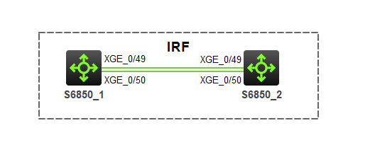

# IRF(H3C)

## 什么是IRF？

> IRF（Intelligent Resilient Framework，智能弹性架构）技术通过将多台设备连接在一起，虚拟化成一台设备，集成多台设备的硬件资源和软件处理能力，实现多台设备的协同工作、统一管理和不间断维护。

## IRF优点

- 统一管理：IRF形成之后，用户通过IRF中的任意端口都可以登录IRF系统，对所有成员设备进行统一管理。同时，对于网络中的其它设备和网管来说，整个IRF就是一个网络节点，简化了网络拓扑，降低了管理难度。
- 高可靠性：IRF中有多台成员设备，其中一台作为主设备，负责IRF的运行、管理和维护；其它成员设备作为从设备，从设备在作为备份的同时也可以处理业务。一旦主设备故障，系统会迅速自动选举新的主设备，以保证业务不中断，从而实现了设备的1:N备份。
- 星形拓扑：所有的成员设备接入二层网络，只要成员设备间二层互通，就可以利用现有的物理连接来转发成员设备间的流量和IRF协议报文，不需要专门的物理线路和接口来转发。
- 跨成员设备的链路聚合：IRF和上、下层设备之间的物理链路支持聚合功能，并且不同成员设备上的物理链路可以聚合成一个逻辑链路，多条物理链路之间可以互为备份也可以进行负载分担，当某个成员设备离开IRF，其它成员设备上的链路仍能收发报文，从而提高了聚合链路的可靠性。
- 强大的网络扩展能力：IRF的各成员设备都有CPU，能够独立处理协议报文、进行报文转发。增加成员设备，可以灵活扩展IRF的处理能力和端口数量。

## IRF搭建

1. 使用HCL V3.0.1模拟器搭建拓扑

    

2. 确定IRF设备角色，配置设备的IRF优先级和编号

    ```
    [IRF2]irf member 1 renumber 2  // 将IRF2(即SW2)的成员编号设置为2，默认为1
    [IRF2]save
    [IRF2]quit
    <IRF2>reboot
    ```
    ```
    [IRF1]irf member 1 priority 32  // 设置IRF1（SW1）的IRF优先级为32，该值已经最大，保证IRF1设备成为主设备（IRF2并未修改优先级，意味着它使用默认的优先级1）
    [IRF1]interface range Ten-GigabitEthernet 1/0/49 to Ten-GigabitEthernet 1/0/50
    [IRF1-if-range]shutdown
    [IRF1-if-range]quit
    [IRF]irf-port 1/2  // 设置IRF1的逻辑接口2
    [IRF1-irf-port1/2]port group interface Ten-GigabitEthernet 1/0/49  // 把物理接口加入逻辑接口
    [IRF1-irf-port1/2]port group interface Ten-GigabitEthernet 1/0/50  // 把物理接口加入逻辑接口
    [IRF1-irf-port1/2]quit
    [IRF1]interface range Ten-GigabitEthernet 1/0/49 to Ten-GigabitEthernet 1/0/50
    [IRF1-if-range]undo shutdown
    [IRF1-if-range]quit
    [IRF1]save
    ```

3. Slave设备加入物理成员接口

    ```
    [IRF2]interface range Ten-GigabitEthernet 2/0/49 to Ten-GigabitEthernet 2/0/50  // 进入物理接口，注意之前已经“renember”了该设备的板卡号码，所以接口为10G接口的2/0/49和50接口
    [IRF2-if-range]shutdown
    [IRF2-if-range]quit
    [IRF2]irf-port 2/1  // 注意，特别推荐使用交叉互联，请对比IRF1设备，否则可能造成堆叠失败
    [IRF2-irf-port2/1]port group interface Ten-GigabitEthernet 2/0/49  // 把物理接口加入逻辑接口
    [IRF2-irf-port2/1]port group interface Ten-GigabitEthernet 2/0/50  // 把物理接口加入逻辑接口
    [IRF2-irf-port2/1]quit
    [IRF2]interface range Ten-GigabitEthernet 2/0/49 to Ten-GigabitEthernet 2/0/50
    [IRF2-if-range]undo shutdown
    [IRF2-if-range]quit
    [IRF2]save
    ```

4. 激活IRF配置

    ```
    [IRF1]irf-port-configuration active  // 请在激活IRF配置前确保已经保存配置
    ```
    ```
    <IRF2>reboot
    ```

5. 启动后，如果成功那么IRF2会变成IRF1
6. IRF实施完毕后的验证
    - `display irf`：显示IRF中所有成员设备的相关信息
    - `display irf configuration`：显示IRF中所有成员设备的配置信息
    - `display irf forwarding [slot slot-number]`：显示指定成员设备收到的IRF Hello报文的信息
    - `display irf link`：显示IRF链路信息
    - `display mad [verbose]`：显示MAD配置信息