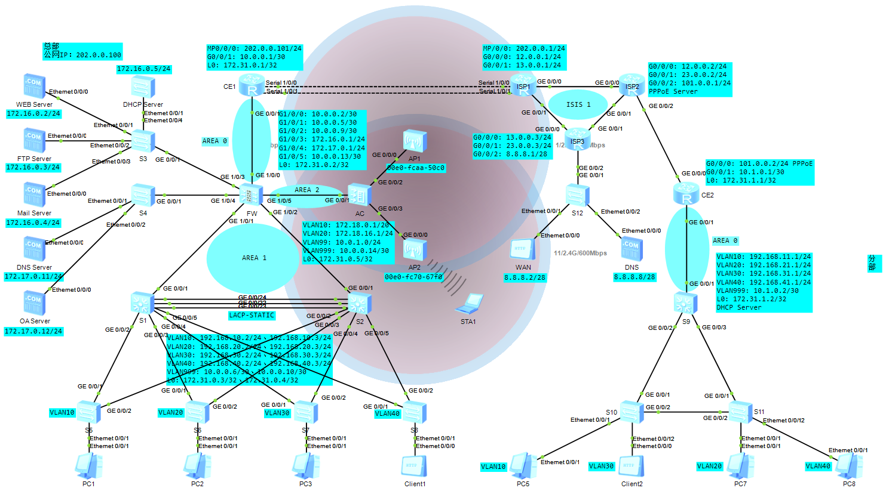

# 大型企业园区网的规划与实现

## 环境搭建

- eNSP 1.3.00.100 V100R003C00 SPC100
- USG6000V镜像
- Oracle VM VirtualBox 5.2.44

## 网络规划



### 总部

#### 出口

- 运营商分配给总部两个IP地址：202.0.0.100、202.0.0.101
- 202.0.0.101用作出口网关
- 202.0.0.100用作外网访问服务器的公网IP
- 与运营商互联采用PPP链路进行绑定实现MP并采用CHAP双向认证

#### 核心

- FW的登录用户名为admin，密码为123qwe..
- WEB、FTP、Mail和DHCP四台服务器部署在DMZ区域
- 内网终端和无线终端都通过Easy IP访问互联网
- CE1上配置DNS Mapping使得无线访客用户可通过公网DNS服务器使用域名访问DMZ中的服务器
- 外网通过静态NAT访问DMZ区域的服务器
- CE1和FW1、FW2通过OSPF的区域0发布路由
- FW和S1、S2通过OSPF的区域1发布路由
- FW和AC通过OSPF的区域2发布路由
- 总部CE1和分部CE2之间通过GRE over IPSEC使得总部与分部互联互通
- 总部CE1和分部CE2通过OSPF进程2的区域0发布路由
- FW通过安全策略使得分部以及员工无线与TRUST区域设备通信

#### 汇聚

- 业务VLAN：VLAN10、VLAN20、VLAN30、VLAN40
- S1和S2间实现LACP-STATIC链路聚合保证链路的高可靠性
- S1和S2间通过VRRP实现网关冗余
- S1和S2开启MSTP并设置实例1和实例2
- S1为MSTP实例1：VLAN10、VLAN20的根
- S2为MSTP实例2：VLAN30、VLAN40的根
- DMZ区域的DHCP服务器为业务VLAN下的所有PC下发IP地址

#### 接入

- 所有接入交换机开启MSTP与S1和S2在同一个域内
- 所有接入交换机的与PC直连的设备接口上配置边缘端口和BPDU报文过滤功能
- 为防止非法AP，配置非法设备检测和反制
- AP开启2.4G和5G频率
- 为预防AP间信道冲突，AP1的信道为1，AP2的信道为11
- 限制AP下每个STA的上行速率不超过1Mb，下行速率不超过5Mb，且VAP下所有STA的上行速率不超过10Mb，下行速率不超过50Mb

### 分部

#### 出口

- CE2为PPPoE Client，由运营商下发IP地址
- 内网终端都通过Easy IP访问互联网

#### 核心

- CE和S10通过OSPF区域0发布路由
- 分部CE2和总部CE1之间通过GRE over IPSEC使得总部与分部互联互通
- 分部CE2和总部CE1通过OSPF进程2的区域0发布路由

#### 汇聚

- 业务VLAN：VLAN10、VLAN20、VLAN30、VLAN40
- 各个部门的网关均在S19上
- S9为业务VLAN下的所有PC下发IP地址
- S9为根交换机

#### 接入

- 所有接入交换机开启MSTP与S1和S2在同一个域内
- 所有接入交换机的与PC直连的设备接口上配置边缘端口和BPDU报文过滤功能
- S10的生成树优先级为4096
- S11的生成树优先级为8192

### ISP运营商

- 运营商内部为IS-IS路由协议
- ISP1为总部CE1下发IP地址
- ISP2为PPPoE Server为分部CE2下发IP地址

## 主要配置

### AC

```
#
 sysname AC
#
vlan batch 10 20 99 999
#
dhcp enable
#
interface Vlanif10
 ip address 172.18.0.1 255.255.240.0
 dhcp select relay
 dhcp relay server-ip 172.16.0.5
#
interface Vlanif20
 ip address 172.18.16.1 255.255.255.0
 dhcp select relay
 dhcp relay server-ip 172.16.0.5
#
interface Vlanif99
 ip address 10.0.1.1 255.255.255.0
 dhcp select relay
 dhcp relay server-ip 172.16.0.5
#
interface Vlanif999
 ip address 10.0.0.14 255.255.255.252
#
interface GigabitEthernet0/0/1
 port link-type access
 port default vlan 999
#
interface GigabitEthernet0/0/2
 port link-type trunk
 port trunk pvid vlan 99
 undo port trunk allow-pass vlan 1
 port trunk allow-pass vlan 10 20 99
#
interface GigabitEthernet0/0/3
 port link-type trunk
 port trunk pvid vlan 99
 undo port trunk allow-pass vlan 1
 port trunk allow-pass vlan 10 20 99
#
interface LoopBack0
 ip address 172.31.0.5 255.255.255.255
#
ospf 1 router-id 172.31.0.5
 import-route direct
 area 0.0.0.2
  network 10.0.0.12 0.0.0.3
  network 172.31.0.5 0.0.0.0
#
capwap source interface loopback0
#
wlan
 traffic-profile name guest
  rate-limit client up 1024
  rate-limit vap up 51200
  rate-limit client down 5120
  rate-limit vap down 102400
 security-profile name guest
 security-profile name employee
  security wpa2 psk pass-phrase 123qwe.. aes
 ssid-profile name guest
  ssid guest
 ssid-profile name employee
  ssid employee
 ssid-profile name guest_5G
  ssid guest_5G
 ssid-profile name employee_5G
  ssid employee_5G
 vap-profile name guest
  service-vlan vlan-id 20
  ssid-profile guest
  security-profile guest
  traffic-profile guest
 vap-profile name employee
  service-vlan vlan-id 10
  ssid-profile employee
  security-profile employee
 vap-profile name guest_5G
  service-vlan vlan-id 20
  ssid-profile guest_5G
  security-profile guest
  traffic-profile guest
 vap-profile name employee_5G
  service-vlan vlan-id 10
  ssid-profile employee_5G
  security-profile employee
 ap-group name ap
  radio 0
   vap-profile employee wlan 1
   vap-profile guest wlan 2
   wids device detect enable
   wids contain enable
  radio 1
   vap-profile employee_5G wlan 1
   vap-profile guest_5G wlan 2
   wids device detect enable
   wids contain enable
 ap-id 1 type-id 69 ap-mac 00e0-fcaa-50c0 ap-sn 210235448310D5312A38
  ap-name AP1
  ap-group ap
  radio 0
   channel 20mhz 1
   eirp 127
 ap-id 2 type-id 69 ap-mac 00e0-fc70-67f0 ap-sn 210235448310692AD94A
  ap-name AP2
  ap-group ap
  radio 0
   channel 20mhz 11
   eirp 127
#
```

### CE1

```
#
 sysname CE1
#
acl number 2000  
 rule 5 permit source 192.168.0.0 0.0.255.255 
 rule 10 permit source 172.18.0.0 0.0.255.255 
#
ipsec proposal 1
 esp authentication-algorithm sha2-256 
 esp encryption-algorithm aes-128
#
ike proposal 1
 encryption-algorithm aes-cbc-128
 dh group14
#
ike peer Branch v1
 pre-shared-key cipher 123qwe.
 ike-proposal 1
#
ipsec policy-template HQ_temp 1
 ike-peer Branch
 proposal 1
#
ipsec profile gre
 ike-peer Branch
 proposal 1
#
aaa
 local-user ce password cipher 123qwe.
 local-user ce privilege level 0
 local-user ce service-type ppp
#
 nat alg dns enable
 #
 nat dns-map www.test.com 202.0.0.100 80 tcp
 nat dns-map ftp.test.com 202.0.0.100 21 tcp
 nat dns-map mail.test.com 202.0.0.100 25 tcp
#
interface Mp-group0/0/0
 ip address ppp-negotiate
 nat server protocol tcp global 202.0.0.100 www inside 172.16.0.2 www
 nat server protocol tcp global 202.0.0.100 ftp inside 172.16.0.3 ftp
 nat server protocol tcp global 202.0.0.100 smtp inside 172.16.0.4 smtp
 nat outbound 2000
#
interface Serial1/0/0
 link-protocol ppp
 ppp authentication-mode chap 
 ppp chap user isp1
 ppp chap password cipher 123qwe.
 ppp mp Mp-group 0/0/0
 timer hold 30
#
interface Serial1/0/1
 link-protocol ppp
 ppp authentication-mode chap 
 ppp chap user isp1
 ppp chap password cipher 123qwe.
 ppp mp Mp-group 0/0/0
 timer hold 30
#
interface GigabitEthernet0/0/1
 ip address 10.0.0.1 255.255.255.252 
#
interface LoopBack0
 ip address 172.31.0.1 255.255.255.255 
#
interface Tunnel0/0/0
 ip address 10.99.0.1 255.255.255.0 
 tunnel-protocol gre
 source 202.0.0.101
 destination 101.0.0.2
 ipsec profile gre
#
ospf 1 router-id 172.31.0.1 
 default-route-advertise always
 import-route ospf 2
 area 0.0.0.0 
  network 10.0.0.0 0.0.0.3 
  network 172.31.0.1 0.0.0.0 
#
ospf 2 router-id 10.99.0.1 
 import-route ospf 1
 area 0.0.0.0 
  network 10.99.0.0 0.0.0.255 
#
ip route-static 0.0.0.0 0.0.0.0 Mp-group0/0/0
#
```

### CE2

```
#
 sysname CE2
#
acl number 2000  
 rule 5 permit source 192.168.0.0 0.0.255.255 
#
ipsec proposal 1
 esp authentication-algorithm sha2-256 
 esp encryption-algorithm aes-128
#
ike proposal 1
 encryption-algorithm aes-cbc-128
 dh group14
#
ike peer HQ v1
 pre-shared-key cipher 123qwe.
 ike-proposal 1
#
ipsec profile gre
 ike-peer HQ
 proposal 1
#
interface Dialer1
 link-protocol ppp
 ppp chap user pppoe
 ppp chap password cipher 123qwe.
 ip address ppp-negotiate
 dialer user pppoe
 dialer bundle 1
 nat outbound 2000
#
interface GigabitEthernet0/0/0
 pppoe-client dial-bundle-number 1 
#
interface GigabitEthernet0/0/1
 ip address 10.1.0.1 255.255.255.252 
#
interface LoopBack0
 ip address 172.31.1.1 255.255.255.255 
#
interface Tunnel0/0/0
 ip address 10.99.0.2 255.255.255.0 
 tunnel-protocol gre
 source 101.0.0.2
 destination 202.0.0.101
 ipsec profile gre
#
dialer-rule
 dialer-rule 1 ip permit
#
ospf 1 router-id 172.31.1.1 
 default-route-advertise always
 import-route ospf 2
 area 0.0.0.0 
  network 10.1.0.0 0.0.0.3 
  network 172.31.1.1 0.0.0.0 
#
ospf 2 router-id 10.99.0.2 
 import-route ospf 1
 area 0.0.0.0 
  network 10.99.0.0 0.0.0.255 
#
ip route-static 0.0.0.0 0.0.0.0 Dialer1
#
```

### DHCP Server

```
#
sysname DHCP Server
#
vlan batch 999
#
stp disable
#
dhcp enable
#
ip pool ap
 gateway-list 10.0.1.1 
 network 10.0.1.0 mask 255.255.255.0 
 lease day 5 hour 0 minute 0 
 dns-list 8.8.8.8 
 option 43 sub-option 3 ascii 172.31.0.5 
#
ip pool employee
 gateway-list 172.18.0.1 
 network 172.18.0.0 mask 255.255.240.0 
 lease day 0 hour 10 minute 0 
 dns-list 172.17.0.11 
#
ip pool guest
 gateway-list 172.18.16.1 
 network 172.18.16.0 mask 255.255.255.0 
 lease day 0 hour 2 minute 0 
 dns-list 8.8.8.8 
#
ip pool vlan10
 gateway-list 192.168.10.1 
 network 192.168.10.0 mask 255.255.255.0 
 excluded-ip-address 192.168.10.2 192.168.10.10 
 lease day 0 hour 10 minute 0 
 dns-list 172.17.0.11 
#
ip pool vlan20
 gateway-list 192.168.20.1 
 network 192.168.20.0 mask 255.255.255.0 
 excluded-ip-address 192.168.20.2 192.168.20.10 
 lease day 0 hour 10 minute 0 
 dns-list 172.17.0.11 
#
ip pool vlan30
 gateway-list 192.168.30.1 
 network 192.168.30.0 mask 255.255.255.0 
 excluded-ip-address 192.168.30.2 192.168.30.10 
 lease day 0 hour 10 minute 0 
 dns-list 172.17.0.11 
#
ip pool vlan40
 gateway-list 192.168.40.1 
 network 192.168.40.0 mask 255.255.255.0 
 excluded-ip-address 192.168.40.2 192.168.40.10 
 lease day 0 hour 10 minute 0 
 dns-list 172.17.0.11 
#
interface Vlanif999
 ip address 172.16.0.5 255.255.255.0 
 dhcp select global
#
interface Ethernet0/0/1
 port link-type access
 port default vlan 999
#
ip route-static 0.0.0.0 0.0.0.0 172.16.0.1
#
```

### FW

```
#
sysname FW
#
interface GigabitEthernet1/0/0
 undo shutdown
 ip address 10.0.0.2 255.255.255.252
 service-manage ping permit
#
interface GigabitEthernet1/0/1
 undo shutdown
 ip address 10.0.0.5 255.255.255.252
 service-manage ping permit
#
interface GigabitEthernet1/0/2
 undo shutdown
 ip address 10.0.0.9 255.255.255.252
 service-manage ping permit
#
interface GigabitEthernet1/0/3
 undo shutdown
 ip address 172.16.0.1 255.255.255.0
 service-manage ping permit
#
interface GigabitEthernet1/0/4
 undo shutdown
 ip address 172.17.0.1 255.255.255.0
 service-manage ping permit
#
interface GigabitEthernet1/0/5
 undo shutdown
 ip address 10.0.0.13 255.255.255.252
 service-manage ping permit
#
interface LoopBack0
 ip address 172.31.0.2 255.255.255.255
#
firewall zone trust
 set priority 85
 add interface GigabitEthernet0/0/0
 add interface GigabitEthernet1/0/1
 add interface GigabitEthernet1/0/2
 add interface GigabitEthernet1/0/4
#
firewall zone untrust
 set priority 5
 add interface GigabitEthernet1/0/0
 add interface GigabitEthernet1/0/5
#
firewall zone dmz
 set priority 50
 add interface GigabitEthernet1/0/3
#
ospf 1 router-id 172.31.0.2
 import-route direct
 area 0.0.0.0
  network 10.0.0.0 0.0.0.3
  network 172.31.0.2 0.0.0.0
 area 0.0.0.1
  network 10.0.0.4 0.0.0.3
  network 10.0.0.8 0.0.0.3
 area 0.0.0.2
  network 10.0.0.12 0.0.0.3
#
security-policy
 rule name LAN_WAN
  source-zone dmz
  source-zone local
  source-zone trust
  destination-zone dmz
  destination-zone local
  destination-zone trust
  destination-zone untrust
  action permit
 rule name WAN_DMZ
  source-zone dmz
  source-zone untrust
  destination-zone dmz
  destination-zone untrust
  action permit
 rule name VPN
  destination-zone trust
  source-address 192.168.0.0 0.0.255.255
  action permit
 rule name Wireless
  destination-zone trust
  source-address 172.18.0.0 0.0.15.255
  action permit
#
```

### ISP1

```
#
 sysname ISP1
#
aaa
 local-user isp1 password cipher 123qwe.
 local-user isp1 privilege level 0
 local-user isp1 service-type ppp
#
isis 1
 is-level level-2
 network-entity 49.0000.0000.0001.00
 import-route direct 
#
interface Mp-group0/0/0
 remote address 202.0.0.101 
 ip address 202.0.0.1 255.255.255.0 
#
interface Serial1/0/0
 link-protocol ppp
 ppp authentication-mode chap 
 ppp chap user ce
 ppp chap password cipher 123qwe.
 ppp mp Mp-group 0/0/0
 timer hold 30
#
interface Serial1/0/1
 link-protocol ppp
 ppp authentication-mode chap 
 ppp chap user ce
 ppp chap password cipher 123qwe.
 ppp mp Mp-group 0/0/0
 timer hold 30
#
interface GigabitEthernet0/0/0
 ip address 12.0.0.1 255.255.255.0 
 isis enable 1
#
interface GigabitEthernet0/0/1
 ip address 13.0.0.1 255.255.255.0 
 isis enable 1
#
```

### ISP2

```
#
 sysname ISP2
#
#
aaa
 local-user pppoe password cipher 123qwe.
 local-user pppoe privilege level 0
 local-user pppoe service-type ppp
#
isis 1
 is-level level-2
 network-entity 49.0000.0000.0002.00
 import-route direct 
#
firewall zone Local
 priority 15
#
interface Virtual-Template1
 ppp authentication-mode chap 
 remote address 101.0.0.2 
 ip address 101.0.0.1 255.255.255.0 
#
interface GigabitEthernet0/0/0
 ip address 12.0.0.2 255.255.255.0 
 isis enable 1
#
interface GigabitEthernet0/0/1
 ip address 23.0.0.2 255.255.255.0 
 isis enable 1
#
interface GigabitEthernet0/0/2
 pppoe-server bind Virtual-Template 1
#
```

### ISP3

```
#
 sysname ISP3
#
isis 1
 is-level level-2
 network-entity 49.0000.0000.0003.00
 import-route direct 
#
interface GigabitEthernet0/0/0
 ip address 13.0.0.3 255.255.255.0 
 isis enable 1
#
interface GigabitEthernet0/0/1
 ip address 23.0.0.3 255.255.255.0 
 isis enable 1
#
interface GigabitEthernet0/0/2
 ip address 8.8.8.1 255.255.255.240 
#
```

### S1

```
#
sysname S1
#
vlan batch 10 20 30 40 999
#
stp instance 0 root primary
stp instance 1 root primary
stp instance 2 root secondary
#
lacp priority 4096
#
dhcp enable
#
stp region-configuration
 region-name MSTP
 instance 1 vlan 10 20 
 instance 2 vlan 30 40 
 active region-configuration
#
interface Vlanif10
 ip address 192.168.10.2 255.255.255.0 
 vrrp vrid 10 virtual-ip 192.168.10.1
 dhcp select relay
 dhcp relay server-ip 172.16.0.5
#
interface Vlanif20
 ip address 192.168.20.2 255.255.255.0 
 vrrp vrid 20 virtual-ip 192.168.20.1
 dhcp select relay
 dhcp relay server-ip 172.16.0.5
#
interface Vlanif30
 ip address 192.168.30.2 255.255.255.0 
 vrrp vrid 30 virtual-ip 192.168.30.1
 vrrp vrid 30 priority 50
 ospf cost 10
 dhcp select relay
 dhcp relay server-ip 172.16.0.5
#
interface Vlanif40
 ip address 192.168.40.2 255.255.255.0 
 vrrp vrid 40 virtual-ip 192.168.40.1
 vrrp vrid 40 priority 50
 ospf cost 10
 dhcp select relay
 dhcp relay server-ip 172.16.0.5
#
interface Vlanif999
 ip address 10.0.0.6 255.255.255.252 
#
interface Eth-Trunk1
 port link-type trunk
 undo port trunk allow-pass vlan 1
 port trunk allow-pass vlan 10 20 30 40
 stp bpdu vlan 10
 mode lacp-static
 max active-linknumber 2
#
interface GigabitEthernet0/0/1
 port link-type access
 port default vlan 999
 stp disable
#
interface GigabitEthernet0/0/2
 port link-type trunk
 undo port trunk allow-pass vlan 1
 port trunk allow-pass vlan 10
 stp bpdu vlan 10
#
interface GigabitEthernet0/0/3
 port link-type trunk
 undo port trunk allow-pass vlan 1
 port trunk allow-pass vlan 20
 stp bpdu vlan 20
#
interface GigabitEthernet0/0/4
 port link-type trunk
 undo port trunk allow-pass vlan 1
 port trunk allow-pass vlan 30
 stp bpdu vlan 30
#
interface GigabitEthernet0/0/5
 port link-type trunk
 undo port trunk allow-pass vlan 1
 port trunk allow-pass vlan 40
 stp bpdu vlan 40
#
interface GigabitEthernet0/0/22
 eth-trunk 1
#
interface GigabitEthernet0/0/23
 eth-trunk 1
#
interface GigabitEthernet0/0/24
 eth-trunk 1
#
interface LoopBack0
 ip address 172.31.0.3 255.255.255.255 
#
ospf 1 router-id 172.31.0.3 
 silent-interface Vlanif10
 silent-interface Vlanif20
 silent-interface Vlanif30
 silent-interface Vlanif40
 area 0.0.0.1 
  network 10.0.0.4 0.0.0.3 
  network 172.31.0.3 0.0.0.0 
  network 192.168.0.0 0.0.255.255 
#
```

### S2

```
#
sysname S2
#
vlan batch 10 20 30 40 999
#
stp instance 0 root secondary
stp instance 1 root secondary
stp instance 2 root primary
#
dhcp enable
#
stp region-configuration
 region-name MSTP
 instance 1 vlan 10 20 
 instance 2 vlan 30 40 
 active region-configuration
#
interface Vlanif10
 ip address 192.168.10.3 255.255.255.0 
 vrrp vrid 10 virtual-ip 192.168.10.1
 vrrp vrid 10 priority 50
 ospf cost 10
 dhcp select relay
 dhcp relay server-ip 172.16.0.5
#
interface Vlanif20
 ip address 192.168.20.3 255.255.255.0 
 vrrp vrid 20 virtual-ip 192.168.20.1
 vrrp vrid 20 priority 50
 ospf cost 10
 dhcp select relay
 dhcp relay server-ip 172.16.0.5
#
interface Vlanif30
 ip address 192.168.30.3 255.255.255.0 
 vrrp vrid 30 virtual-ip 192.168.30.1
 dhcp select relay
 dhcp relay server-ip 172.16.0.5
#
interface Vlanif40
 ip address 192.168.40.3 255.255.255.0 
 vrrp vrid 40 virtual-ip 192.168.40.1
 dhcp select relay
 dhcp relay server-ip 172.16.0.5
#
interface Vlanif999
 ip address 10.0.0.10 255.255.255.252 
#
interface Eth-Trunk1
 port link-type trunk
 undo port trunk allow-pass vlan 1
 port trunk allow-pass vlan 10 20 30 40
 stp bpdu vlan 10
 mode lacp-static
 max active-linknumber 2
#
interface GigabitEthernet0/0/1
 port link-type access
 port default vlan 999
 stp disable
#
interface GigabitEthernet0/0/2
 port link-type trunk
 undo port trunk allow-pass vlan 1
 port trunk allow-pass vlan 10
 stp bpdu vlan 10
#
interface GigabitEthernet0/0/3
 port link-type trunk
 undo port trunk allow-pass vlan 1
 port trunk allow-pass vlan 20
 stp bpdu vlan 20
#
interface GigabitEthernet0/0/4
 port link-type trunk
 undo port trunk allow-pass vlan 1
 port trunk allow-pass vlan 30
 stp bpdu vlan 30
#
interface GigabitEthernet0/0/5
 port link-type trunk
 undo port trunk allow-pass vlan 1
 port trunk allow-pass vlan 40
 stp bpdu vlan 40
#
interface GigabitEthernet0/0/22
 eth-trunk 1
#
interface GigabitEthernet0/0/23
 eth-trunk 1
#
interface GigabitEthernet0/0/24
 eth-trunk 1
#
interface LoopBack0
 ip address 172.31.0.4 255.255.255.255 
#
ospf 1 router-id 172.31.0.4 
 silent-interface Vlanif10
 silent-interface Vlanif20
 silent-interface Vlanif30
 silent-interface Vlanif40
 area 0.0.0.1 
  network 10.0.0.8 0.0.0.3 
  network 172.31.0.4 0.0.0.0 
  network 192.168.0.0 0.0.255.255 
#
```

### S3

```
#
sysname S3
#
stp disable
#
```

### S4

```
#
sysname S4
#
stp disable
#
```

### S5

```
#
sysname S5
#
vlan batch 10
#
stp bpdu-filter default
stp bpdu-protection
#
stp region-configuration
 region-name MSTP
 instance 1 vlan 10 20 
 instance 2 vlan 30 40 
 active region-configuration
#
interface Ethernet0/0/1
 port link-type access
 port default vlan 10
 stp edged-port enable
#
interface Ethernet0/0/2
 port link-type access
 port default vlan 10
 stp edged-port enable
#
interface Ethernet0/0/3
 port link-type access
 port default vlan 10
 stp edged-port enable
#
interface Ethernet0/0/4
 port link-type access
 port default vlan 10
 stp edged-port enable
#
interface Ethernet0/0/5
 port link-type access
 port default vlan 10
 stp edged-port enable
#
interface Ethernet0/0/6
 port link-type access
 port default vlan 10
 stp edged-port enable
#
interface Ethernet0/0/7
 port link-type access
 port default vlan 10
 stp edged-port enable
#
interface Ethernet0/0/8
 port link-type access
 port default vlan 10
 stp edged-port enable
#
interface Ethernet0/0/9
 port link-type access
 port default vlan 10
 stp edged-port enable
#
interface Ethernet0/0/10
 port link-type access
 port default vlan 10
 stp edged-port enable
#
interface Ethernet0/0/11
 port link-type access
 port default vlan 10
 stp edged-port enable
#
interface Ethernet0/0/12
 port link-type access
 port default vlan 10
 stp edged-port enable
#
interface Ethernet0/0/13
 port link-type access
 port default vlan 10
 stp edged-port enable
#
interface Ethernet0/0/14
 port link-type access
 port default vlan 10
 stp edged-port enable
#
interface Ethernet0/0/15
 port link-type access
 port default vlan 10
 stp edged-port enable
#
interface Ethernet0/0/16
 port link-type access
 port default vlan 10
 stp edged-port enable
#
interface Ethernet0/0/17
 port link-type access
 port default vlan 10
 stp edged-port enable
#
interface Ethernet0/0/18
 port link-type access
 port default vlan 10
 stp edged-port enable
#
interface Ethernet0/0/19
 port link-type access
 port default vlan 10
 stp edged-port enable
#
interface Ethernet0/0/20
 port link-type access
 port default vlan 10
 stp edged-port enable
#
interface Ethernet0/0/21
 port link-type access
 port default vlan 10
 stp edged-port enable
#
interface Ethernet0/0/22
 port link-type access
 port default vlan 10
 stp edged-port enable
#
interface GigabitEthernet0/0/1
 port link-type trunk
 undo port trunk allow-pass vlan 1
 port trunk allow-pass vlan 10
 stp bpdu vlan 10
#
interface GigabitEthernet0/0/2
 port link-type trunk
 undo port trunk allow-pass vlan 1
 port trunk allow-pass vlan 10
 stp bpdu vlan 10
#
```

### S6

```
#
sysname S6
#
vlan batch 20
#
stp bpdu-filter default
stp bpdu-protection
#
stp region-configuration
 region-name MSTP
 instance 1 vlan 10 20 
 instance 2 vlan 30 40 
 active region-configuration
#
interface Ethernet0/0/1
 port link-type access
 port default vlan 20
 stp edged-port enable
#
interface Ethernet0/0/2
 port link-type access
 port default vlan 20
 stp edged-port enable
#
interface Ethernet0/0/3
 port link-type access
 port default vlan 20
 stp edged-port enable
#
interface Ethernet0/0/4
 port link-type access
 port default vlan 20
 stp edged-port enable
#
interface Ethernet0/0/5
 port link-type access
 port default vlan 20
 stp edged-port enable
#
interface Ethernet0/0/6
 port link-type access
 port default vlan 20
 stp edged-port enable
#
interface Ethernet0/0/7
 port link-type access
 port default vlan 20
 stp edged-port enable
#
interface Ethernet0/0/8
 port link-type access
 port default vlan 20
 stp edged-port enable
#
interface Ethernet0/0/9
 port link-type access
 port default vlan 20
 stp edged-port enable
#
interface Ethernet0/0/10
 port link-type access
 port default vlan 20
 stp edged-port enable
#
interface Ethernet0/0/11
 port link-type access
 port default vlan 20
 stp edged-port enable
#
interface Ethernet0/0/12
 port link-type access
 port default vlan 20
 stp edged-port enable
#
interface Ethernet0/0/13
 port link-type access
 port default vlan 20
 stp edged-port enable
#
interface Ethernet0/0/14
 port link-type access
 port default vlan 20
 stp edged-port enable
#
interface Ethernet0/0/15
 port link-type access
 port default vlan 20
 stp edged-port enable
#
interface Ethernet0/0/16
 port link-type access
 port default vlan 20
 stp edged-port enable
#
interface Ethernet0/0/17
 port link-type access
 port default vlan 20
 stp edged-port enable
#
interface Ethernet0/0/18
 port link-type access
 port default vlan 20
 stp edged-port enable
#
interface Ethernet0/0/19
 port link-type access
 port default vlan 20
 stp edged-port enable
#
interface Ethernet0/0/20
 port link-type access
 port default vlan 20
 stp edged-port enable
#
interface Ethernet0/0/21
 port link-type access
 port default vlan 20
 stp edged-port enable
#
interface Ethernet0/0/22
 port link-type access
 port default vlan 20
 stp edged-port enable
#
interface GigabitEthernet0/0/1
 port link-type trunk
 undo port trunk allow-pass vlan 1
 port trunk allow-pass vlan 20
 stp bpdu vlan 20
#
interface GigabitEthernet0/0/2
 port link-type trunk
 undo port trunk allow-pass vlan 1
 port trunk allow-pass vlan 20
 stp bpdu vlan 20
#
```

### S7

```
#
sysname S7
#
vlan batch 30
#
stp bpdu-filter default
stp bpdu-protection
#
stp region-configuration
 region-name MSTP
 instance 1 vlan 10 20 
 instance 2 vlan 30 40 
 active region-configuration
#
interface Ethernet0/0/1
 port link-type access
 port default vlan 30
 stp edged-port enable
#
interface Ethernet0/0/2
 port link-type access
 port default vlan 30
 stp edged-port enable
#
interface Ethernet0/0/3
 port link-type access
 port default vlan 30
 stp edged-port enable
#
interface Ethernet0/0/4
 port link-type access
 port default vlan 30
 stp edged-port enable
#
interface Ethernet0/0/5
 port link-type access
 port default vlan 30
 stp edged-port enable
#
interface Ethernet0/0/6
 port link-type access
 port default vlan 30
 stp edged-port enable
#
interface Ethernet0/0/7
 port link-type access
 port default vlan 30
 stp edged-port enable
#
interface Ethernet0/0/8
 port link-type access
 port default vlan 30
 stp edged-port enable
#
interface Ethernet0/0/9
 port link-type access
 port default vlan 30
 stp edged-port enable
#
interface Ethernet0/0/10
 port link-type access
 port default vlan 30
 stp edged-port enable
#
interface Ethernet0/0/11
 port link-type access
 port default vlan 30
 stp edged-port enable
#
interface Ethernet0/0/12
 port link-type access
 port default vlan 30
 stp edged-port enable
#
interface Ethernet0/0/13
 port link-type access
 port default vlan 30
 stp edged-port enable
#
interface Ethernet0/0/14
 port link-type access
 port default vlan 30
 stp edged-port enable
#
interface Ethernet0/0/15
 port link-type access
 port default vlan 30
 stp edged-port enable
#
interface Ethernet0/0/16
 port link-type access
 port default vlan 30
 stp edged-port enable
#
interface Ethernet0/0/17
 port link-type access
 port default vlan 30
 stp edged-port enable
#
interface Ethernet0/0/18
 port link-type access
 port default vlan 30
 stp edged-port enable
#
interface Ethernet0/0/19
 port link-type access
 port default vlan 30
 stp edged-port enable
#
interface Ethernet0/0/20
 port link-type access
 port default vlan 30
 stp edged-port enable
#
interface Ethernet0/0/21
 port link-type access
 port default vlan 30
 stp edged-port enable
#
interface Ethernet0/0/22
 port link-type access
 port default vlan 30
 stp edged-port enable
#
interface GigabitEthernet0/0/1
 port link-type trunk
 undo port trunk allow-pass vlan 1
 port trunk allow-pass vlan 30
 stp bpdu vlan 30
#
interface GigabitEthernet0/0/2
 port link-type trunk
 undo port trunk allow-pass vlan 1
 port trunk allow-pass vlan 30
 stp bpdu vlan 30
#
```

### S8

```
#
sysname S8
#
vlan batch 40
#
stp bpdu-filter default
stp bpdu-protection
#
stp region-configuration
 region-name MSTP
 instance 1 vlan 10 20 
 instance 2 vlan 30 40 
 active region-configuration
#
interface Ethernet0/0/1
 port link-type access
 port default vlan 40
 stp edged-port enable
#
interface Ethernet0/0/2
 port link-type access
 port default vlan 40
 stp edged-port enable
#
interface Ethernet0/0/3
 port link-type access
 port default vlan 40
 stp edged-port enable
#
interface Ethernet0/0/4
 port link-type access
 port default vlan 40
 stp edged-port enable
#
interface Ethernet0/0/5
 port link-type access
 port default vlan 40
 stp edged-port enable
#
interface Ethernet0/0/6
 port link-type access
 port default vlan 40
 stp edged-port enable
#
interface Ethernet0/0/7
 port link-type access
 port default vlan 40
 stp edged-port enable
#
interface Ethernet0/0/8
 port link-type access
 port default vlan 40
 stp edged-port enable
#
interface Ethernet0/0/9
 port link-type access
 port default vlan 40
 stp edged-port enable
#
interface Ethernet0/0/10
 port link-type access
 port default vlan 40
 stp edged-port enable
#
interface Ethernet0/0/11
 port link-type access
 port default vlan 40
 stp edged-port enable
#
interface Ethernet0/0/12
 port link-type access
 port default vlan 40
 stp edged-port enable
#
interface Ethernet0/0/13
 port link-type access
 port default vlan 40
 stp edged-port enable
#
interface Ethernet0/0/14
 port link-type access
 port default vlan 40
 stp edged-port enable
#
interface Ethernet0/0/15
 port link-type access
 port default vlan 40
 stp edged-port enable
#
interface Ethernet0/0/16
 port link-type access
 port default vlan 40
 stp edged-port enable
#
interface Ethernet0/0/17
 port link-type access
 port default vlan 40
 stp edged-port enable
#
interface Ethernet0/0/18
 port link-type access
 port default vlan 40
 stp edged-port enable
#
interface Ethernet0/0/19
 port link-type access
 port default vlan 40
 stp edged-port enable
#
interface Ethernet0/0/20
 port link-type access
 port default vlan 40
 stp edged-port enable
#
interface Ethernet0/0/21
 port link-type access
 port default vlan 40
 stp edged-port enable
#
interface Ethernet0/0/22
 port link-type access
 port default vlan 40
 stp edged-port enable
#
interface GigabitEthernet0/0/1
 port link-type trunk
 undo port trunk allow-pass vlan 1
 port trunk allow-pass vlan 40
 stp bpdu vlan 40
#
interface GigabitEthernet0/0/2
 port link-type trunk
 undo port trunk allow-pass vlan 1
 port trunk allow-pass vlan 40
 stp bpdu vlan 40
#
```

### S9

```
#
sysname S9
#
vlan batch 10 20 30 40 999
#
stp instance 0 root primary
#
dhcp enable
#
ip pool vlan10
 gateway-list 192.168.11.1 
 network 192.168.11.0 mask 255.255.255.0 
 lease day 0 hour 10 minute 0 
 dns-list 172.17.0.11 
#
ip pool vlan20
 gateway-list 192.168.21.1 
 network 192.168.21.0 mask 255.255.255.0 
 lease day 0 hour 10 minute 0 
 dns-list 172.17.0.11 
#
ip pool vlan30
 gateway-list 192.168.31.1 
 network 192.168.31.0 mask 255.255.255.0 
 lease day 0 hour 10 minute 0 
 dns-list 172.17.0.11 
#
ip pool vlan40
 gateway-list 192.168.41.1 
 network 192.168.41.0 mask 255.255.255.0 
 lease day 0 hour 10 minute 0 
 dns-list 172.17.0.11 
#
interface Vlanif10
 ip address 192.168.11.1 255.255.255.0 
 dhcp select global
#
interface Vlanif20
 ip address 192.168.21.1 255.255.255.0 
 dhcp select global
#
interface Vlanif30
 ip address 192.168.31.1 255.255.255.0 
 dhcp select global
#
interface Vlanif40
 ip address 192.168.41.1 255.255.255.0 
 dhcp select global
#
interface Vlanif999
 ip address 10.1.0.2 255.255.255.252 
#
interface GigabitEthernet0/0/1
 port link-type access
 port default vlan 999
#
interface GigabitEthernet0/0/2
 port link-type trunk
 undo port trunk allow-pass vlan 1
 port trunk allow-pass vlan 10 20 30 40
 stp bpdu vlan 10
#
interface GigabitEthernet0/0/3
 port link-type trunk
 undo port trunk allow-pass vlan 1
 port trunk allow-pass vlan 10 20 30 40
 stp bpdu vlan 10
#
interface LoopBack0
 ip address 172.31.1.2 255.255.255.255 
#
ospf 1 router-id 172.31.1.2 
 import-route direct
 area 0.0.0.0 
  network 10.1.0.0 0.0.0.3 
  network 172.31.1.2 0.0.0.0 
#
```

### S10

```
#
sysname S10
#
vlan batch 10 20 30 40
#
stp bpdu-filter default
stp instance 0 priority 4096
stp bpdu-protection
#
interface Ethernet0/0/1
 port link-type access
 port default vlan 10
 stp edged-port enable
#
interface Ethernet0/0/2
 port link-type access
 port default vlan 10
 stp edged-port enable
#
interface Ethernet0/0/3
 port link-type access
 port default vlan 10
 stp edged-port enable
#
interface Ethernet0/0/4
 port link-type access
 port default vlan 10
 stp edged-port enable
#
interface Ethernet0/0/5
 port link-type access
 port default vlan 10
 stp edged-port enable
#
interface Ethernet0/0/6
 port link-type access
 port default vlan 10
 stp edged-port enable
#
interface Ethernet0/0/7
 port link-type access
 port default vlan 10
 stp edged-port enable
#
interface Ethernet0/0/8
 port link-type access
 port default vlan 10
 stp edged-port enable
#
interface Ethernet0/0/9
 port link-type access
 port default vlan 10
 stp edged-port enable
#
interface Ethernet0/0/10
 port link-type access
 port default vlan 10
 stp edged-port enable
#
interface Ethernet0/0/11
 port link-type access
 port default vlan 10
 stp edged-port enable
#
interface Ethernet0/0/12
 port link-type access
 port default vlan 30
 stp edged-port enable
#
interface Ethernet0/0/13
 port link-type access
 port default vlan 30
 stp edged-port enable
#
interface Ethernet0/0/14
 port link-type access
 port default vlan 30
 stp edged-port enable
#
interface Ethernet0/0/15
 port link-type access
 port default vlan 30
 stp edged-port enable
#
interface Ethernet0/0/16
 port link-type access
 port default vlan 30
 stp edged-port enable
#
interface Ethernet0/0/17
 port link-type access
 port default vlan 30
 stp edged-port enable
#
interface Ethernet0/0/18
 port link-type access
 port default vlan 30
 stp edged-port enable
#
interface Ethernet0/0/19
 port link-type access
 port default vlan 30
 stp edged-port enable
#
interface Ethernet0/0/20
 port link-type access
 port default vlan 30
 stp edged-port enable
#
interface Ethernet0/0/21
 port link-type access
 port default vlan 30
 stp edged-port enable
#
interface Ethernet0/0/22
 port link-type access
 port default vlan 30
 stp edged-port enable
#
interface GigabitEthernet0/0/1
 port link-type trunk
 undo port trunk allow-pass vlan 1
 port trunk allow-pass vlan 10 20 30 40
 stp bpdu vlan 10
#
interface GigabitEthernet0/0/2
 port link-type trunk
 undo port trunk allow-pass vlan 1
 port trunk allow-pass vlan 10 20 30 40
 stp bpdu vlan 10
#
```

### S11

```
#
sysname S11
#
vlan batch 10 20 30 40
#
stp bpdu-filter default
stp instance 0 priority 8192
stp bpdu-protection
#
interface Ethernet0/0/1
 port link-type access
 port default vlan 20
 stp edged-port enable
#
interface Ethernet0/0/2
 port link-type access
 port default vlan 20
 stp edged-port enable
#
interface Ethernet0/0/3
 port link-type access
 port default vlan 20
 stp edged-port enable
#
interface Ethernet0/0/4
 port link-type access
 port default vlan 20
 stp edged-port enable
#
interface Ethernet0/0/5
 port link-type access
 port default vlan 20
 stp edged-port enable
#
interface Ethernet0/0/6
 port link-type access
 port default vlan 20
 stp edged-port enable
#
interface Ethernet0/0/7
 port link-type access
 port default vlan 20
 stp edged-port enable
#
interface Ethernet0/0/8
 port link-type access
 port default vlan 20
 stp edged-port enable
#
interface Ethernet0/0/9
 port link-type access
 port default vlan 20
 stp edged-port enable
#
interface Ethernet0/0/10
 port link-type access
 port default vlan 20
 stp edged-port enable
#
interface Ethernet0/0/11
 port link-type access
 port default vlan 20
 stp edged-port enable
#
interface Ethernet0/0/12
 port link-type access
 port default vlan 40
 stp edged-port enable
#
interface Ethernet0/0/13
 port link-type access
 port default vlan 40
 stp edged-port enable
#
interface Ethernet0/0/14
 port link-type access
 port default vlan 40
 stp edged-port enable
#
interface Ethernet0/0/15
 port link-type access
 port default vlan 40
 stp edged-port enable
#
interface Ethernet0/0/16
 port link-type access
 port default vlan 40
 stp edged-port enable
#
interface Ethernet0/0/17
 port link-type access
 port default vlan 40
 stp edged-port enable
#
interface Ethernet0/0/18
 port link-type access
 port default vlan 40
 stp edged-port enable
#
interface Ethernet0/0/19
 port link-type access
 port default vlan 40
 stp edged-port enable
#
interface Ethernet0/0/20
 port link-type access
 port default vlan 40
 stp edged-port enable
#
interface Ethernet0/0/21
 port link-type access
 port default vlan 40
 stp edged-port enable
#
interface Ethernet0/0/22
 port link-type access
 port default vlan 40
 stp edged-port enable
#
interface GigabitEthernet0/0/1
 port link-type trunk
 undo port trunk allow-pass vlan 1
 port trunk allow-pass vlan 10 20 30 40
 stp bpdu vlan 10
#
interface GigabitEthernet0/0/2
 port link-type trunk
 undo port trunk allow-pass vlan 1
 port trunk allow-pass vlan 10 20 30 40
 stp bpdu vlan 10
#
```

### S12

```
#
sysname S12
#
stp disable
#
```