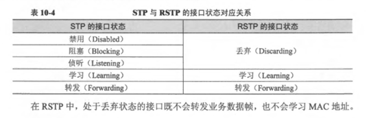

# STP

## 了解STP

> STP在802.1D中定义。

> STP（Spanning Tree Protocol生成树协议）是运行在交换机上的二层破环协议，环路会导致广播风暴、MAC地址表震荡等后果，STP的主要目的就是确保在网络中存在冗余路径时，不会产生环路。

> STP是一个用于局域网中消除环路的协议，它的标准是IEEE 802.1D。运行该协议的设备通过彼此交互信息而发现网络中的环路，STP将部分冗余链路强制为阻塞状态，其他链路处于转发状态。当处于转发状态的链路不可用时，STP重新配置网络，并激活合适的备用链路状态。

> 由于局域网规模的不断增长，生成树协议已经成为当前最重要的局域网协议之一。

### 三要素选举

从环形网络拓扑结构到树形结构，总体来说有三个要素：根桥、根端口和指定端口。

- 根桥：对于一个STP网络，根桥在全网中只有一个，它是整个网络的逻辑中心，但不一定是物理中心。在进行根桥的选择时，一般会选择性能高、网络层次高的交换设备作为根桥。根桥会根据网络拓扑的变化而动态变化。在配置STP过程中，建议手动配置根桥和备份根桥。请配置最核心的交换设备为根桥，以保证STP二层网络的稳定性，否则新接入设备可能会触发STP根切换，从而导致业务短暂中断。
- 根端口：去往根桥路径开销最小的端口，根端口负责向根桥方向转发数据，这个端口的选择标准是依据路径开销判定。在一台设备上所有使能STP的端口中，根路径开销最小者，就是根端口。很显然，在一个运行STP协议的设备上根端口有且只有一个，根桥上没有根端口。
- 指定端口：指定桥向本设备转发配置消息（BPDU报文）的端口或者指定桥向本网段转发配置消息的端口。

此外，交换设备和端口都有ID，分别是桥ID（BID）和端口ID（PID）。端口ID由端口优先级和端口号组成。桥ID由桥优先级和桥MAC两部分组成，在STP网络中，桥ID最小的设备会被选举为根桥。

一旦根桥、根端口、指定端口选举成功，则整个树形拓扑建立完毕。在拓扑稳定后，只有根端口和指定端口转发流量，其他的非根、非指定端口都处于阻塞（Blocking）状态，它们只接收STP协议报文而不转发用户流量。

### 四个比较原则

构成消息优先级向量：{ 根桥ID，根路径开销，发送设备BID，发送端口PID }。

| 字段内容 | 简要说明 |
| -- | -- |
| 根桥ID | 每个STP网络中有且仅有一个根 |
| 根路径开销 | 发送配置BPDU的端口到根桥的距离，决定了到根桥的路径开销 |
| 发送设备BID | 发送配置BPDU的设备的BID |
| 发送端口PID | 发出配置BPDU的端口的PID |

### 五种端口状态

| 端口状态 | 目的 | 说明 |
| -- | -- | -- |
| Forwarding | 端口既转发用户流量也处理BPDU报文 | 只有根端口或指定端口才能进入此状态 |
| Learning | 设备会根据收到的用户流量构建MAC地址表，但不转发用户流量 | 过渡状态，增加Learning状态防止临时环路
| Listening | 确定端口角色，将选举出根桥、根端口和指定端口 | 过渡状态 |
| Blocking | 端口仅仅接收并处理BPDU，不转发用户流量 | 阻塞端口的最终状态 |
| Disabled | 端口不仅不处理BPDU报文，也不转发用户流量 | 端口状态为Down |

### STP报文格式

上述桥ID、路径开销和端口ID等信息都是通过BPDU协议报文传输的。BPDU报文被封装在以太网数据帧中，目的MAC是组播MAC：01-80-C2-00-00-00，Length/Type字段为MAC数据长度，后面是LLC头，LLC之后是BPDU报文头。以太网数据帧格式如下图所示。

在初始化过程中，每个桥都主动发送配置BPDU。但在网络拓扑稳定以后，只有根桥主动发送配置BPDU，其他桥在收到上游传来的配置BPDU后，才触发发送自己的配置BPDU。配置BPDU的长度至少要35个字节，包含了桥ID、路径开销和端口ID等参数，即{根桥ID，累计根路径开销，发送者BID，发送端口PID}。只有当发送者的BID或端口的PID两个字段中至少有一个和本桥接收端口不同，BPDU报文才会被处理，否则丢弃。这样避免了处理和本端口信息一致的BPDU报文。

### STP实现过程

STP的树形结构实现过程如下：

1. 网络初始化时，网络中所有的STP设备都认为自己是“根桥”，根桥ID为自身的设备ID。通过交换BPDU消息，设备之间比较根桥ID，网络中根桥ID最小的设备被选为根桥。根桥上的所有端口都是转发状态。
2. 非根桥设备将接收最优配置消息的那个端口定为根端口，根端口也是处于转发状态。
3. 设备根据根端口的配置消息和根端口的路径开销，为每个端口计算一个指定端口配置消息，然后将计算出的配置消息与角色待定端口自己的配置消息进行比较：
   - 如果计算出的配置消息更优，则该端口被确定为指定端口，其配置消息也被计算出的配置消息替换，并周期性地向外发送；
   - 如果该端口自己的配置消息更优，则不更新该端口的配置消息并将该端口阻塞。该端口将不再转发数据，且只接收不发送配置消息。

### STP算法实现举例

一旦根桥、根端口和指定端口选举成功，整个树形拓扑就建立完毕了。

## 配置STP

### 启动STP

1. `stp mode stp`，配置交换设备的STP模式，缺省情况下，交换机默认运行MSTP模式。
2. （可选）配置根桥和备份根桥
    - `stp root primary`，配置当前设备为根桥设备。
    - `stp root secondary`，配置当前设备为备份根桥设备。
3. （可选）`stp priority {0 ~ 32768}`，配置交换设备在系统中的优先级。缺省为32768，数值越小，优先级越高。
4. （可选）`stp pathcost-standard { dot1d-1998 | dot1t | legacy }`，配置端口路径开销计算方法。缺省为IEEE 802.1t（dot1t）标准方法。同一网络内所有交换设备的端口路径开销应使用相同的计算方法。
5. （可选）配置端口路径开销值及优先级
    1. 进入参与生成树协议计算的接口视图
    2. `stp cost { cost }`，设置当前端口的路径开销值。对于链路速率值相对较小的端口，建议将其路径开销值配置相对较大，以使其在生成树算法中被选举成为阻塞端口，阻塞其所在链路。
    3. `stp port priority { priority }`，配置端口优先级。缺省为128，如希望将某交换设备的端口阻塞从而破除环路，则可将其端口优先级设置的比缺省值大，使其在选举过程中成为被阻塞的端口。
6. `stp enable`，使能交换设备的STP功能。

# RSTP

> RSTP即快速生成树协议，RSTP在802.1W中定义，他引入了新的接口角色，其中替代接口的引入使交换机在根接口失效时，可以立即获得新的路径到达根桥。引入P/A机制，使得指定接口被选举产生后可以快速的进入转发状态，不用像STP一样经历转发延迟时间。它还引入了边缘接口概念，使交换机连接终端设备的接口在初始化之后可以立即进入转发状态。

## 接口角色增加

- ALTE：可以理解为根接口的备份，他是一台设备上由于收到其他设备发送的BPDU从而被阻塞的接口。如果根接口发生故障，那么替代接口将成为新的根接口。
- BACK：备份接口是一台设备上由于收到了自己所发送的BPDU从而被阻塞的接口。如果一台交换机拥有多个接口接入同一个网段，并在这些接口中有一个被选为该网段制定接口，那么这些接口中的其他接口将被选举为备份接口，备份接口将作为该网段到达根桥的冗余接口，缺省为丢弃状态。

## 接口状态

# MSTP

> MSTP在802.1S中定义，该协议兼容STP以及RSTP。该协议不是基于VLAN，而是基于Instance（实例）运行的。所谓Instance，也即一个或多个VLAN的集合。可以将一个或多个VLAN映射到一个Instance，然后MSTP基于该Instance计算生成树。基于Instance计算出的生成树被称为MSTI（多生成树实例），映射到同一个Instance的VLAN共享一颗生成树。可以针对MSTI进行主根桥，次根桥，接口优先级或cost等相关配置。MSTP引入了域的概念，可以将一个大型交换网络划分成多个MST域（多生成树域）。