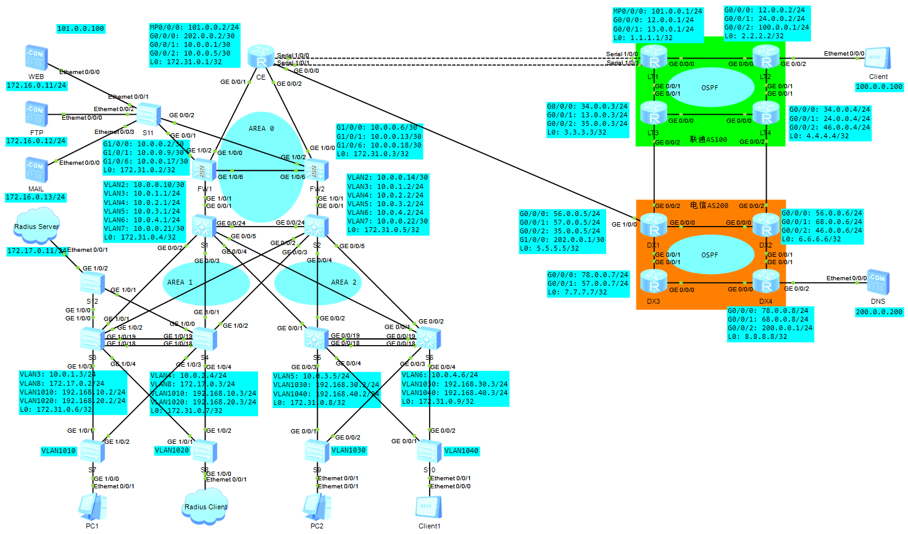
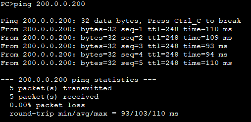
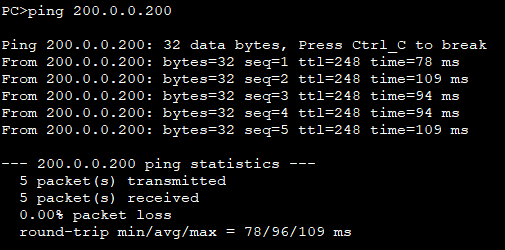
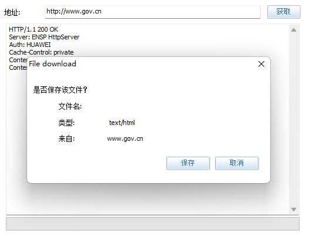
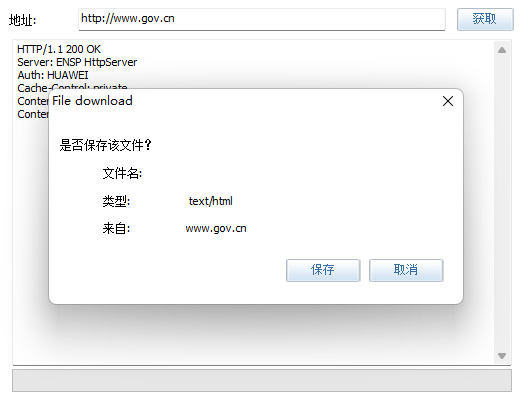
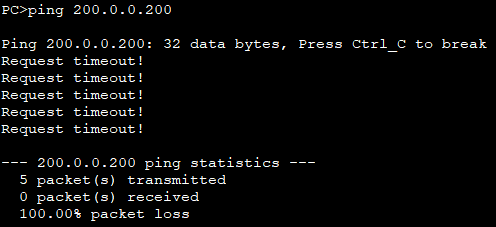
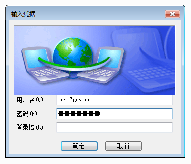
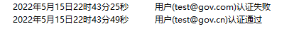
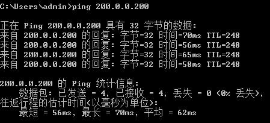

# 面向政府部门的网络安全体系设计

## 环境搭建

- eNSP 1.3.00.100 V100R003C00 SPC100
- USG6000V镜像
- CE6800镜像
- Oracle VM VirtualBox 5.2.44
- VMware Workstation Pro 16.1
- Windows 7
- WinRadius

## 网络规划



### 设备选型

- AR2240: CE、LT1、LT2、LT3、LT4、DX1、DX2、DX3、DX4
- USG6000V: FW1、FW2
- CE6800: S3、S4、S7、S8、S12
- S5700: S1、S2、S5、S6
- S3700: S9、S10、S11

### 政府部门

#### 出口

- 电信分配给政府部门两个IP地址：101.0.0.2、101.0.0.100
- 联通分配给政府部门一个IP地址：202.0.0.2
- 101.0.0.2用作与电信的出口网关
- 202.0.0.2用作与联通的出口网关
- 101.0.0.100用作外网访问服务器的公网IP
- 与电信互联采用PPP链路进行绑定实现MP并采用CHAP双向认证
- 与联通互联采用PPPoE拨号认证
- CE使用NQA绑定静态路由达到路由备份的效果

#### 核心

- FW1和FW2的登录用户名均为admin，密码均为123qwe..
- FW1和FW2采用双机热备
- WEB、FTP和Mail三台服务器部署在DMZ区域
- 内网终端都通过Easy IP访问互联网
- CE上配置DNS Mapping使得内网用户可通过域名访问DMZ中的服务器
- 外网通过静态NAT访问DMZ区域的服务器
- CE和FW1、FW2通过OSPF的区域0发布路由
- FW1、FW2和S1、S2通过OSPF的区域0发布路由
- S1、S2和S3、S4通过OSPF的区域1发布路由
- S1、S2和S5、S6通过OSPF的区域2发布路由
- 通过OSPF进行负载分担

#### 汇聚

- 通信VLAN：VLAN2、VLAN3、VLAN4、VLAN5、VLAN6、VLAN7
- 业务VLAN：VLAN1010、VLAN1020、VLAN1030、VLAN1040
- S3与S4和S5与S6间实现链路聚合保证流量负载均衡
- S3与S4和S5与S6间通过VRRP实现网关冗余并发送VRRP通告报文利用MD5算法对认证字进行加密
- 所有交换机开启MSTP，S3和S4为同个域，S5和S6为同个域
- S3为MSTP1实例1：VLAN1010的根
- S4为MSTP1实例2：VLAN1020的根
- S5为MSTP2实例1：VLAN1030的根
- S6为MSTP2实例2：VLAN1040的根
- 由于模拟器CE6800的DHCP中继存在BUG，所以将S3、S4、S5和S6配置为DHCP服务器
- 应将Radius服务器放置核心DMZ区域，由于模拟器BUG，现将Radius服务器直连S3和S4
- S3通过静态路由学习Radius服务器的网段
- VLAN1010和VLAN1020下的主机开启802.1X认证，只有通过认证的用户才可访问其他网络

#### 接入

- 所有接入交换机开启MSTP
- S7、S8和S3、S4为同个域
- S9、S10和S5、S6为同个域
- 所有接入交换机的与PC直连的设备接口上配置边缘端口和BPDU报文过滤功能

### ISP运营商

- LT1、LT2、LT3和LT4模拟为联通，DX1、DX2、DX3和DX4模拟为电信
- 联通内部路由协议为OSPF，BGP区域为100
- 电信内部路由协议为OSPF，BGP区域为200
- 运营商之间只发布公网IP，不发布运营商内部互通IP
- 公网DNS服务器与电信互联

## 主要配置

### CE

```
#
 sysname CE
#
acl number 2000  
 rule 5 permit source 192.168.0.0 0.0.255.255 
#
aaa
 local-user ce password cipher 123qwe.
 local-user ce privilege level 0
 local-user ce service-type ppp
#
 nat alg dns enable
 #
 nat dns-map www.gov.cn 101.0.0.100 80 tcp
 nat dns-map ftp.gov.cn 101.0.0.100 21 tcp
 nat dns-map mail.gov.cn 101.0.0.100 25 tcp
#
interface Dialer1
 link-protocol ppp
 ppp chap user pppoe
 ppp chap password cipher 123qwe.
 ip address ppp-negotiate
 dialer user pppoe
 dialer bundle 1
 nat outbound 2000
#
interface Mp-group0/0/0
 ip address ppp-negotiate
 nat server protocol tcp global 101.0.0.100 www inside 172.16.0.11 www
 nat server protocol tcp global 101.0.0.100 ftp inside 172.16.0.12 ftp
 nat server protocol tcp global 101.0.0.100 smtp inside 172.16.0.13 smtp
 nat outbound 2000
#
interface Serial1/0/0
 link-protocol ppp
 ppp authentication-mode chap 
 ppp chap user lt1
 ppp chap password cipher 123qwe.
 ppp mp Mp-group 0/0/0
 timer hold 30
#
interface Serial1/0/1
 link-protocol ppp
 ppp authentication-mode chap 
 ppp chap user lt1
 ppp chap password cipher 123qwe.
 ppp mp Mp-group 0/0/0
 timer hold 30
#
interface GigabitEthernet0/0/0
 pppoe-client dial-bundle-number 1 
#
interface GigabitEthernet0/0/1
 ip address 10.0.0.1 255.255.255.252 
#
interface GigabitEthernet0/0/2
 ip address 10.0.0.5 255.255.255.252 
 ospf cost 10
#
interface LoopBack0
 ip address 172.31.0.1 255.255.255.255 
#
ospf 1 router-id 172.31.0.1 
 default-route-advertise always
 area 0.0.0.0 
  network 10.0.0.0 0.0.0.3 
  network 10.0.0.4 0.0.0.3 
  network 172.31.0.1 0.0.0.0 
#
ip route-static 0.0.0.0 0.0.0.0 Dialer1 track nqa admin DX
ip route-static 0.0.0.0 0.0.0.0 Mp-group0/0/0 preference 70 track nqa admin LT
#
nqa test-instance admin DX 
 test-type icmp
 destination-address ipv4 202.0.0.1
 frequency 30
 interval seconds 5
 timeout 5
 probe-count 2
 start now
nqa test-instance admin LT 
 test-type icmp
 destination-address ipv4 101.0.0.1
 frequency 30
 interval seconds 5
 timeout 5
 probe-count 2
 start now
#
```

### DX1

```
#
 sysname DX1
#
aaa
 local-user pppoe password cipher 123qwe.
 local-user pppoe privilege level 0
 local-user pppoe service-type ppp
#
interface Virtual-Template1
 ppp authentication-mode chap domain gov
 remote address 202.0.0.2 
 timer hold 30
 ip address 202.0.0.1 255.255.255.252 
#
interface GigabitEthernet0/0/0
 ip address 56.0.0.5 255.255.255.0 
#
interface GigabitEthernet0/0/1
 ip address 57.0.0.5 255.255.255.0 
#
interface GigabitEthernet0/0/2
 ip address 35.0.0.5 255.255.255.0 
#
interface GigabitEthernet1/0/0
 pppoe-server bind Virtual-Template 1
#
interface LoopBack0
 ip address 5.5.5.5 255.255.255.255 
#
bgp 200
 router-id 5.5.5.5
 peer 6.6.6.6 as-number 200 
 peer 6.6.6.6 connect-interface LoopBack0
 peer 7.7.7.7 as-number 200 
 peer 7.7.7.7 connect-interface LoopBack0
 peer 8.8.8.8 as-number 200 
 peer 8.8.8.8 connect-interface LoopBack0
 peer 35.0.0.3 as-number 100 
 #
 ipv4-family unicast
  undo synchronization
  network 202.0.0.0 255.255.255.252 
  peer 6.6.6.6 enable
  peer 7.7.7.7 enable
  peer 8.8.8.8 enable
  peer 35.0.0.3 enable
#
ospf 1 router-id 5.5.5.5 
 silent-interface GigabitEthernet0/0/2
 area 0.0.0.0 
  network 5.5.5.5 0.0.0.0 
  network 35.0.0.0 0.0.0.255 
  network 56.0.0.0 0.0.0.255 
  network 57.0.0.0 0.0.0.255 
#
```

### DX2

```
#
 sysname DX2
#
interface GigabitEthernet0/0/0
 ip address 56.0.0.6 255.255.255.0 
#
interface GigabitEthernet0/0/1
 ip address 68.0.0.6 255.255.255.0 
#
interface GigabitEthernet0/0/2
 ip address 46.0.0.6 255.255.255.0 
#
interface LoopBack0
 ip address 6.6.6.6 255.255.255.255 
#
bgp 200
 router-id 6.6.6.6
 peer 5.5.5.5 as-number 200 
 peer 5.5.5.5 connect-interface LoopBack0
 peer 7.7.7.7 as-number 200 
 peer 7.7.7.7 connect-interface LoopBack0
 peer 8.8.8.8 as-number 200 
 peer 8.8.8.8 connect-interface LoopBack0
 peer 46.0.0.4 as-number 100 
 #
 ipv4-family unicast
  undo synchronization
  peer 5.5.5.5 enable
  peer 7.7.7.7 enable
  peer 8.8.8.8 enable
  peer 46.0.0.4 enable
#
ospf 1 router-id 6.6.6.6 
 silent-interface GigabitEthernet0/0/2
 area 0.0.0.0 
  network 6.6.6.6 0.0.0.0 
  network 46.0.0.0 0.0.0.255 
  network 56.0.0.0 0.0.0.255 
  network 68.0.0.0 0.0.0.255 
#
```

### DX3

```
#
 sysname DX3
#
interface GigabitEthernet0/0/0
 ip address 78.0.0.7 255.255.255.0 
#
interface GigabitEthernet0/0/1
 ip address 57.0.0.7 255.255.255.0 
#
interface LoopBack0
 ip address 7.7.7.7 255.255.255.255 
#
bgp 200
 router-id 7.7.7.7
 peer 5.5.5.5 as-number 200 
 peer 5.5.5.5 connect-interface LoopBack0
 peer 6.6.6.6 as-number 200 
 peer 6.6.6.6 connect-interface LoopBack0
 peer 8.8.8.8 as-number 200 
 peer 8.8.8.8 connect-interface LoopBack0
 #
 ipv4-family unicast
  undo synchronization
  peer 5.5.5.5 enable
  peer 6.6.6.6 enable
  peer 8.8.8.8 enable
#
ospf 1 router-id 7.7.7.7 
 area 0.0.0.0 
  network 7.7.7.7 0.0.0.0 
  network 57.0.0.0 0.0.0.255 
  network 78.0.0.0 0.0.0.255 
#
```

### DX4

```
#
 sysname DX4
#
interface GigabitEthernet0/0/0
 ip address 78.0.0.8 255.255.255.0 
#
interface GigabitEthernet0/0/1
 ip address 68.0.0.8 255.255.255.0 
#
interface GigabitEthernet0/0/2
 ip address 200.0.0.1 255.255.255.0 
#
interface LoopBack0
 ip address 8.8.8.8 255.255.255.255 
#
bgp 200
 router-id 8.8.8.8
 peer 5.5.5.5 as-number 200 
 peer 5.5.5.5 connect-interface LoopBack0
 peer 6.6.6.6 as-number 200 
 peer 6.6.6.6 connect-interface LoopBack0
 peer 7.7.7.7 as-number 200 
 peer 7.7.7.7 connect-interface LoopBack0
 #
 ipv4-family unicast
  undo synchronization
  network 200.0.0.0 
  peer 5.5.5.5 enable
  peer 6.6.6.6 enable
  peer 7.7.7.7 enable
#
ospf 1 router-id 8.8.8.8 
 silent-interface GigabitEthernet0/0/2
 area 0.0.0.0 
  network 8.8.8.8 0.0.0.0 
  network 68.0.0.0 0.0.0.255 
  network 78.0.0.0 0.0.0.255 
#
```

### FW1

```
#
sysname FW1
#
 hrp enable
 hrp interface GigabitEthernet1/0/6 remote 10.0.0.18
 hrp mirror session enable
 undo hrp adjust ospf-cost enable
 hrp track interface GigabitEthernet1/0/0
 hrp track interface GigabitEthernet1/0/1
#
interface GigabitEthernet1/0/0
 undo shutdown
 ip address 10.0.0.2 255.255.255.252
 service-manage ping permit
#
interface GigabitEthernet1/0/1
 undo shutdown
 ip address 10.0.0.9 255.255.255.252
 service-manage ping permit
#
interface GigabitEthernet1/0/2
 undo shutdown
 ip address 172.16.0.2 255.255.255.0
 vrrp vrid 1 virtual-ip 172.16.0.1 active
 vrrp vrid 1 authentication-mode md5 server
 service-manage ping permit
#
interface GigabitEthernet1/0/6
 undo shutdown
 ip address 10.0.0.17 255.255.255.252
 service-manage ping permit
#
interface LoopBack0
 ip address 172.31.0.2 255.255.255.255
#
firewall zone trust
 add interface GigabitEthernet1/0/1
#
firewall zone untrust
 add interface GigabitEthernet1/0/0
#
firewall zone dmz
 add interface GigabitEthernet1/0/2
 add interface GigabitEthernet1/0/6
#
ospf 1 router-id 172.31.0.2
 silent-interface GigabitEthernet1/0/2
 area 0.0.0.0
  network 10.0.0.0 0.0.0.3
  network 10.0.0.8 0.0.0.3
  network 172.16.0.0 0.0.0.255
  network 172.31.0.2 0.0.0.0
#
security-policy
 rule name LAN_WAN
  source-zone local
  source-zone trust
  destination-zone dmz
  destination-zone local
  destination-zone trust
  destination-zone untrust
  action permit
 rule name WAN_DMZ
  source-zone dmz
  source-zone local
  source-zone untrust
  destination-zone dmz
  destination-zone local
  destination-zone untrust
  action permit
#
```

### FW2

```
#
sysname FW2
#
 hrp enable
 hrp standby-device
 hrp interface GigabitEthernet1/0/6 remote 10.0.0.17
 hrp mirror session enable
 undo hrp adjust ospf-cost enable
 hrp track interface GigabitEthernet1/0/0
 hrp track interface GigabitEthernet1/0/1
#
interface GigabitEthernet1/0/0
 undo shutdown
 ip address 10.0.0.6 255.255.255.252
#
interface GigabitEthernet1/0/1
 undo shutdown
 ip address 10.0.0.13 255.255.255.252
 service-manage ping permit
#
interface GigabitEthernet1/0/2
 undo shutdown
 ip address 172.16.0.3 255.255.255.0
 vrrp vrid 1 virtual-ip 172.16.0.1 standby
 vrrp vrid 1 authentication-mode md5 server
 service-manage ping permit
#
interface GigabitEthernet1/0/6
 undo shutdown
 ip address 10.0.0.18 255.255.255.252
#
interface LoopBack0
 ip address 172.31.0.3 255.255.255.255
#
firewall zone trust
 add interface GigabitEthernet1/0/1
#
firewall zone untrust
 add interface GigabitEthernet1/0/0
#
firewall zone dmz
 add interface GigabitEthernet1/0/2
 add interface GigabitEthernet1/0/6
#
ospf 1 router-id 172.31.0.3
 silent-interface GigabitEthernet1/0/2
 area 0.0.0.0
  network 10.0.0.4 0.0.0.3
  network 10.0.0.12 0.0.0.3
  network 172.16.0.0 0.0.0.255
  network 172.31.0.3 0.0.0.0
#
security-policy
 rule name LAN_WAN
  source-zone local
  source-zone trust
  destination-zone dmz
  destination-zone local
  destination-zone trust
  destination-zone untrust
  action permit
 rule name WAN_DMZ
  source-zone dmz
  source-zone local
  source-zone untrust
  destination-zone dmz
  destination-zone local
  destination-zone untrust
  action permit
#
```

### LT1

```
#
 sysname LT1
#
aaa
 local-user lt1 password cipher 123qwe.
 local-user lt1 privilege level 0
 local-user lt1 service-type ppp
#
interface Mp-group0/0/0
 remote address 101.0.0.2 
 ip address 101.0.0.1 255.255.255.0 
#
interface Serial1/0/0
 link-protocol ppp
 ppp authentication-mode chap 
 ppp chap user ce
 ppp chap password cipher 123qwe.
 ppp mp Mp-group 0/0/0
 timer hold 30
#
interface Serial1/0/1
 link-protocol ppp
 ppp authentication-mode chap 
 ppp chap user ce
 ppp chap password cipher 123qwe.
 ppp mp Mp-group 0/0/0
 timer hold 30
#
interface GigabitEthernet0/0/0
 ip address 12.0.0.1 255.255.255.0 
#
interface GigabitEthernet0/0/1
 ip address 13.0.0.1 255.255.255.0 
#
interface LoopBack0
 ip address 1.1.1.1 255.255.255.255 
#
bgp 100
 router-id 1.1.1.1
 peer 2.2.2.2 as-number 100 
 peer 2.2.2.2 connect-interface LoopBack0
 peer 3.3.3.3 as-number 100 
 peer 3.3.3.3 connect-interface LoopBack0
 peer 4.4.4.4 as-number 100 
 peer 4.4.4.4 connect-interface LoopBack0
 #
 ipv4-family unicast
  undo synchronization
  network 101.0.0.0 255.255.255.0 
  peer 2.2.2.2 enable
  peer 3.3.3.3 enable
  peer 4.4.4.4 enable
#
ospf 1 router-id 1.1.1.1 
 area 0.0.0.0 
  network 1.1.1.1 0.0.0.0 
  network 12.0.0.0 0.0.0.255 
  network 13.0.0.0 0.0.0.255 
#
```

### LT2

```
#
 sysname LT2
#
interface GigabitEthernet0/0/0
 ip address 12.0.0.2 255.255.255.0 
#
interface GigabitEthernet0/0/1
 ip address 24.0.0.2 255.255.255.0 
#
interface GigabitEthernet0/0/2
 ip address 100.0.0.1 255.255.255.0 
#
interface LoopBack0
 ip address 2.2.2.2 255.255.255.255 
#
bgp 100
 router-id 2.2.2.2
 peer 1.1.1.1 as-number 100 
 peer 1.1.1.1 connect-interface LoopBack0
 peer 3.3.3.3 as-number 100 
 peer 3.3.3.3 connect-interface LoopBack0
 peer 4.4.4.4 as-number 100 
 peer 4.4.4.4 connect-interface LoopBack0
 #
 ipv4-family unicast
  undo synchronization
  network 100.0.0.0 255.255.255.0 
  peer 1.1.1.1 enable
  peer 3.3.3.3 enable
  peer 4.4.4.4 enable
#
ospf 1 router-id 2.2.2.2 
 area 0.0.0.0 
  network 2.2.2.2 0.0.0.0 
  network 12.0.0.0 0.0.0.255 
  network 24.0.0.0 0.0.0.255 
#
```

### LT3

```
#
 sysname LT3
#
interface GigabitEthernet0/0/0
 ip address 34.0.0.3 255.255.255.0 
#
interface GigabitEthernet0/0/1
 ip address 13.0.0.3 255.255.255.0 
#
interface GigabitEthernet0/0/2
 ip address 35.0.0.3 255.255.255.0 
#
interface LoopBack0
 ip address 3.3.3.3 255.255.255.255 
#
bgp 100
 router-id 3.3.3.3
 peer 1.1.1.1 as-number 100 
 peer 1.1.1.1 connect-interface LoopBack0
 peer 2.2.2.2 as-number 100 
 peer 2.2.2.2 connect-interface LoopBack0
 peer 4.4.4.4 as-number 100 
 peer 4.4.4.4 connect-interface LoopBack0
 peer 35.0.0.5 as-number 200 
 #
 ipv4-family unicast
  undo synchronization
  peer 1.1.1.1 enable
  peer 2.2.2.2 enable
  peer 4.4.4.4 enable
  peer 35.0.0.5 enable
#
ospf 1 router-id 3.3.3.3 
 silent-interface GigabitEthernet0/0/2
 area 0.0.0.0 
  network 3.3.3.3 0.0.0.0 
  network 13.0.0.0 0.0.0.255 
  network 34.0.0.0 0.0.0.255 
  network 35.0.0.0 0.0.0.255 
#
```

### LT4

```
#
 sysname LT4
#
interface GigabitEthernet0/0/0
 ip address 34.0.0.4 255.255.255.0 
#
interface GigabitEthernet0/0/1
 ip address 24.0.0.4 255.255.255.0 
#
interface GigabitEthernet0/0/2
 ip address 46.0.0.4 255.255.255.0 
#
interface LoopBack0
 ip address 4.4.4.4 255.255.255.255 
#
bgp 100
 router-id 4.4.4.4
 peer 1.1.1.1 as-number 100 
 peer 1.1.1.1 connect-interface LoopBack0
 peer 2.2.2.2 as-number 100 
 peer 2.2.2.2 connect-interface LoopBack0
 peer 3.3.3.3 as-number 100 
 peer 3.3.3.3 connect-interface LoopBack0
 peer 46.0.0.6 as-number 200 
 #
 ipv4-family unicast
  undo synchronization
  peer 1.1.1.1 enable
  peer 2.2.2.2 enable
  peer 3.3.3.3 enable
  peer 46.0.0.6 enable
#
ospf 1 router-id 4.4.4.4 
 silent-interface GigabitEthernet0/0/2
 area 0.0.0.0 
  network 4.4.4.4 0.0.0.0 
  network 24.0.0.0 0.0.0.255 
  network 34.0.0.0 0.0.0.255 
  network 46.0.0.0 0.0.0.255 
#
```

### S1

```
#
sysname S1
#
vlan batch 2 to 7
#
stp disable
#
interface Vlanif2
 ip address 10.0.0.10 255.255.255.252 
#
interface Vlanif3
 ip address 10.0.1.1 255.255.255.0 
#
interface Vlanif4
 ip address 10.0.2.1 255.255.255.0 
#
interface Vlanif5
 ip address 10.0.3.1 255.255.255.0 
 ospf cost 10
#
interface Vlanif6
 ip address 10.0.4.1 255.255.255.0 
 ospf cost 10
#
interface Vlanif7
 ip address 10.0.0.21 255.255.255.252 
#
interface GigabitEthernet0/0/1
 port link-type access
 port default vlan 2
#
interface GigabitEthernet0/0/2
 port link-type access
 port default vlan 3
#
interface GigabitEthernet0/0/3
 port link-type access
 port default vlan 4
#
interface GigabitEthernet0/0/4
 port link-type access
 port default vlan 5
#
interface GigabitEthernet0/0/5
 port link-type access
 port default vlan 6
#
interface GigabitEthernet0/0/24
 port link-type access
 port default vlan 7
#
interface LoopBack0
 ip address 172.31.0.4 255.255.255.255 
#
ospf 1 router-id 172.31.0.4 
 area 0.0.0.0 
  network 10.0.0.8 0.0.0.3 
  network 10.0.0.20 0.0.0.3 
  network 172.31.0.4 0.0.0.0 
 area 0.0.0.1 
  network 10.0.1.0 0.0.0.255 
  network 10.0.2.0 0.0.0.255 
 area 0.0.0.2 
  network 10.0.3.0 0.0.0.255 
  network 10.0.4.0 0.0.0.255 
#
```

### S2

```
#
sysname S2
#
vlan batch 2 to 7
#
stp disable
#
interface Vlanif2
 ip address 10.0.0.14 255.255.255.252 
#
interface Vlanif3
 ip address 10.0.1.2 255.255.255.0 
 ospf cost 10
#
interface Vlanif4
 ip address 10.0.2.2 255.255.255.0 
 ospf cost 10
#
interface Vlanif5
 ip address 10.0.3.2 255.255.255.0 
#
interface Vlanif6
 ip address 10.0.4.2 255.255.255.0 
#
interface Vlanif7
 ip address 10.0.0.22 255.255.255.252 
#
interface GigabitEthernet0/0/1
 port link-type access
 port default vlan 2
#
interface GigabitEthernet0/0/2
 port link-type access
 port default vlan 3
#
interface GigabitEthernet0/0/3
 port link-type access
 port default vlan 4
#
interface GigabitEthernet0/0/4
 port link-type access
 port default vlan 5
#
interface GigabitEthernet0/0/5
 port link-type access
 port default vlan 6
#
interface GigabitEthernet0/0/24
 port link-type access
 port default vlan 7
#
interface LoopBack0
 ip address 172.31.0.5 255.255.255.255 
#
ospf 1 router-id 172.31.0.5 
 area 0.0.0.0 
  network 10.0.0.12 0.0.0.3 
  network 10.0.0.20 0.0.0.3 
  network 172.31.0.5 0.0.0.0 
 area 0.0.0.1 
  network 10.0.1.0 0.0.0.255 
  network 10.0.2.0 0.0.0.255 
 area 0.0.0.2 
  network 10.0.3.0 0.0.0.255 
  network 10.0.4.0 0.0.0.255 
#
```

### S3

```
#
sysname S3
#
vlan batch 3 8 1010 1020
#
stp instance 1 root primary
stp instance 2 root secondary
stp enable
#
dhcp enable
#
dot1x enable
domain gov.cn
#
radius enable
#
radius server group radius
 radius server shared-key-cipher 123qwe.
 radius server authentication 172.17.0.11 1812
#
stp region-configuration
 region-name MSTP1
 instance 1 vlan 1010
 instance 2 vlan 1020
#
ip pool vlan1010
 gateway-list 192.168.10.1 
 network 192.168.10.0 mask 255.255.255.0
 excluded-ip-address 192.168.10.2 192.168.10.10
 excluded-ip-address 192.168.10.150 192.168.10.254
 lease day 0 hour 8 minute 0
 dns-list 200.0.0.200 
#
ip pool vlan1020
 gateway-list 192.168.20.1 
 network 192.168.20.0 mask 255.255.255.0
 excluded-ip-address 192.168.20.2 192.168.20.149
 lease day 0 hour 8 minute 0
 dns-list 200.0.0.200 
#
aaa
 #
 authentication-scheme radius
  authentication-mode radius
 #
 domain gov.cn
  authentication-scheme radius
  radius server group radius
#
interface Vlanif3
 ip address 10.0.1.3 255.255.255.0
#
interface Vlanif8
 ip address 172.17.0.2 255.255.255.0
 vrrp vrid 8 virtual-ip 172.17.0.1
 vrrp vrid 8 authentication-mode md5 radius
#
interface Vlanif1010
 ip address 192.168.10.2 255.255.255.0
 vrrp vrid 10 virtual-ip 192.168.10.1
 vrrp vrid 10 authentication-mode md5 vlan1010
#
interface Vlanif1020
 ip address 192.168.20.2 255.255.255.0
 vrrp vrid 20 virtual-ip 192.168.20.1
 vrrp vrid 20 priority 50
 vrrp vrid 20 authentication-mode md5 vlan1020
 ospf cost 10
#
interface Eth-Trunk1
 port link-type trunk
 undo port trunk allow-pass vlan 1
 port trunk allow-pass vlan 1010 1020
 stp bpdu vlan 1010
#
interface GE1/0/0
 undo shutdown
 port default vlan 8
#
interface GE1/0/1
 undo shutdown
 port default vlan 3
 stp disable
#
interface GE1/0/2
 undo shutdown
 port default vlan 3
 stp disable
#
interface GE1/0/3
 undo shutdown
 port link-type trunk
 undo port trunk allow-pass vlan 1
 port trunk allow-pass vlan 1010
 stp bpdu vlan 1010
 dot1x enable
#
interface GE1/0/4
 undo shutdown
 port link-type trunk
 undo port trunk allow-pass vlan 1
 port trunk allow-pass vlan 1020
 stp bpdu vlan 1020
 dot1x enable
#
interface GE1/0/18
 undo shutdown
 eth-trunk 1
#
interface GE1/0/19
 undo shutdown
 eth-trunk 1
#
ospf 1 router-id 172.31.0.6
 silent-interface Vlanif1010
 silent-interface Vlanif1020
 nexthop 10.0.1.1 weight 1
 area 0.0.0.1
  network 10.0.1.0 0.0.0.255
  network 10.0.2.0 0.0.0.255
  network 172.31.0.6 0.0.0.0
  network 192.168.0.0 0.0.255.255
#
```

### S4

```
#
sysname S4
#
vlan batch 4 8 1010 1020
#
stp instance 1 root secondary
stp instance 2 root primary
stp enable
#
dhcp enable
#
dot1x enable
domain gov.cn
#
radius enable
#
radius server group radius
 radius server shared-key-cipher 123qwe.
 radius server authentication 172.17.0.11 1812
#
stp region-configuration
 region-name MSTP1
 instance 1 vlan 1010
 instance 2 vlan 1020
#
ip pool vlan1010
 gateway-list 192.168.10.1 
 network 192.168.10.0 mask 255.255.255.0
 excluded-ip-address 192.168.10.2 192.168.10.149
 lease day 0 hour 8 minute 0
 dns-list 200.0.0.200 
#
ip pool vlan1020
 gateway-list 192.168.20.1 
 network 192.168.20.0 mask 255.255.255.0
 excluded-ip-address 192.168.20.2 192.168.20.10
 excluded-ip-address 192.168.20.150 192.168.20.254
 lease day 0 hour 8 minute 0
 dns-list 200.0.0.200 
#
aaa
 #
 authentication-scheme default
 #
 authentication-scheme radius
  authentication-mode radius
 #
 domain gov.cn
  authentication-scheme radius
  radius server group radius
#
interface Vlanif4
 ip address 10.0.2.4 255.255.255.0
#
interface Vlanif8
 ip address 172.17.0.3 255.255.255.0
 vrrp vrid 8 virtual-ip 172.17.0.1
 vrrp vrid 8 priority 50
 vrrp vrid 8 authentication-mode md5 radius
#
interface Vlanif1010
 ip address 192.168.10.3 255.255.255.0
 vrrp vrid 10 virtual-ip 192.168.10.1
 vrrp vrid 10 priority 50
 vrrp vrid 10 authentication-mode md5 vlan1010
 ospf cost 10
#
interface Vlanif1020
 ip address 192.168.20.3 255.255.255.0
 vrrp vrid 20 virtual-ip 192.168.20.1
 vrrp vrid 20 authentication-mode md5 vlan1020
#
interface Eth-Trunk1
 port link-type trunk
 undo port trunk allow-pass vlan 1
 port trunk allow-pass vlan 1010 1020
 stp bpdu vlan 1010
#
interface GE1/0/0
 undo shutdown
 port default vlan 8
#
interface GE1/0/1
 undo shutdown
 port default vlan 4
 stp disable
#
interface GE1/0/2
 undo shutdown
 port default vlan 4
 stp disable
#
interface GE1/0/3
 undo shutdown
 port link-type trunk
 undo port trunk allow-pass vlan 1
 port trunk allow-pass vlan 1010
 stp bpdu vlan 1010
 dot1x enable
#
interface GE1/0/4
 undo shutdown
 port link-type trunk
 undo port trunk allow-pass vlan 1
 port trunk allow-pass vlan 1020
 stp bpdu vlan 1020
 dot1x enable
#
interface GE1/0/18
 undo shutdown
 eth-trunk 1
#
interface GE1/0/19
 undo shutdown
 eth-trunk 1
#
interface LoopBack0
 ip address 172.31.0.7 255.255.255.255
#
ospf 1 router-id 172.31.0.7
 silent-interface Vlanif1010
 silent-interface Vlanif1020
 nexthop 10.0.2.1 weight 1
 area 0.0.0.1
  network 10.0.2.0 0.0.0.255
  network 172.31.0.7 0.0.0.0
  network 192.168.0.0 0.0.255.255
#
```

### S5

```
#
sysname S5
#
vlan batch 5 1030 1040
#
stp instance 1 root primary
stp instance 2 root secondary
#
dhcp enable
#
stp region-configuration
 region-name MSTP2
 instance 1 vlan 1030 
 instance 2 vlan 1040 
 active region-configuration
#
ip pool vlan1030
 gateway-list 192.168.30.1 
 network 192.168.30.0 mask 255.255.255.0 
 excluded-ip-address 192.168.30.2 192.168.30.10 
 excluded-ip-address 192.168.30.150 192.168.30.254 
 lease day 0 hour 8 minute 0 
 dns-list 200.0.0.200 
#
ip pool vlan1040
 gateway-list 192.168.40.1 
 network 192.168.40.0 mask 255.255.255.0 
 excluded-ip-address 192.168.40.2 192.168.40.149 
 lease day 0 hour 8 minute 0 
 dns-list 200.0.0.200 
#
interface Vlanif5
 ip address 10.0.3.5 255.255.255.0 
#
interface Vlanif1030
 ip address 192.168.30.2 255.255.255.0 
 vrrp vrid 30 virtual-ip 192.168.30.1
 vrrp vrid 30 authentication-mode md5 vlan1030
 dhcp select global
#
interface Vlanif1040
 ip address 192.168.40.3 255.255.255.0 
 vrrp vrid 40 virtual-ip 192.168.40.1
 vrrp vrid 40 priority 50
 vrrp vrid 40 authentication-mode md5 vlan1040
 ospf cost 10
 dhcp select global
#
interface Eth-Trunk1
 port link-type trunk
 undo port trunk allow-pass vlan 1
 port trunk allow-pass vlan 1030 1040
 stp bpdu vlan 1030
#
interface GigabitEthernet0/0/1
 port link-type access
 port default vlan 5
 stp disable
#
interface GigabitEthernet0/0/2
 port link-type access
 port default vlan 5
 stp disable
#
interface GigabitEthernet0/0/3
 port link-type trunk
 undo port trunk allow-pass vlan 1
 port trunk allow-pass vlan 1030
 stp bpdu vlan 1030
#
interface GigabitEthernet0/0/4
 port link-type trunk
 undo port trunk allow-pass vlan 1
 port trunk allow-pass vlan 1040
 stp bpdu vlan 1040
#
interface GigabitEthernet0/0/18
 eth-trunk 1
#
interface GigabitEthernet0/0/19
 eth-trunk 1
#
interface LoopBack0
 ip address 172.31.0.8 255.255.255.255 
#
ospf 1 router-id 172.31.0.8 
 silent-interface Vlanif1030
 silent-interface Vlanif1040
 nexthop 10.0.3.2 weight 1 
 area 0.0.0.2 
  network 10.0.3.0 0.0.0.255 
  network 172.31.0.8 0.0.0.0 
  network 192.168.0.0 0.0.255.255 
#
```

### S6

```
#
sysname S6
#
vlan batch 6 1030 1040
#
stp instance 1 root secondary
stp instance 2 root primary
#
dhcp enable
#
stp region-configuration
 region-name MSTP2
 instance 1 vlan 1030 
 instance 2 vlan 1040 
 active region-configuration
#
ip pool vlan1030
 gateway-list 192.168.30.1 
 network 192.168.30.0 mask 255.255.255.0 
 excluded-ip-address 192.168.30.2 192.168.30.149 
 lease day 0 hour 8 minute 0 
 dns-list 200.0.0.200 
#
ip pool vlan1040
 gateway-list 192.168.40.1 
 network 192.168.40.0 mask 255.255.255.0 
 excluded-ip-address 192.168.40.2 192.168.40.10 
 excluded-ip-address 192.168.40.150 192.168.40.254 
 lease day 0 hour 8 minute 0 
 dns-list 200.0.0.200 
#
interface Vlanif6
 ip address 10.0.4.6 255.255.255.0 
#
interface Vlanif1030
 ip address 192.168.30.3 255.255.255.0 
 vrrp vrid 30 virtual-ip 192.168.30.1
 vrrp vrid 30 priority 50
 vrrp vrid 30 authentication-mode md5 vlan1030
 ospf cost 10
 dhcp select global
#
interface Vlanif1040
 ip address 192.168.40.3 255.255.255.0 
 vrrp vrid 40 virtual-ip 192.168.40.1
 vrrp vrid 40 authentication-mode md5 vlan1040
 dhcp select global
#
interface Eth-Trunk1
 port link-type trunk
 undo port trunk allow-pass vlan 1
 port trunk allow-pass vlan 1030 1040
 stp bpdu vlan 1030
#
interface GigabitEthernet0/0/1
 port link-type access
 port default vlan 6
 stp disable
#
interface GigabitEthernet0/0/2
 port link-type access
 port default vlan 6
 stp disable
#
interface GigabitEthernet0/0/3
 port link-type trunk
 undo port trunk allow-pass vlan 1
 port trunk allow-pass vlan 1030
 stp bpdu vlan 1030
#
interface GigabitEthernet0/0/4
 port link-type trunk
 undo port trunk allow-pass vlan 1
 port trunk allow-pass vlan 1040
 stp bpdu vlan 1040
#
interface GigabitEthernet0/0/18
 eth-trunk 1
#
interface GigabitEthernet0/0/19
 eth-trunk 1
#
ospf 1 router-id 172.31.0.9 
 silent-interface Vlanif1030
 silent-interface Vlanif1040
 nexthop 10.0.4.2 weight 1 
 area 0.0.0.2 
  network 10.0.4.0 0.0.0.255 
  network 172.31.0.9 0.0.0.0 
  network 192.168.0.0 0.0.255.255 
#
```

### S7

```
#
sysname S7
#
vlan batch 1010
#
stp bpdu-filter default
stp bpdu-protection
stp enable
#
stp region-configuration
 region-name MSTP1
 instance 1 vlan 1010
 instance 2 vlan 1020
#
interface GE1/0/0
 undo shutdown
 port default vlan 1010
 stp edged-port enable
#
interface GE1/0/1
 undo shutdown
 port link-type trunk
 undo port trunk allow-pass vlan 1
 port trunk allow-pass vlan 1010
 stp bpdu vlan 1010
#
interface GE1/0/2
 undo shutdown
 port link-type trunk
 undo port trunk allow-pass vlan 1
 port trunk allow-pass vlan 1010
 stp bpdu vlan 1010
#
```

### S8

```
#
sysname S8
#
vlan batch 1020
#
stp bpdu-filter default
stp bpdu-protection
stp enable
#
stp region-configuration
 region-name MSTP1
 instance 1 vlan 1010
 instance 2 vlan 1020
#
interface GE1/0/0
 undo shutdown
 port default vlan 1020
#
interface GE1/0/1
 undo shutdown
 port link-type trunk
 undo port trunk allow-pass vlan 1
 port trunk allow-pass vlan 1020
 stp bpdu vlan 1020
#
interface GE1/0/2
 undo shutdown
 port link-type trunk
 undo port trunk allow-pass vlan 1
 port trunk allow-pass vlan 1020
 stp bpdu vlan 1020
#
```

### S9

```
#
sysname S9
#
vlan batch 1030
#
stp bpdu-filter default
stp bpdu-protection
#
stp region-configuration
 region-name MSTP2
 instance 1 vlan 1030 
 instance 2 vlan 1040 
 active region-configuration
#
interface Ethernet0/0/1
 port link-type access
 port default vlan 1030
 stp edged-port enable
#
interface GigabitEthernet0/0/1
 port link-type trunk
 undo port trunk allow-pass vlan 1
 port trunk allow-pass vlan 1030
 stp bpdu vlan 1030
#
interface GigabitEthernet0/0/2
 port link-type trunk
 undo port trunk allow-pass vlan 1
 port trunk allow-pass vlan 1030
 stp bpdu vlan 1030
#
```

### S10

```
#
sysname S10
#
vlan batch 1040
#
stp bpdu-filter default
stp bpdu-protection
#
stp region-configuration
 region-name MSTP2
 instance 1 vlan 1030 
 instance 2 vlan 1040 
 active region-configuration
#
interface Ethernet0/0/1
 port link-type access
 port default vlan 1040
 stp edged-port enable
#
interface GigabitEthernet0/0/1
 port link-type trunk
 undo port trunk allow-pass vlan 1
 port trunk allow-pass vlan 1040
 stp bpdu vlan 1040
#
interface GigabitEthernet0/0/2
 port link-type trunk
 undo port trunk allow-pass vlan 1
 port trunk allow-pass vlan 1040
 stp bpdu vlan 1040
#
```

### S11

```
#
sysname S11
#
stp disable
#
```

### S12

```
#
sysname S12
#
interface GE1/0/0
 undo shutdown
#
interface GE1/0/1
 undo shutdown
#
interface GE1/0/2
 undo shutdown
#
```

## 完成测试

1. 使用PC2 ping 公网DNS服务器，模拟内网访问外网

    

2. 将S2设备关闭，模拟设备故障，使用PC2 ping 公网DNS服务器

    

3. 将WEB服务器和公网DNS服务器启动后，配置Client1的DNS地址为公网DNS服务器 `200.0.0.200`，使用HttpClient访问 `http://www.gov.cn`

    

4. 配置Client的DNS地址为公网DNS服务器 `200.0.0.200`，使用HttpClient访问 `http://www.gov.cn`，模拟外网设备访问DMZ区域的服务器

    

5. 将Raius Server开启后，使用未进行认证的PC1 ping 公网DNS服务器

    

6. 使用虚拟机中的Windows 7模拟Raius Client，进行Radius认证

    

7. 查看Radius Server认证结果

    

8. 使用Windows 7 ping 公网DNS服务器

    