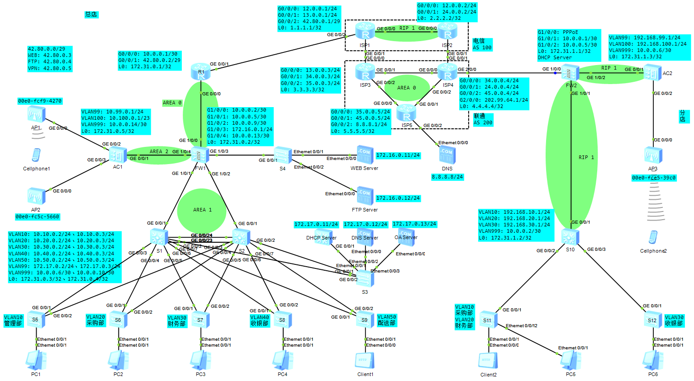

# 某大型连锁超市的网络规划与设计

## 环境搭建

- eNSP 1.3.00.100 V100R003C00 SPC100
- USG6000V镜像
- Oracle VM VirtualBox 5.2.44

## 网络规划



### 总店

#### 出口

- 运营商分配给总店42.80.0.0/29网段
- 42.80.0.1为ISP网关
- 42.80.0.2为出口IP
- 42.80.0.3为WEB服务器
- 42.80.0.4为FTP服务器
- 42.80.0.5为VPN
- R1的出口IP配置为静态IP

#### 核心

- FW1的登录用户名为admin，密码为123qwe..
- WEB和FTP两台服务器部署在DMZ区域
- 内网终端都通过Easy IP访问互联网
- 外网通过静态NAT访问DMZ区域的WEB和FTP服务器
- R1和FW1通过OSPF的区域0发布路由
- FW1和S1、S2通过OSPF的区域1发布路由
- FW1和AC1通过OSPF的区域2发布路由
- 分店通过IPSec VPN连接FW1后可以访问内网服务器组
- 办公区为trust区域，顾客Wi-Fi为untrust区域
- R1上配置DNS Mapping使得内网用户可通过公网DNS使用域名访问内网中的服务器

#### 汇聚

- 业务VLAN：VLAN10（管理部）、VLAN20（采购部）、VLAN30（财务部）、VLAN40（收银部）、VLAN50（配送部）
- 通信VLAN：VLAN99（内网服务器组）、VLAN999（S1和S2与FW1通信）
- S1和S2间实现链路聚合保证流量负载均衡
- S1和S2间通过VRRP实现网关冗余并发送VRRP通告报文利用MD5算法对认证字进行加密
- S1和S2开启MSTP并设置实例1和实例2
- S1为MSTP实例1：VLAN10、VLAN20、VLAN30的根
- S2为MSTP实例2：VLAN40、VLAN50、VLAN99的根
- DHCP、DNS、OA三台服务器部署在内网，仅允许内网用户访问
- 内网的DHCP服务器为业务VLAN下的所有PC下发IP地址

#### 接入

- 所有接入交换机开启MSTP与S1和S2在同一个域内
- 所有接入交换机的与PC直连的设备接口上配置边缘端口和BPDU报文过滤功能
- 配置与PC直连出入方向的接口限速为不超过10Mb，配置向汇聚层出入方向的接口限速为不超过200Mb
- 顾客无线的SSID为guest，无密码
- AC1为AP组和Wi-Fi的DHCP服务器
- 为防止非法AP，配置非法设备检测和反制
- AP组仅开启2.4G频率
- 为预防AP间信道冲突，AP1的信道为1，AP2的信道为11
- 限制AP下每个STA的上行速率不超过1Mb，下行速率不超过5Mb，且VAP下所有STA的上行速率不超过50Mb，下行速率不超过100Mb

### 分店

#### 出口

- FW2为PPPoE Client，由运营商下发IP地址
- 内网终端都通过Easy IP访问互联网
- 分部FW2通过IPSec VPN连接总部FW1可使得分店访问总店内网服务器组

#### 核心

- FW2的登录用户名均为admin，密码均为123qwe..
- FW2和S10通过RIP路由协议发布路由
- FW2为所有上网终端的DHCP服务器
- 办公区为trust区域，顾客Wi-Fi为wireless区域

#### 汇聚

- 业务VLAN：VLAN10（采购部）、VLAN20（财务部）、VLAN30（收银部）
- 通信VLAN：VLAN99（S10与AC2和AP3通信）、VLAN999（S10与FW2通信）
- 各个部门的网关均在S10上
- S10为业务VLAN下的所有PC下发IP地址

#### 接入

- 所有接入交换机开启MSTP与S1和S2在同一个域内
- 所有接入交换机的与PC直连的设备接口上配置边缘端口和BPDU报文过滤功能
- S11的E0/0/1 - E0/0/11属于VLAN10，E0/0/12 - E0/0/22属于VLAN20
- 顾客无线的SSID为guest，无密码
- AC2为分店的AP和Wi-Fi的DHCP服务器
- 为防止非法AP，配置非法设备检测和反制
- AP仅开启2.4G频率
- 为预防AP间信道冲突，AP1的信道为1，AP2的信道为11
- 限制AP下每个STA的上行速率不超过1Mb，下行速率不超过5Mb，且VAP下所有STA的上行速率不超过10Mb，下行速率不超过50Mb

### ISP运营商

- ISP1和ISP2模拟为电信，ISP3、ISP4和ISP5模拟为联通
- 电信内部路由协议为RIP，BGP区域为100
- 联通内部路由协议为OSPF，BGP区域为200
- 运营商之间只发布公网IP，不发布运营商内部互通IP

## 主要配置

### AC1

```
#
 sysname AC1
#
vlan batch 99 to 100 999
#
dhcp enable
#
ip pool AP
 gateway-list 10.99.0.1 
 network 10.99.0.0 mask 255.255.255.0 
 lease day 7 hour 0 minute 0 
 dns-list 8.8.8.8 
 option 43 sub-option 3 ascii 10.99.0.1 
#
ip pool GUEST
 gateway-list 10.100.0.1 
 network 10.100.0.0 mask 255.255.254.0 
 lease day 0 hour 1 minute 0 
 dns-list 8.8.8.8 
#
interface Vlanif99
 ip address 10.99.0.1 255.255.255.0
 dhcp select global
#
interface Vlanif100
 ip address 10.100.0.1 255.255.254.0
 dhcp select global
#
interface Vlanif999
 ip address 10.0.0.14 255.255.255.252
#
interface GigabitEthernet0/0/1
 port link-type access
 port default vlan 999
#
interface GigabitEthernet0/0/2
 port link-type trunk
 port trunk pvid vlan 99
 undo port trunk allow-pass vlan 1
 port trunk allow-pass vlan 99 to 100
 port-isolate enable group 1
#
interface GigabitEthernet0/0/3
 port link-type trunk
 port trunk pvid vlan 99
 undo port trunk allow-pass vlan 1
 port trunk allow-pass vlan 99 to 100
 port-isolate enable group 1
#
interface LoopBack0
 ip address 172.31.0.5 255.255.255.255
#
ospf 1 router-id 172.31.0.5
 silent-interface GigabitEthernet0/0/2
 silent-interface GigabitEthernet0/0/3
 area 0.0.0.2
  network 10.0.0.12 0.0.0.3
  network 10.99.0.0 0.0.0.255
  network 10.100.0.0 0.0.1.255
  network 172.31.0.5 0.0.0.0
#
capwap source interface vlanif99
#
wlan
 traffic-profile name guest
  rate-limit client up 1024
  rate-limit vap up 51200
  rate-limit client down 5120
  rate-limit vap down 102400
 security-profile name guest
 ssid-profile name guest
  ssid guest
 vap-profile name guest
  service-vlan vlan-id 100
  ssid-profile guest
  security-profile guest
  traffic-profile guest
 ap-group name guest
  radio 0
   vap-profile guest wlan 1
   wids device detect enable
   wids contain enable
 ap-id 1 type-id 69 ap-mac 00e0-fcf9-4270 ap-sn 2102354483103E3C5A6C
  ap-name AP1
  ap-group guest
  radio 0
   channel 20mhz 1
   eirp 127
 ap-id 2 type-id 69 ap-mac 00e0-fc5c-5660 ap-sn 210235448310474C6537
  ap-name AP2
  ap-group guest
  radio 0
   channel 20mhz 11
   eirp 127
 provision-ap
#
```

### AC2

```
#
 sysname AC2
#
dhcp enable
#
interface Vlanif99
 ip address 192.168.99.1 255.255.255.0
 dhcp select relay
 dhcp relay server-ip 172.31.1.1
#
interface Vlanif100
 ip address 192.168.100.1 255.255.255.0
 dhcp select relay
 dhcp relay server-ip 172.31.1.1
#
interface Vlanif999
 ip address 10.0.0.6 255.255.255.252
#
interface GigabitEthernet0/0/1
 port link-type access
 port default vlan 999
#
interface GigabitEthernet0/0/2
 port link-type trunk
 port trunk pvid vlan 99
 port trunk allow-pass vlan 99 to 100
#
interface LoopBack0
 ip address 172.31.1.3 255.255.255.255
#
rip 1
 undo summary
 version 2
 network 10.0.0.0
 import-route direct
#
capwap source interface vlanif99
#
wlan
 traffic-profile name guest
  rate-limit client up 1024
  rate-limit vap up 10240
  rate-limit client down 5120
  rate-limit vap down 51200
 ssid-profile name guest
  ssid guest
 vap-profile name guest
  service-vlan vlan-id 100
  ssid-profile guest
  security-profile guest
 ap-group name guest
  radio 0
   vap-profile guest wlan 1
   wids device detect enable
   wids contain enable
 ap-group name default
 ap-id 1 type-id 69 ap-mac 00e0-fce5-39c0 ap-sn 210235448310A603F854
  ap-name AP3
  ap-group guest
  radio 0
   channel 20mhz 6
   eirp 127
 provision-ap
#
```

### DHCP Server

```
#
sysname DHCP Server
#
vlan batch 99
#
stp disable
#
dhcp enable
#
ip pool vlan10
 gateway-list 10.10.0.1 
 network 10.10.0.0 mask 255.255.255.0 
 excluded-ip-address 10.10.0.2 10.10.0.10 
 dns-list 172.17.0.12 
#
ip pool vlan20
 gateway-list 10.20.0.1 
 network 10.20.0.0 mask 255.255.255.0 
 excluded-ip-address 10.20.0.2 10.20.0.10 
 dns-list 172.17.0.12 
#
ip pool vlan30
 gateway-list 10.30.0.1 
 network 10.30.0.0 mask 255.255.255.0 
 excluded-ip-address 10.30.0.2 10.30.0.10 
 dns-list 172.17.0.12 
#
ip pool vlan40
 gateway-list 10.40.0.1 
 network 10.40.0.0 mask 255.255.255.0 
 excluded-ip-address 10.40.0.2 10.40.0.10 
 dns-list 172.17.0.12 
#
ip pool vlan50
 gateway-list 10.50.0.1 
 network 10.50.0.0 mask 255.255.255.0 
 excluded-ip-address 10.50.0.2 10.50.0.10 
 dns-list 172.17.0.12 
#
interface Vlanif99
 ip address 172.17.0.11 255.255.255.0 
 dhcp select global
#
interface GigabitEthernet0/0/1
 port link-type access
 port default vlan 99
#
ip route-static 0.0.0.0 0.0.0.0 172.17.0.1
#
```

### FW1

```
#
sysname FW1
#
acl number 3000
 rule 5 permit ip source 172.16.0.0 0.0.0.255
 rule 10 permit ip source 172.17.0.0 0.0.0.255
#
ipsec proposal 1
 esp authentication-algorithm sha2-256 
 esp encryption-algorithm aes-256 
#
ike proposal 1
 encryption-algorithm aes-256 
 dh group14 
 authentication-algorithm sha2-256 
 authentication-method pre-share
 integrity-algorithm hmac-sha2-256 
 prf hmac-sha2-256 
#
ike peer Branch
 pre-shared-key 123qwe.
 ike-proposal 1
#
ipsec policy-template HQ_temp 1
 security acl 3000
 ike-peer Branch
 proposal 1
#
ipsec policy HQ 1 isakmp template HQ_temp
#
interface GigabitEthernet1/0/0
 ip address 10.0.0.2 255.255.255.252
 service-manage ping permit
 ipsec policy HQ
#
interface GigabitEthernet1/0/1
 ip address 10.0.0.5 255.255.255.252
 service-manage ping permit
#
interface GigabitEthernet1/0/2
 ip address 10.0.0.9 255.255.255.252
 service-manage ping permit
#
interface GigabitEthernet1/0/3
 ip address 172.16.0.1 255.255.255.0
 service-manage ping permit
#
interface GigabitEthernet1/0/4
 ip address 10.0.0.13 255.255.255.252
 service-manage ping permit
#
interface LoopBack0
 ip address 172.31.0.2 255.255.255.255
#
firewall zone trust
 add interface GigabitEthernet1/0/1
 add interface GigabitEthernet1/0/2
#
firewall zone untrust
 add interface GigabitEthernet1/0/0
 add interface GigabitEthernet1/0/4
#
firewall zone dmz
 add interface GigabitEthernet1/0/3
#
ospf 1 router-id 172.31.0.2
 silent-interface GigabitEthernet1/0/3
 area 0.0.0.0
  network 10.0.0.0 0.0.0.3
  network 172.16.0.0 0.0.0.255
  network 172.31.0.2 0.0.0.0
 area 0.0.0.1
  network 10.0.0.4 0.0.0.3
  network 10.0.0.8 0.0.0.3
 area 0.0.0.2
  network 10.0.0.12 0.0.0.3
#
security-policy
 rule name LAN
  source-zone dmz
  source-zone local
  source-zone trust
  destination-zone dmz
  destination-zone local
  destination-zone trust
  destination-zone untrust
  action permit
 rule name WAN
  source-zone dmz
  source-zone local
  source-zone untrust
  destination-zone dmz
  destination-zone local
  destination-zone untrust
  action permit
 rule name VPN
  source-address 192.168.0.0 mask 255.255.0.0
  destination-address 172.17.0.0 mask 255.255.255.0
  action permit
#
```

### FW2

```
#
sysname FW2
#
 dialer-rule 1 ip permit
#
dhcp enable
#
acl number 3000
 rule 5 permit ip source 192.168.0.0 0.0.255.255 destination 172.16.0.0 0.0.0.255 
 rule 10 permit ip source 192.168.0.0 0.0.255.255 destination 172.17.0.0 0.0.0.255 
#
ipsec proposal 1
 esp authentication-algorithm sha2-256 
 esp encryption-algorithm aes-256 
#
ike proposal 1
 encryption-algorithm aes-256 
 dh group14 
 authentication-algorithm sha2-256 
 authentication-method pre-share
 integrity-algorithm hmac-sha2-256 
 prf hmac-sha2-256 
#
ike peer HQ
 pre-shared-key 123qwe.
 ike-proposal 1
 remote-address 42.80.0.5 
#
ipsec policy Branch 1 isakmp
 security acl 3000
 ike-peer HQ
 proposal 1
#
ip pool vlan10
 gateway-list 192.168.10.1 
 network 192.168.10.0 mask 255.255.255.0 
 dns-list 172.17.0.12 
# 
ip pool vlan20
 gateway-list 192.168.20.1 
 network 192.168.20.0 mask 255.255.255.0 
 dns-list 172.17.0.12 
# 
ip pool vlan30
 gateway-list 192.168.30.1 
 network 192.168.30.0 mask 255.255.255.0 
 dns-list 172.17.0.12 
# 
ip pool ap
 gateway-list 192.168.99.1 
 network 192.168.99.0 mask 255.255.255.0 
 dns-list 8.8.8.8 
# 
ip pool guest
 gateway-list 192.168.100.1 
 network 192.168.100.0 mask 255.255.255.0 
 lease day 0 hour 2 minute 0 
 dns-list 8.8.8.8 
#
interface Dialer1
 link-protocol ppp
 ppp pap local-user pppoe password cipher 123qwe.
 ip address ppp-negotiate
 dialer user pppoe
 dialer bundle 1
 service-manage ping permit
 ipsec policy Branch
#
interface GigabitEthernet0/0/0
 undo shutdown
 ip binding vpn-instance default
 ip address 192.168.0.1 255.255.255.0
 alias GE0/METH
#
interface GigabitEthernet1/0/0
 pppoe-client dial-bundle-number 1 
 undo shutdown
#
interface GigabitEthernet1/0/1
 undo shutdown
 ip address 10.0.0.1 255.255.255.252
 service-manage ping permit
#
interface GigabitEthernet1/0/2
 undo shutdown
 ip address 10.0.0.5 255.255.255.252
 service-manage ping permit
#
interface LoopBack0
 ip address 172.31.1.1 255.255.255.255
#
firewall zone trust
 add interface GigabitEthernet1/0/1
#
firewall zone untrust
 add interface Dialer1
#
firewall zone name wireless id 4
 add interface GigabitEthernet1/0/2
#
rip 1
 undo summary
 default-route originate
 version 2
 network 10.0.0.0
 import-route direct
#
ip route-static 0.0.0.0 0.0.0.0 Dialer1
#
security-policy
 rule name LAN_WAN
  source-zone local
  source-zone trust
  destination-zone local
  destination-zone trust
  destination-zone untrust
  action permit
 rule name WIFI_WAN
  source-zone local
  source-zone wireless
  destination-zone local
  destination-zone untrust
  destination-zone wireless
  action permit
#
nat-policy
 rule name LAN
  source-zone trust
  destination-zone untrust
  source-address 192.168.0.0 0.0.255.255
  destination-address-exclude 172.16.0.0 0.0.0.255
  destination-address-exclude 172.17.0.0 0.0.0.255
  action source-nat easy-ip
 rule name wireless
  source-zone wireless
  destination-zone untrust
  source-address 192.168.0.0 0.0.255.255
  action source-nat easy-ip
#
```

### ISP1

```
#
 sysname ISP1
#
router id 1.1.1.1 
#
interface GigabitEthernet0/0/0
 ip address 12.0.0.1 255.255.255.0 
#
interface GigabitEthernet0/0/1
 ip address 13.0.0.1 255.255.255.0 
#
interface GigabitEthernet0/0/2
 ip address 42.80.0.1 255.255.255.248 
#
interface LoopBack0
 ip address 1.1.1.1 255.255.255.255 
#
bgp 100
 router-id 1.1.1.1
 peer 2.2.2.2 as-number 100 
 peer 2.2.2.2 connect-interface LoopBack0
 peer 13.0.0.3 as-number 200 
 #
 ipv4-family unicast
  undo synchronization
  network 42.80.0.0 255.255.255.248 
  peer 2.2.2.2 enable
  peer 13.0.0.3 enable
#
rip 1
 undo summary
 version 2
 network 12.0.0.0
 network 13.0.0.0
 network 1.0.0.0
 silent-interface GigabitEthernet0/0/1
#
```

### ISP2

```
#
 sysname ISP2
#
router id 2.2.2.2 
#
interface GigabitEthernet0/0/0
 ip address 12.0.0.2 255.255.255.0 
#
interface GigabitEthernet0/0/1
 ip address 24.0.0.2 255.255.255.0 
#
interface LoopBack0
 ip address 2.2.2.2 255.255.255.255 
#
bgp 100
 router-id 2.2.2.2
 peer 1.1.1.1 as-number 100 
 peer 1.1.1.1 connect-interface LoopBack0
 peer 24.0.0.4 as-number 200 
 #
 ipv4-family unicast
  undo synchronization
  peer 1.1.1.1 enable
  peer 24.0.0.4 enable
#
rip 1
 undo summary
 version 2
 network 12.0.0.0
 network 24.0.0.0
 network 2.0.0.0
 silent-interface GigabitEthernet0/0/1
#
```

### ISP3

```
#
 sysname ISP3
#
interface GigabitEthernet0/0/0
 ip address 13.0.0.3 255.255.255.0 
#
interface GigabitEthernet0/0/1
 ip address 34.0.0.3 255.255.255.0 
#
interface GigabitEthernet0/0/2
 ip address 35.0.0.3 255.255.255.0 
#
interface LoopBack0
 ip address 3.3.3.3 255.255.255.0 
#
bgp 200
 router-id 3.3.3.3
 peer 4.4.4.4 as-number 200 
 peer 4.4.4.4 connect-interface LoopBack0
 peer 5.5.5.5 as-number 200 
 peer 5.5.5.5 connect-interface LoopBack0
 peer 13.0.0.1 as-number 100 
 #
 ipv4-family unicast
  undo synchronization
  peer 4.4.4.4 enable
  peer 5.5.5.5 enable
  peer 13.0.0.1 enable
#
ospf 1 router-id 3.3.3.3 
 silent-interface GigabitEthernet0/0/0
 area 0.0.0.0 
  network 3.3.3.3 0.0.0.0 
  network 13.0.0.0 0.0.0.255 
  network 34.0.0.0 0.0.0.255 
  network 35.0.0.0 0.0.0.255 
#
```

### ISP4

```
#
 sysname ISP4
#
ip pool pppoe
 gateway-list 202.99.64.1 
 network 202.99.64.0 mask 255.255.255.0 
#
aaa
 local-user pppoe password cipher 123qwe.
 local-user pppoe service-type ppp
#
interface Virtual-Template1
 remote address pool pppoe
 ip address 202.99.64.1 255.255.255.0 
#
interface GigabitEthernet0/0/0
 ip address 34.0.0.4 255.255.255.0 
#
interface GigabitEthernet0/0/1
 ip address 24.0.0.4 255.255.255.0 
#
interface GigabitEthernet0/0/2
 ip address 45.0.0.4 255.255.255.0 
#
interface GigabitEthernet2/0/0
 pppoe-server bind Virtual-Template 1
#
interface LoopBack0
 ip address 4.4.4.4 255.255.255.255 
#
bgp 200
 router-id 4.4.4.4
 peer 3.3.3.3 as-number 200 
 peer 3.3.3.3 connect-interface LoopBack0
 peer 5.5.5.5 as-number 200 
 peer 5.5.5.5 connect-interface LoopBack0
 peer 24.0.0.2 as-number 100 
 #
 ipv4-family unicast
  undo synchronization
  network 202.99.64.0 
  peer 3.3.3.3 enable
  peer 5.5.5.5 enable
  peer 24.0.0.2 enable
#
ospf 1 router-id 4.4.4.4 
 silent-interface GigabitEthernet0/0/1
 area 0.0.0.0 
  network 4.4.4.4 0.0.0.0 
  network 24.0.0.0 0.0.0.255 
  network 34.0.0.0 0.0.0.255 
  network 45.0.0.0 0.0.0.255 
#
```

### ISP5

```
#
 sysname ISP5
#
interface GigabitEthernet0/0/0
 ip address 35.0.0.5 255.255.255.0 
#
interface GigabitEthernet0/0/1
 ip address 45.0.0.5 255.255.255.0 
#
interface GigabitEthernet0/0/2
 ip address 8.8.8.1 255.255.255.0 
#
interface LoopBack0
 ip address 5.5.5.5 255.255.255.255 
#
bgp 200
 router-id 5.5.5.5
 peer 3.3.3.3 as-number 200 
 peer 3.3.3.3 connect-interface LoopBack0
 peer 4.4.4.4 as-number 200 
 peer 4.4.4.4 connect-interface LoopBack0
 #
 ipv4-family unicast
  undo synchronization
  network 8.8.8.0 255.255.255.0 
  peer 3.3.3.3 enable
  peer 4.4.4.4 enable
#
ospf 1 router-id 5.5.5.5 
 area 0.0.0.0 
  network 5.5.5.5 0.0.0.0 
  network 35.0.0.0 0.0.0.255 
  network 45.0.0.0 0.0.0.255 
#
```

### R1

```
#
 sysname R1
#
acl number 2000  
 rule 5 permit source 10.0.0.0 0.255.255.255 
#
 nat alg dns enable
 #
 nat dns-map www.market.com 42.80.0.3 80 tcp
 nat dns-map ftp.market.com 42.80.0.4 21 tcp
#
interface GigabitEthernet0/0/0
 ip address 10.0.0.1 255.255.255.252 
#
interface GigabitEthernet0/0/1
 ip address 42.80.0.2 255.255.255.248 
 nat server protocol tcp global 42.80.0.3 www inside 172.16.0.11 www
 nat server protocol tcp global 42.80.0.4 ftp inside 172.16.0.12 ftp
 nat static global 42.80.0.5 inside 172.31.0.2 netmask 255.255.255.255
 nat outbound 2000
#
interface LoopBack0
 ip address 172.31.0.1 255.255.255.255 
#
ospf 1 router-id 172.31.0.1 
 default-route-advertise always
 area 0.0.0.0 
  network 10.0.0.0 0.0.0.3 
  network 172.31.0.1 0.0.0.0 
#
ip route-static 0.0.0.0 0.0.0.0 42.80.0.1
#
```

### S1

```
#
sysname S1
#
vlan batch 10 20 30 40 50 99 999
#
stp instance 0 root primary
stp instance 1 root primary
stp instance 2 root secondary
#
dhcp enable
#
stp region-configuration
 region-name MSTP
 instance 1 vlan 10 20 30 
 instance 2 vlan 40 50 99 
 active region-configuration
#
interface Vlanif10
 ip address 10.10.0.2 255.255.255.0 
 vrrp vrid 10 virtual-ip 10.10.0.1
 vrrp vrid 10 authentication-mode md5 vlan10
 dhcp select relay
 dhcp relay server-ip 172.17.0.11
#
interface Vlanif20
 ip address 10.20.0.2 255.255.255.0 
 vrrp vrid 20 virtual-ip 10.20.0.1
 vrrp vrid 20 authentication-mode md5 vlan20
 dhcp select relay
 dhcp relay server-ip 172.17.0.11
#
interface Vlanif30
 ip address 10.30.0.2 255.255.255.0 
 vrrp vrid 30 virtual-ip 10.30.0.1
 vrrp vrid 30 authentication-mode md5 vlan30
 dhcp select relay
 dhcp relay server-ip 172.17.0.11
#
interface Vlanif40
 ip address 10.40.0.2 255.255.255.0 
 vrrp vrid 40 virtual-ip 10.40.0.1
 vrrp vrid 40 authentication-mode md5 vlan40
 dhcp select relay
 dhcp relay server-ip 172.17.0.11
#
interface Vlanif50
 ip address 10.50.0.2 255.255.255.0 
 vrrp vrid 50 virtual-ip 10.50.0.1
 vrrp vrid 50 priority 50
 vrrp vrid 50 authentication-mode md5 vlan50
 ospf cost 10
 dhcp select relay
 dhcp relay server-ip 172.17.0.11
#
interface Vlanif99
 ip address 172.17.0.2 255.255.255.0 
 vrrp vrid 99 virtual-ip 172.17.0.1
 vrrp vrid 99 priority 50
 vrrp vrid 99 authentication-mode md5 server
 ospf cost 10
#
interface Vlanif999
 ip address 10.0.0.6 255.255.255.252 
#
interface Eth-Trunk1
 port link-type trunk
 undo port trunk allow-pass vlan 1
 port trunk allow-pass vlan 10 20 30 40 50 99
 stp bpdu vlan 99
#
interface GigabitEthernet0/0/1
 port link-type access
 port default vlan 999
 stp disable
#
interface GigabitEthernet0/0/2
 port link-type trunk
 undo port trunk allow-pass vlan 1
 port trunk allow-pass vlan 99
 stp bpdu vlan 99
#
interface GigabitEthernet0/0/3
 port link-type trunk
 undo port trunk allow-pass vlan 1
 port trunk allow-pass vlan 10
 stp bpdu vlan 10
#
interface GigabitEthernet0/0/4
 port link-type trunk
 undo port trunk allow-pass vlan 1
 port trunk allow-pass vlan 20
 stp bpdu vlan 20
#
interface GigabitEthernet0/0/5
 port link-type trunk
 undo port trunk allow-pass vlan 1
 port trunk allow-pass vlan 30
 stp bpdu vlan 30
#
interface GigabitEthernet0/0/6
 port link-type trunk
 undo port trunk allow-pass vlan 1
 port trunk allow-pass vlan 40
 stp bpdu vlan 40
#
interface GigabitEthernet0/0/7
 port link-type trunk
 undo port trunk allow-pass vlan 1
 port trunk allow-pass vlan 50
 stp bpdu vlan 50
#
interface GigabitEthernet0/0/23
 eth-trunk 1
#
interface GigabitEthernet0/0/24
 eth-trunk 1
#
interface LoopBack0
 ip address 172.31.0.3 255.255.255.255 
#
ospf 1 router-id 172.31.0.3 
 silent-interface Vlanif10
 silent-interface Vlanif20
 silent-interface Vlanif30
 silent-interface Vlanif40
 silent-interface Vlanif50
 area 0.0.0.1 
  network 10.0.0.4 0.0.0.3 
  network 172.17.0.0 0.0.0.255 
  network 172.31.0.3 0.0.0.0 
  network 10.10.0.0 0.0.0.255 
  network 10.20.0.0 0.0.0.255 
  network 10.30.0.0 0.0.0.255 
  network 10.40.0.0 0.0.0.255 
  network 10.50.0.0 0.0.0.255 
#
```

### S2

```
#
sysname S2
#
vlan batch 10 20 30 40 50 99 999
#
stp instance 0 root secondary
stp instance 1 root secondary
stp instance 2 root primary
#
dhcp enable
#
stp region-configuration
 region-name MSTP
 instance 1 vlan 10 20 30 
 instance 2 vlan 40 50 99 
 active region-configuration
#
interface Vlanif10
 ip address 10.10.0.3 255.255.255.0 
 vrrp vrid 10 virtual-ip 10.10.0.1
 vrrp vrid 10 priority 50
 vrrp vrid 10 authentication-mode md5 vlan10
 ospf cost 10
 dhcp select relay
 dhcp relay server-ip 172.17.0.11
#
interface Vlanif20
 ip address 10.20.0.3 255.255.255.0 
 vrrp vrid 20 virtual-ip 10.20.0.1
 vrrp vrid 20 priority 50
 vrrp vrid 20 authentication-mode md5 vlan20
 ospf cost 10
 dhcp select relay
 dhcp relay server-ip 172.17.0.11
#
interface Vlanif30
 ip address 10.30.0.3 255.255.255.0 
 vrrp vrid 30 virtual-ip 10.30.0.1
 vrrp vrid 30 priority 50
 vrrp vrid 30 authentication-mode md5 vlan30
 ospf cost 10
 dhcp select relay
 dhcp relay server-ip 172.17.0.11
#
interface Vlanif40
 ip address 10.40.0.3 255.255.255.0 
 vrrp vrid 40 virtual-ip 10.40.0.1
 vrrp vrid 40 priority 50
 vrrp vrid 40 authentication-mode md5 vlan40
 ospf cost 10
 dhcp select relay
 dhcp relay server-ip 172.17.0.11
#
interface Vlanif50
 ip address 10.50.0.3 255.255.255.0 
 vrrp vrid 50 virtual-ip 10.50.0.1
 vrrp vrid 50 authentication-mode md5 vlan50
 dhcp select relay
 dhcp relay server-ip 172.17.0.11
#
interface Vlanif99
 ip address 172.17.0.3 255.255.255.0 
 vrrp vrid 99 virtual-ip 172.17.0.1
 vrrp vrid 99 authentication-mode md5 server
#
interface Vlanif999
 ip address 10.0.0.10 255.255.255.252 
#
interface Eth-Trunk1
 port link-type trunk
 undo port trunk allow-pass vlan 1
 port trunk allow-pass vlan 10 20 30 40 50 99
 stp bpdu vlan 99
#
interface GigabitEthernet0/0/1
 port link-type access
 port default vlan 999
 stp disable
#
interface GigabitEthernet0/0/2
 port link-type trunk
 undo port trunk allow-pass vlan 1
 port trunk allow-pass vlan 99
 stp bpdu vlan 99
#
interface GigabitEthernet0/0/3
 port link-type trunk
 undo port trunk allow-pass vlan 1
 port trunk allow-pass vlan 10
 stp bpdu vlan 10
#
interface GigabitEthernet0/0/4
 port link-type trunk
 undo port trunk allow-pass vlan 1
 port trunk allow-pass vlan 20
 stp bpdu vlan 20
#
interface GigabitEthernet0/0/5
 port link-type trunk
 undo port trunk allow-pass vlan 1
 port trunk allow-pass vlan 30
 stp bpdu vlan 30
#
interface GigabitEthernet0/0/6
 port link-type trunk
 undo port trunk allow-pass vlan 1
 port trunk allow-pass vlan 40
 stp bpdu vlan 40
#
interface GigabitEthernet0/0/7
 port link-type trunk
 undo port trunk allow-pass vlan 1
 port trunk allow-pass vlan 50 60
 stp bpdu vlan 50
#
interface GigabitEthernet0/0/23
 eth-trunk 1
#
interface GigabitEthernet0/0/24
 eth-trunk 1
#
interface LoopBack0
 ip address 172.31.0.4 255.255.255.255 
#
ospf 1 router-id 172.31.0.4 
 silent-interface Vlanif10
 silent-interface Vlanif20
 silent-interface Vlanif30
 silent-interface Vlanif40
 silent-interface Vlanif50
 area 0.0.0.1 
  network 10.0.0.8 0.0.0.3 
  network 172.17.0.0 0.0.0.255 
  network 172.31.0.4 0.0.0.0 
  network 10.10.0.0 0.0.0.255 
  network 10.20.0.0 0.0.0.255 
  network 10.30.0.0 0.0.0.255 
  network 10.40.0.0 0.0.0.255 
  network 10.50.0.0 0.0.0.255 
#
```

### S3

```
#
sysname S3
#
vlan batch 99
#
stp bpdu-filter default
stp bpdu-protection
#
stp region-configuration
 region-name MSTP
 instance 1 vlan 10 20 30 40 
 instance 2 vlan 50 60 99 
 active region-configuration
#
interface Ethernet0/0/1
 port link-type access
 port default vlan 99
 stp edged-port enable
#
interface Ethernet0/0/2
 port link-type access
 port default vlan 99
 stp edged-port enable
#
interface Ethernet0/0/3
 port link-type access
 port default vlan 99
 stp edged-port enable
#
interface GigabitEthernet0/0/1
 port link-type trunk
 undo port trunk allow-pass vlan 1
 port trunk allow-pass vlan 99
 stp bpdu vlan 99
#
interface GigabitEthernet0/0/2
 port link-type trunk
 undo port trunk allow-pass vlan 1
 port trunk allow-pass vlan 99
 stp bpdu vlan 99
#
```

### S4

```
#
sysname S4
#
stp disable
#
```

### S5

```
#
sysname S5
#
vlan batch 10
#
stp bpdu-filter default
stp bpdu-protection
#
stp region-configuration
 region-name MSTP
 instance 1 vlan 10 20 30 
 instance 2 vlan 40 50 99 
 active region-configuration
#
interface Ethernet0/0/1
 port link-type access
 port default vlan 10
 stp edged-port enable
 qos lr outbound cir 10240 cbs 1280000
 qos lr inbound cir 10240 cbs 1280000
#
interface GigabitEthernet0/0/1
 port link-type trunk
 undo port trunk allow-pass vlan 1
 port trunk allow-pass vlan 10
 stp bpdu vlan 10
 qos lr outbound cir 204800 cbs 25600000
 qos lr inbound cir 204800 cbs 25600000
#
interface GigabitEthernet0/0/2
 port link-type trunk
 undo port trunk allow-pass vlan 1
 port trunk allow-pass vlan 10
 stp bpdu vlan 10
 qos lr outbound cir 204800 cbs 25600000
 qos lr inbound cir 204800 cbs 25600000
#
```

### S6

```
#
sysname S6
#
vlan batch 20
#
stp bpdu-filter default
stp bpdu-protection
#
stp region-configuration
 region-name MSTP
 instance 1 vlan 10 20 30 
 instance 2 vlan 40 50 99 
 active region-configuration
#
interface Ethernet0/0/1
 port link-type access
 port default vlan 20
 stp edged-port enable
 qos lr outbound cir 10240 cbs 1280000
 qos lr inbound cir 10240 cbs 1280000
#
interface GigabitEthernet0/0/1
 port link-type trunk
 undo port trunk allow-pass vlan 1
 port trunk allow-pass vlan 20
 stp bpdu vlan 20
 qos lr outbound cir 204800 cbs 25600000
 qos lr inbound cir 204800 cbs 25600000
#
interface GigabitEthernet0/0/2
 port link-type trunk
 undo port trunk allow-pass vlan 1
 port trunk allow-pass vlan 20
 stp bpdu vlan 20
 qos lr outbound cir 204800 cbs 25600000
 qos lr inbound cir 204800 cbs 25600000
#
```

### S7

```
#
sysname S7
#
vlan batch 30
#
stp bpdu-filter default
stp bpdu-protection
#
stp region-configuration
 region-name MSTP
 instance 1 vlan 10 20 30 
 instance 2 vlan 40 50 99 
 active region-configuration
#
interface Ethernet0/0/1
 port link-type access
 port default vlan 30
 stp edged-port enable
 qos lr outbound cir 10240 cbs 1280000
 qos lr inbound cir 10240 cbs 1280000
#
interface GigabitEthernet0/0/1
 port link-type trunk
 undo port trunk allow-pass vlan 1
 port trunk allow-pass vlan 30
 stp bpdu vlan 30
 qos lr outbound cir 204800 cbs 25600000
 qos lr inbound cir 204800 cbs 25600000
#
interface GigabitEthernet0/0/2
 port link-type trunk
 undo port trunk allow-pass vlan 1
 port trunk allow-pass vlan 30
 stp bpdu vlan 30
 qos lr outbound cir 204800 cbs 25600000
 qos lr inbound cir 204800 cbs 25600000
#
```

### S8

```
#
sysname S8
#
vlan batch 40
#
stp bpdu-filter default
stp bpdu-protection
#
stp region-configuration
 region-name MSTP
 instance 1 vlan 10 20 30 
 instance 2 vlan 40 50 99 
 active region-configuration
#
interface Ethernet0/0/1
 port link-type access
 port default vlan 40
 stp edged-port enable
 qos lr outbound cir 10240 cbs 1280000
 qos lr inbound cir 10240 cbs 1280000
#
interface GigabitEthernet0/0/1
 port link-type trunk
 undo port trunk allow-pass vlan 1
 port trunk allow-pass vlan 40
 stp bpdu vlan 40
 qos lr outbound cir 204800 cbs 25600000
 qos lr inbound cir 204800 cbs 25600000
#
interface GigabitEthernet0/0/2
 port link-type trunk
 undo port trunk allow-pass vlan 1
 port trunk allow-pass vlan 40
 stp bpdu vlan 40
 qos lr outbound cir 204800 cbs 25600000
 qos lr inbound cir 204800 cbs 25600000
#
```

### S9

```
#
sysname S9
#
vlan batch 50
#
stp bpdu-filter default
stp bpdu-protection
#
stp region-configuration
 region-name MSTP
 instance 1 vlan 10 20 30 
 instance 2 vlan 40 50 99 
 active region-configuration
#
interface Ethernet0/0/1
 port link-type access
 port default vlan 50
 stp edged-port enable
 qos lr outbound cir 10240 cbs 1280000
 qos lr inbound cir 10240 cbs 1280000
#
interface GigabitEthernet0/0/1
 port link-type trunk
 undo port trunk allow-pass vlan 1
 port trunk allow-pass vlan 50
 stp bpdu vlan 50
 qos lr outbound cir 204800 cbs 25600000
 qos lr inbound cir 204800 cbs 25600000
#
interface GigabitEthernet0/0/2
 port link-type trunk
 undo port trunk allow-pass vlan 1
 port trunk allow-pass vlan 50
 stp bpdu vlan 50
 qos lr outbound cir 204800 cbs 25600000
 qos lr inbound cir 204800 cbs 25600000
#
```

### S10

```
#
sysname S10
#
vlan batch 10 20 30 999
#
stp instance 0 root primary
#
dhcp enable
#
interface Vlanif10
 ip address 192.168.10.1 255.255.255.0 
 dhcp select relay
 dhcp relay server-ip 172.31.1.1
#
interface Vlanif20
 ip address 192.168.20.1 255.255.255.0 
 dhcp select relay
 dhcp relay server-ip 172.31.1.1
#
interface Vlanif30
 ip address 192.168.30.1 255.255.255.0 
 dhcp select relay
 dhcp relay server-ip 172.31.1.1
#
interface Vlanif999
 ip address 10.0.0.2 255.255.255.252 
#
interface GigabitEthernet0/0/1
 port link-type access
 port default vlan 999
 stp disable
#
interface GigabitEthernet0/0/2
 port link-type trunk
 undo port trunk allow-pass vlan 1
 port trunk allow-pass vlan 10 20
 stp bpdu vlan 10
#
interface GigabitEthernet0/0/3
 port link-type access
 port default vlan 30
#
interface LoopBack0
 ip address 172.31.1.2 255.255.255.255 
#
rip 1
 undo summary
 version 2
 network 10.0.0.0
 import-route direct
#
```

### S11

```
#
sysname S11
#
vlan batch 10 20
#
stp bpdu-filter default
stp bpdu-protection
#
interface Ethernet0/0/1
 port link-type access
 port default vlan 10
 stp edged-port enable
#
interface Ethernet0/0/12
 port link-type access
 port default vlan 20
 stp edged-port enable
#
interface GigabitEthernet0/0/1
 port link-type trunk
 undo port trunk allow-pass vlan 1
 port trunk allow-pass vlan 10 20
 stp bpdu vlan 10
#
```

### S12

```
#
sysname S12
#
stp bpdu-filter default
stp bpdu-protection
#
interface Ethernet0/0/1
 stp edged-port enable
#
```