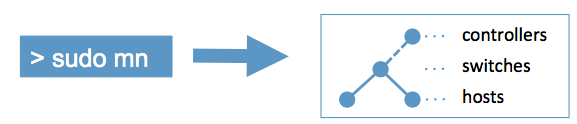

# 基于OpenFlow的园区网络规划与设计

## 环境搭建

### 所需软件

- VMware Workstation Pro 16.1
- Ubuntu 18.04.6 LTS
- Java JDK 8u311
- [karaf 0.8.4](https://nexus.opendaylight.org/content/repositories/opendaylight.release/org/opendaylight/integration/karaf/0.8.4/)
- [Mininet 2.3.0](https://github.com/mininet/mininet/)
- Wireshark

### 配置软件源

1. Ubuntu 18.04 LTS的软件源配置文件是 `/etc/apt/sources.list`。将系统自带的该文件做个备份，将该文件替换为下面内容：

    ```
    # 默认注释了源码镜像以提高 apt update 速度，如有需要可自行取消注释
    deb https://mirrors.tuna.tsinghua.edu.cn/ubuntu/ bionic main restricted universe multiverse
    # deb-src https://mirrors.tuna.tsinghua.edu.cn/ubuntu/ bionic main restricted universe multiverse
    deb https://mirrors.tuna.tsinghua.edu.cn/ubuntu/ bionic-updates main restricted universe multiverse
    # deb-src https://mirrors.tuna.tsinghua.edu.cn/ubuntu/ bionic-updates main restricted universe multiverse
    deb https://mirrors.tuna.tsinghua.edu.cn/ubuntu/ bionic-backports main restricted universe multiverse
    # deb-src https://mirrors.tuna.tsinghua.edu.cn/ubuntu/ bionic-backports main restricted universe multiverse
    deb https://mirrors.tuna.tsinghua.edu.cn/ubuntu/ bionic-security main restricted universe multiverse
    # deb-src https://mirrors.tuna.tsinghua.edu.cn/ubuntu/ bionic-security main restricted universe multiverse

    # 预发布软件源，不建议启用
    # deb https://mirrors.tuna.tsinghua.edu.cn/ubuntu/ bionic-proposed main restricted universe multiverse
    # deb-src https://mirrors.tuna.tsinghua.edu.cn/ubuntu/ bionic-proposed main restricted universe multiverse
    ```

2. 更新软件源

    ```
    sudo apt-get update
    ```

3. 更新所有软件

    ```
    sudo apt-get upgrade
    ```

### 安装JDK

#### 解压JDK安装包

```
sudo mkdir /opt/java
sudo tar -zxvf ~/Downloads/jdk-8u311-linux-x64.tar.gz -C /opt/java/
```

#### 配置环境变量

1. 环境变量在将会在 `/etc/profile` 文件中配置，添加以下文本

    注意： `JAVA_HOME` 为刚刚解压的绝对路径

    ```
    export JAVA_HOME=/opt/java/jdk1.8.0_311
    export JRE_HOME=${JAVA_HOME}/jre
    export CLASSPATH=.:${JAVA_HOME}/lib:${JRE_HOME}/lib
    export PATH=${JAVA_HOME}/bin:$PATH
    ```

2. 使 `profile` 文件生效

    ```
    source /etc/profile
    ```

3. 检查是否配置成功

    ```
    javac -version
    ```

### OpenDayLight控制器安装

1. 解压ODL版本包

    ```
    sudo mkdir /opt/opendaylight
    sudo tar -zxvf ~/Downloads/karaf-0.8.4.tar.gz -C /opt/opendaylight/
    ```

2. 编辑 `setenv` 文件

    ```
    cd /opt/opendaylight/karaf-0.8.4/bin/
    sudo vim setenv
    ```

    在文件最后一行添加

    ```
    export JAVA_HOME="/opt/java/jdk1.8.0_311"
    ```

3. 运行karaf

    ```
    sudo ./karaf
    ```

4. 安装feature

    ```
    opendaylight-user@root>feature:install odl-restconf-all odl-l2switch-switch-ui odl-mdsal-all odl-dlux-core odl-dluxapps-yangui odl-dluxapps-nodes
    ```

5. 查看全部Karaf feature

    ```
    opendaylight-user@root>feature:list
    ```

6. 组件检查

    ```
    opendaylight-user@root>list
    ```

7. 重启karaf

    ```
    opendaylight-user@root>system:shutdown
    onfirm: halt instance root (yes/no): yes
    ./karaf
    ```

8. 在浏览器地址栏输入 `http://127.0.0.1:8181/index.html` 账号和密码均为 `admin`

9. 其他

    - 查看所有命令

        ```
        opendaylight-user@root>help
        ```

    - 卸载feature

        ```
        ps -eaf | grep karaf
        sudo kill -9 4530  # PID
        cd /opt/opendaylight/karaf-0.8.4/
        sudo rm -rf ./data
        sudo ./bin/karaf clean
        ```

    - 北向接口API

        获取当前所有拓扑结构

        ```
        http://127.0.0.1:8181/restconf/operational/network-topology:network-topology
        ```

        获取当前指定拓扑结构

        ```
        http://127.0.0.1:8181/restconf/operational/network-topology:network-topology/topology/flow:1
        ```

        获取当前所有拓扑结构中的所有交换机节点的信息

        ```
        http://127.0.0.1:8181/restconf/operational/opendaylight-inventory:nodes
        ```

        获取当前指定拓扑结构中的指定交换机节点的信息

        ```
        http://127.0.0.1:8181/restconf/operational/opendaylight-inventory:nodes/node/openflow:1
        ```

        获取当前指定拓扑结构中的指定交换机节点中指定端口连接的信息

        ```
        http://127.0.0.1:8181/restconf/operational/opendaylight-inventory:nodes/node/openflow:1/opendaylight-inventory:node-connector/openflow:1:2
        ```

        获取当前指定拓扑结构中的指定交换机节点中单个FlowTable的信息

        ```
        http://127.0.0.1:8181/restconf/operational/opendaylight-inventory:nodes/node/openflow:1/table/0
        ```

        获取当前指定拓扑结构中的指定交换机节点中单个FlowTable中指定Flow的信息

        ```
        http://127.0.0.1:8181/restconf/operational/opendaylight-inventory:nodes/node/openflow:1/table/0/flow/L2switch-0
        ```

### Mininet安装

1. 解压Mininet

    ```
    sudo mkdir /opt/mininet && cd /opt/mininet/
    sudo git clone https://github.com/mininet/mininet.git
    ```

2. 开始安装mininet

    ```
    sudo ./mininet/utils/install.sh
    ```
    
3. 验证安装

    ```
    sudo mn
    ```

    这是一个最简单的拓扑，包括两个host和一个switch

    

    如遇到6653端口占用，输入以下代码

    ```
    sudo fuser -k 6653/tcp
    sudo mn -c
    ```

4. 检查安装是否成功

    ```
    sudo mn --test pingall
    ```

5. 其他功能

    - 网络构建启动参数

        ```
        --topo
        --custom
        --switch
        --controller
        --mac
        ```

    - 内部交互命令

        ```
        dump
        net
        nodes
        links
        dpctl
        iperf
        ```

    - 外部运行参数

        ```
        -c  # 清除配置信息
        -h  # 帮助
        ```

    - MiniEdit

        运行MiniEdit

        ```
        sudo ./mininet/examples/miniedit.py
        ```

        运行后如下图

        

        - Select

            用于在画布上移动节点。单击并拖动任何现有节点。如要删除现有节点或连接，只需将鼠标指针悬停在它上面，不管当前处于活动状态的工具如何，按Delete键删除即可。

        - Host

            在画布上创建主机节点。单击该工具，然后单击画布上要放置节点的任意位置。只要该工具保持选中状态，您就可以通过单击画布上的任意位置来继续添加主机。用户可以通过右键单击它并从菜单中选择属性来配置每个主机。

        - Switch

            此按钮可以在画布上创建支持OpenFlow的交换机。这些交换机可以连接到控制器。该工具的操作方式与上述主机工具相同。用户可以通过右键单击它并从菜单中选择属性来配置每个属性。

        - LegacySwitch

            此按钮可以在画布上创建传统以太网交换机。每个交换机独立运行，无需控制器。此交换机无法配置，并且设置为禁用生成树，因此请勿将此交换机连成环路。

        - LegacyRouter

            此按钮可以在画布上创建传统路由器，每个路由器独立运行，无需控制器。基本上只是一个启用了IP转发的主机。无法从MiniEdit GUI配置旧版路由器。

        - NetLink

            此按钮可以使画布上的节点之间创建连接。点击此工具后，再单击任何一个节点并拖动到其他目标节点。用户可以通过右键单击并从菜单中来配置每个连接的属性。

        - Controller

            此按钮可以使画布上创建一个控制器。可以添加多个控制器。默认情况下，创建一个OpenFlow参考控制器，它可以控制SDN交换机的行为。可以配置成其他控制器类型。用户可以通过右键单击它并从菜单中来配置每个控制器的属性。

### 测试ODL与Mininet联动

1. 启动OpenDayLight

    ```
    cd /opt/opendaylight/karaf-0.8.4/
    sudo ./bin/karaf
    ```

2. 另开一个终端，创建拓扑并运行mininet

    ```
    sudo mn --topo tree,3,2 --controller remote,ip=127.0.0.1,port=6633 --switch ovs,protocols=OpenFlow13 --mac
    ```

3. 检查是否与控制器连接成功

    ```
    mininet> sh ovs-vsctl show
    ```

    查看输出的结果是否有 `is_connected: true` 字段

4. 在mininet中查看流表信息

    ```
    mininet> sh ovs-ofctl dump-flows -O OpenFlow13 s1
    ```

5. 在浏览器地址栏输入 `http://localhost:8181/index.html` 登录后查看拓扑

## 网络规划


## 网络搭建

### SDN部分


#### 开启ODL

```
sudo /opt/opendaylight/karaf-0.8.4/bin/karaf
```

#### Mininet拓扑实现

1. 搭建拓扑

    ```python
    #!/usr/bin/env python

    from mininet.net import Mininet
    from mininet.node import Controller, RemoteController, OVSController
    from mininet.node import CPULimitedHost, Host, Node
    from mininet.node import OVSKernelSwitch, UserSwitch
    from mininet.node import IVSSwitch
    from mininet.cli import CLI
    from mininet.log import setLogLevel, info
    from mininet.link import TCLink, Intf
    from subprocess import call

    def myNetwork():

        net = Mininet(topo=None, build=False, ipBase='192.168.0.0/19')

        info( '*** Adding controller\n' )
        c0 = net.addController(name = 'ODL', controller = RemoteController, ip = '127.0.0.1', protocol = 'tcp', port = 6633)

        info( '*** Add switches\n')
        s1 = net.addSwitch('OVS1', cls = OVSKernelSwitch)
        s2 = net.addSwitch('OVS2', cls = OVSKernelSwitch)
        s3 = net.addSwitch('OVS3', cls = OVSKernelSwitch)
        s4 = net.addSwitch('OVS4', cls = OVSKernelSwitch)
        s5 = net.addSwitch('OVS5', cls = OVSKernelSwitch)
        s6 = net.addSwitch('OVS6', cls = OVSKernelSwitch)
        s7 = net.addSwitch('OVS7', cls = OVSKernelSwitch)

        info( '*** Add hosts\n')
        h1 = net.addHost('H1', cls = Host, mac = '00:00:00:00:00:01')
        h2 = net.addHost('H2', cls = Host, mac = '00:00:00:00:00:02')
        h3 = net.addHost('H3', cls = Host, mac = '00:00:00:00:00:03')
        h4 = net.addHost('H4', cls = Host, mac = '00:00:00:00:00:04')
        h5 = net.addHost('H5', cls = Host, mac = '00:00:00:00:00:05')
        h6 = net.addHost('H6', cls = Host, mac = '00:00:00:00:00:06')
        h7 = net.addHost('H7', cls = Host, mac = '00:00:00:00:00:07')
        h8 = net.addHost('H8', cls = Host, mac = '00:00:00:00:00:08')

        info( '*** Add links\n')
        net.addLink(s1, s2, 2, 1)
        net.addLink(s1, s3, 3, 1)
        net.addLink(s2, s4, 2, 1)
        net.addLink(s2, s5, 3, 1)
        net.addLink(s2, s6, 4, 1)
        net.addLink(s2, s7, 5, 1)
        net.addLink(s3, s4, 2, 2)
        net.addLink(s3, s5, 3, 2)
        net.addLink(s3, s6, 4, 2)
        net.addLink(s3, s7, 5, 2)
        net.addLink(s4, h1, 3, 0)
        net.addLink(s4, h2, 4, 0)
        net.addLink(s5, h3, 3, 0)
        net.addLink(s5, h4, 4, 0)
        net.addLink(s6, h5, 3, 0)
        net.addLink(s6, h6, 4, 0)
        net.addLink(s7, h7, 3, 0)
        net.addLink(s7, h8, 4, 0)

        info( '*** Starting network\n')
        net.build()
        info( '*** Starting controllers\n')
        for controller in net.controllers:
            controller.start()

        info( '*** Starting switches\n')
        net.get('OVS1').start([c0])
        net.get('OVS2').start([c0])
        net.get('OVS3').start([c0])
        net.get('OVS4').start([c0])
        net.get('OVS5').start([c0])
        net.get('OVS6').start([c0])
        net.get('OVS7').start([c0])

        info( '*** Post configure switches and hosts\n')

        CLI(net)
        net.stop()

    if __name__ == '__main__':
        setLogLevel( 'info' )
        myNetwork()
    ```

2. 运行拓扑

    ```
    sudo python3 ./mininet_topo.py
    ```

3. 在迷你net中查看链路状态

    ```
    mininet> links
    OVS1-eth2<->OVS2-eth1 (OK OK) 
    OVS1-eth3<->OVS3-eth1 (OK OK) 
    OVS2-eth2<->OVS4-eth1 (OK OK) 
    OVS2-eth3<->OVS5-eth1 (OK OK) 
    OVS2-eth4<->OVS6-eth1 (OK OK) 
    OVS2-eth5<->OVS7-eth1 (OK OK) 
    OVS3-eth2<->OVS4-eth2 (OK OK) 
    OVS3-eth3<->OVS5-eth2 (OK OK) 
    OVS3-eth4<->OVS6-eth2 (OK OK) 
    OVS3-eth5<->OVS7-eth2 (OK OK) 
    OVS4-eth3<->H1-eth0 (OK OK) 
    OVS4-eth4<->H2-eth0 (OK OK) 
    OVS5-eth3<->H3-eth0 (OK OK) 
    OVS5-eth4<->H4-eth0 (OK OK) 
    OVS6-eth3<->H5-eth0 (OK OK) 
    OVS6-eth4<->H6-eth0 (OK OK) 
    OVS7-eth3<->H7-eth0 (OK OK) 
    OVS7-eth4<->H8-eth0 (OK OK) 
    ```

4. 在mininet中测试连通性

    ```
    mininet> pingall
    *** Ping: testing ping reachability
    H1 -> H2 H3 H4 H5 H6 H7 H8 
    H2 -> H1 H3 H4 H5 H6 H7 H8 
    H3 -> H1 H2 H4 H5 H6 H7 H8 
    H4 -> H1 H2 H3 H5 H6 H7 H8 
    H5 -> H1 H2 H3 H4 H6 H7 H8 
    H6 -> H1 H2 H3 H4 H5 H7 H8 
    H7 -> H1 H2 H3 H4 H5 H6 H8 
    H8 -> H1 H2 H3 H4 H5 H6 H7 
    *** Results: 0% dropped (56/56 received)
    ```

5. 在ODL控制器中查看拓扑

    

6. 使用ODL的北向接口API查看所有节点

    

#### 在mininet中开启NAT以便访问外网

1. 添加NAT

    停止mininet后在拓扑文件的添加主机后加入以下代码：

    ```python
    info( '*** Add NAT\n')
    net.addNAT(ip = '192.168.31.254').configDefault()
    ```

2. 在主机上配置默认路由

    - Mininet未运行时，在拓扑文件中添加代码：

        ```python
        info( '*** Post configure switches and hosts\n')
        H1.cmd('route add default gw 192.168.31.254')
        ```

    - Mininet运行时，在mininet中输入：

        ```
        mininet> xterm H1

        route add default gw 192.168.31.254
        ```

3. 测试与外部虚拟机的连通性

    1. 启动mininet

        ```
        sudo python3 ./mininet_topo.py
        ```

    2. 测试能否ping通虚拟机

        ```
        mininet> H1 ping 192.168.254.100 -c 4
        PING 192.168.254.100 (192.168.254.100) 56(84) bytes of data.
        64 bytes from 192.168.254.100: icmp_seq=1 ttl=64 time=0.129 ms
        64 bytes from 192.168.254.100: icmp_seq=2 ttl=64 time=0.161 ms
        64 bytes from 192.168.254.100: icmp_seq=3 ttl=64 time=0.102 ms
        64 bytes from 192.168.254.100: icmp_seq=4 ttl=64 time=0.141 ms

        --- 192.168.254.100 ping statistics ---
        4 packets transmitted, 4 received, 0% packet loss, time 3070ms
        rtt min/avg/max/mdev = 0.102/0.133/0.161/0.022 ms
        ```

#### 负载均衡

##### 为什么要做负载均衡

- 测试h1到h2之间的带宽

    ```
    mininet> iperf H1 H2
    *** Iperf: testing TCP bandwidth between H1 and H2 
    *** Results: ['43.6 Gbits/sec', '43.7 Gbits/sec']
    ```

- 测试h1到h8之间的带宽

    ```
    mininet> iperf H1 H8
    *** Iperf: testing TCP bandwidth between H1 and H8 
    *** Results: ['5.59 Gbits/sec', '5.59 Gbits/sec']
    ```

- 结论

    随着跨交换机网络的转发，性能随着跨交换机网络而减弱。为了数据在跨多交换机传输时能获得更高的可用带宽，我们利用基于链路选择给交换机分片（组）的方式来实现负载均衡（提高可用带宽）。

##### 负载均衡实现

通过将客户端的数据分流来达到交换机的负载均衡，以提高性能

如H1与H8通信，数据流的路程如图所示


如客户端访问外网，数据流的路程如图所示


1. 清空所有流表

    ```
    sudo ovs-ofctl del-flows -O Openflow13 OVS1
    sudo ovs-ofctl del-flows -O Openflow13 OVS2
    sudo ovs-ofctl del-flows -O Openflow13 OVS3
    sudo ovs-ofctl del-flows -O Openflow13 OVS4
    sudo ovs-ofctl del-flows -O Openflow13 OVS5
    sudo ovs-ofctl del-flows -O Openflow13 OVS6
    sudo ovs-ofctl del-flows -O Openflow13 OVS7
    ```

2. 下发流表

    ```
    # OVS1
    sudo ovs-ofctl add-flow -O OpenFlow13 OVS1 priority=2,in_port=2,actions=output:1
    sudo ovs-ofctl add-flow -O OpenFlow13 OVS1 priority=2,in_port=3,actions=output:1
    sudo ovs-ofctl add-flow -O OpenFlow13 OVS1 priority=65535,dl_dst=00:00:00:00:00:01,actions=output:2
    sudo ovs-ofctl add-flow -O OpenFlow13 OVS1 priority=65535,dl_dst=00:00:00:00:00:02,actions=output:2
    sudo ovs-ofctl add-flow -O OpenFlow13 OVS1 priority=65535,dl_dst=00:00:00:00:00:03,actions=output:2
    sudo ovs-ofctl add-flow -O OpenFlow13 OVS1 priority=65535,dl_dst=00:00:00:00:00:04,actions=output:2
    sudo ovs-ofctl add-flow -O OpenFlow13 OVS1 priority=65535,dl_dst=00:00:00:00:00:05,actions=output:3
    sudo ovs-ofctl add-flow -O OpenFlow13 OVS1 priority=65535,dl_dst=00:00:00:00:00:06,actions=output:3
    sudo ovs-ofctl add-flow -O OpenFlow13 OVS1 priority=65535,dl_dst=00:00:00:00:00:07,actions=output:3
    sudo ovs-ofctl add-flow -O OpenFlow13 OVS1 priority=65535,dl_dst=00:00:00:00:00:08,actions=output:3
    # OVS2
    sudo ovs-ofctl add-flow -O OpenFlow13 OVS2 priority=2,actions=output:all
    # OVS3
    sudo ovs-ofctl add-flow -O OpenFlow13 OVS3 priority=2,actions=output:all
    # OVS4
    sudo ovs-ofctl add-flow -O OpenFlow13 OVS4 priority=2,in_port=1,actions=output:3,output:4
    sudo ovs-ofctl add-flow -O OpenFlow13 OVS4 priority=2,in_port=2,actions=output:3,output:4
    sudo ovs-ofctl add-flow -O OpenFlow13 OVS4 priority=2,in_port=3,actions=output:1,output:4
    sudo ovs-ofctl add-flow -O OpenFlow13 OVS4 priority=2,in_port=4,actions=output:1,output:3
    sudo ovs-ofctl add-flow -O OpenFlow13 OVS4 priority=65535,dl_dst=00:00:00:00:00:01,actions=output:3
    sudo ovs-ofctl add-flow -O OpenFlow13 OVS4 priority=65535,dl_dst=00:00:00:00:00:02,actions=output:4
    # OVS5
    sudo ovs-ofctl add-flow -O OpenFlow13 OVS5 priority=2,in_port=1,actions=output:3,output:4
    sudo ovs-ofctl add-flow -O OpenFlow13 OVS5 priority=2,in_port=2,actions=output:3,output:4
    sudo ovs-ofctl add-flow -O OpenFlow13 OVS5 priority=2,in_port=3,actions=output:1,output:4
    sudo ovs-ofctl add-flow -O OpenFlow13 OVS5 priority=2,in_port=4,actions=output:1,output:3
    sudo ovs-ofctl add-flow -O OpenFlow13 OVS5 priority=65535,dl_dst=00:00:00:00:00:03,actions=output:3
    sudo ovs-ofctl add-flow -O OpenFlow13 OVS5 priority=65535,dl_dst=00:00:00:00:00:04,actions=output:4
    # OVS6
    sudo ovs-ofctl add-flow -O OpenFlow13 OVS6 priority=2,in_port=1,actions=output:3,output:4
    sudo ovs-ofctl add-flow -O OpenFlow13 OVS6 priority=2,in_port=2,actions=output:3,output:4
    sudo ovs-ofctl add-flow -O OpenFlow13 OVS6 priority=2,in_port=3,actions=output:2,output:4
    sudo ovs-ofctl add-flow -O OpenFlow13 OVS6 priority=2,in_port=4,actions=output:2,output:3
    sudo ovs-ofctl add-flow -O OpenFlow13 OVS6 priority=65535,dl_dst=00:00:00:00:00:05,actions=output:3
    sudo ovs-ofctl add-flow -O OpenFlow13 OVS6 priority=65535,dl_dst=00:00:00:00:00:06,actions=output:4
    # OVS7
    sudo ovs-ofctl add-flow -O OpenFlow13 OVS7 priority=2,in_port=1,actions=output:3,output:4
    sudo ovs-ofctl add-flow -O OpenFlow13 OVS7 priority=2,in_port=2,actions=output:3,output:4
    sudo ovs-ofctl add-flow -O OpenFlow13 OVS7 priority=2,in_port=3,actions=output:2,output:4
    sudo ovs-ofctl add-flow -O OpenFlow13 OVS7 priority=2,in_port=4,actions=output:2,output:3
    sudo ovs-ofctl add-flow -O OpenFlow13 OVS7 priority=65535,dl_dst=00:00:00:00:00:07,actions=output:3
    sudo ovs-ofctl add-flow -O OpenFlow13 OVS7 priority=65535,dl_dst=00:00:00:00:00:08,actions=output:4
    ```

3. 测试h1到h2之间的带宽

    ```
    mninet> iperf H1 H2
    *** Iperf: testing TCP bandwidth between H1 and H2 
    *** Results: ['46.0 Gbits/sec', '46.0 Gbits/sec']
    ```

    H1与H2因为没有链路变化所以带宽基本不变

4. 测试H1到H8之间的带宽

    ```
    mininet> iperf H1 H8
    *** Iperf: testing TCP bandwidth between H1 and H8 
    *** Results: ['29.3 Gbits/sec', '29.3 Gbits/sec']
    ```

    H1与H8带宽提升很多，变化明显

#### 限制H7和H8访问外网

下发流表，使得H7和H8的流量进入OVS1时被丢弃

```
sudo ovs-ofctl add-flow -O OpenFlow13 OVS1 priority=65535,dl_src=00:00:00:00:00:07,action=drop
sudo ovs-ofctl add-flow -O OpenFlow13 OVS1 priority=65535,dl_src=00:00:00:00:00:08,action=drop
```

#### 最终拓扑文件

```python
#!/usr/bin/env python

from mininet.net import Mininet
from mininet.node import Controller, RemoteController, OVSController
from mininet.node import CPULimitedHost, Host, Node
from mininet.node import OVSKernelSwitch, UserSwitch
from mininet.node import IVSSwitch
from mininet.cli import CLI
from mininet.log import setLogLevel, info
from mininet.link import TCLink, Intf
from subprocess import call

def myNetwork():

    net = Mininet(topo=None, build=False, ipBase='192.168.0.0/19')

    info( '*** Adding controller\n' )
    c0 = net.addController(name = 'ODL', controller = RemoteController, ip = '127.0.0.1', protocol = 'tcp', port = 6633)

    info( '*** Add switches\n')
    s1 = net.addSwitch('OVS1', cls = OVSKernelSwitch)
    s2 = net.addSwitch('OVS2', cls = OVSKernelSwitch)
    s3 = net.addSwitch('OVS3', cls = OVSKernelSwitch)
    s4 = net.addSwitch('OVS4', cls = OVSKernelSwitch)
    s5 = net.addSwitch('OVS5', cls = OVSKernelSwitch)
    s6 = net.addSwitch('OVS6', cls = OVSKernelSwitch)
    s7 = net.addSwitch('OVS7', cls = OVSKernelSwitch)

    info( '*** Add hosts\n')
    h1 = net.addHost('H1', cls = Host, mac = '00:00:00:00:00:01')
    h2 = net.addHost('H2', cls = Host, mac = '00:00:00:00:00:02')
    h3 = net.addHost('H3', cls = Host, mac = '00:00:00:00:00:03')
    h4 = net.addHost('H4', cls = Host, mac = '00:00:00:00:00:04')
    h5 = net.addHost('H5', cls = Host, mac = '00:00:00:00:00:05')
    h6 = net.addHost('H6', cls = Host, mac = '00:00:00:00:00:06')
    h7 = net.addHost('H7', cls = Host, mac = '00:00:00:00:00:07')
    h8 = net.addHost('H8', cls = Host, mac = '00:00:00:00:00:08')

    info( '*** Add NAT\n')
    net.addNAT(ip = '192.168.31.254').configDefault()

    info( '*** Add links\n')
    net.addLink(s1, s2, 2, 1)
    net.addLink(s1, s3, 3, 1)
    net.addLink(s2, s4, 2, 1)
    net.addLink(s2, s5, 3, 1)
    net.addLink(s2, s6, 4, 1)
    net.addLink(s2, s7, 5, 1)
    net.addLink(s3, s4, 2, 2)
    net.addLink(s3, s5, 3, 2)
    net.addLink(s3, s6, 4, 2)
    net.addLink(s3, s7, 5, 2)
    net.addLink(s4, h1, 3, 0)
    net.addLink(s4, h2, 4, 0)
    net.addLink(s5, h3, 3, 0)
    net.addLink(s5, h4, 4, 0)
    net.addLink(s6, h5, 3, 0)
    net.addLink(s6, h6, 4, 0)
    net.addLink(s7, h7, 3, 0)
    net.addLink(s7, h8, 4, 0)

    info( '*** Starting network\n')
    net.build()
    info( '*** Starting controllers\n')
    for controller in net.controllers:
        controller.start()

    info( '*** Starting switches\n')
    net.get('OVS1').start([c0])
    net.get('OVS2').start([c0])
    net.get('OVS3').start([c0])
    net.get('OVS4').start([c0])
    net.get('OVS5').start([c0])
    net.get('OVS6').start([c0])
    net.get('OVS7').start([c0])

    info( '*** Post configure switches and hosts\n')
    h1.cmd('route add default gw 192.168.31.254')
    h2.cmd('route add default gw 192.168.31.254')
    h3.cmd('route add default gw 192.168.31.254')
    h4.cmd('route add default gw 192.168.31.254')
    h5.cmd('route add default gw 192.168.31.254')
    h6.cmd('route add default gw 192.168.31.254')
    h7.cmd('route add default gw 192.168.31.254')
    h8.cmd('route add default gw 192.168.31.254')
    CLI(net)
    net.stop()

if __name__ == '__main__':
    setLogLevel( 'info' )
    myNetwork()
```

### 核心层及外网部分


#### 拓扑实现


#### 网络规划

- 园区内所有核心层设备通过OSPF发布路由
- 所有流量均经过防火墙
- 内网属于TRUST区域
- 服务器组属于DMZ区域，使得外网可访问
- 出口网关属于UNTRUST区域
- 192.168.0.0/16网段内所有的主机均可通过Easy IP访问外网
- 出口网关的接口IP111.33.8.100通过PPPoE拨号由运营商下发
- 配置静态NAT，外网可通过出口网关的接口IP访问DMZ区域的服务器
- 出口网关配置DNS Mapping使得内网用户通过域名访问内网服务器

#### 主要配置

##### CE

```
#
 sysname CE
#
acl number 2000  
 rule 5 permit source 192.168.0.0 0.0.255.255 
#
 nat alg dns enable
 #
 nat dns-map www.test.com 111.33.8.101 80 tcp
 nat dns-map ftp.test.com 111.33.8.101 21 tcp
 nat dns-map oa.test.com 111.33.8.100 80 tcp
#
interface Dialer1
 link-protocol ppp
 ppp chap user pppoe
 ppp chap password cipher 123qwe.
 ip address ppp-negotiate
 dialer user pppoe
 dialer bundle 1
 nat server protocol tcp global 111.33.8.101 www inside 172.16.0.11 www
 nat server protocol tcp global 111.33.8.101 ftp inside 172.16.0.12 ftp
 nat server protocol tcp global current-interface www inside 172.16.0.13 www
 nat outbound 2000
#
interface GigabitEthernet0/0/0
 pppoe-client dial-bundle-number 1 
#
interface GigabitEthernet0/0/1
 description TO_CE
 ip address 10.0.0.1 255.255.255.252 
#
interface LoopBack0
 ip address 172.31.0.1 255.255.255.255 
#
dialer-rule
 dialer-rule 1 ip permit
#
ospf 1 router-id 172.31.0.1 
 default-route-advertise always
 import-route direct
 area 0.0.0.0 
  network 10.0.0.0 0.0.0.3 
#
ip route-static 0.0.0.0 0.0.0.0 Dialer1
#
```

##### FW

```
#
sysname FW
#
interface GigabitEthernet1/0/0
 description TO_CE
 undo shutdown
 ip address 10.0.0.2 255.255.255.252
 service-manage ping permit
#
interface GigabitEthernet1/0/1
 description TO_SERVER
 undo shutdown
 ip address 172.16.0.1 255.255.255.0
 service-manage ping permit
#
interface GigabitEthernet1/0/2
 description TO_L3-Swtich
 undo shutdown
 ip address 10.0.0.5 255.255.255.252
 service-manage ping permit
#
interface LoopBack0
 ip address 172.31.0.2 255.255.255.255
#
firewall zone trust
 add interface GigabitEthernet1/0/2
#
firewall zone untrust
 add interface GigabitEthernet1/0/0
#
firewall zone dmz
 add interface GigabitEthernet1/0/1
#
ospf 1 router-id 172.31.0.2
 import-route direct
 area 0.0.0.0
  network 10.0.0.0 0.0.0.3
  network 10.0.0.4 0.0.0.3
#
security-policy
 rule name LAN_WAN
  source-zone local
  source-zone trust
  destination-zone local
  destination-zone trust
  destination-zone untrust
  action permit
 rule name LAN_DMZ
  source-zone dmz
  source-zone local
  source-zone trust
  destination-zone dmz
  destination-zone local
  destination-zone trust
  action permit
 rule name WAN_DMZ
  source-zone dmz
  source-zone untrust
  destination-zone dmz
  destination-zone untrust
  action permit
#
```

##### L2-Swtich

```
#
sysname L2-Switch
#
stp disable
#
```

##### L3-Swtich

```
#
sysname L3-Switch
#
vlan batch 2 to 3
#
stp disable
#
interface Vlanif2
 description TO_FW
 ip address 10.0.0.6 255.255.255.252 
#
interface Vlanif3
 description TO_Mininet
 ip address 192.168.254.254 255.255.255.0 
#
interface GigabitEthernet0/0/1
 port link-type access
 port default vlan 2
#
interface GigabitEthernet0/0/24
 port link-type access
 port default vlan 3
#
interface LoopBack0
 ip address 172.31.0.3 255.255.255.255 
#
ospf 1 router-id 172.31.0.3 
 import-route direct
 area 0.0.0.0 
  network 10.0.0.4 0.0.0.3 
#
```

##### ISP_R1

```
#
 sysname ISP_R1
#
aaa
 local-user pppoe password cipher 123qwe.
 local-user pppoe privilege level 0
 local-user pppoe service-type ppp
#
isis 1
 is-level level-2
 network-entity 49.0000.0000.0001.00
 import-route direct 
#
interface Virtual-Template1
 remote address 111.33.8.100 
 ip address 111.33.8.1 255.255.255.0 
#
interface GigabitEthernet0/0/0
 ip address 12.0.0.1 255.255.255.0 
 isis enable 1
#
interface GigabitEthernet0/0/1
 ip address 13.0.0.1 255.255.255.0 
 isis enable 1
#
interface GigabitEthernet0/0/2
 pppoe-server bind Virtual-Template 1
#
interface LoopBack0
 ip address 1.1.1.1 255.255.255.255 
#
```

##### ISP_R2

```
#
 sysname ISP_R2
#
isis 1
 is-level level-2
 network-entity 49.0000.0000.0002.00
 import-route direct 
#
interface GigabitEthernet0/0/0
 ip address 12.0.0.2 255.255.255.0 
 isis enable 1
#
interface GigabitEthernet0/0/1
 ip address 24.0.0.2 255.255.255.0 
 isis enable 1
#
interface LoopBack0
 ip address 2.2.2.2 255.255.255.255 
#
```

##### ISP_R3

```
#
 sysname ISP_R3
#
isis 1
 is-level level-2
 network-entity 49.0000.0000.0003.00
 import-route direct 
#
interface GigabitEthernet0/0/0
 ip address 13.0.0.3 255.255.255.0 
 isis enable 1
#
interface GigabitEthernet0/0/1
 ip address 34.0.0.3 255.255.255.0 
 isis enable 1
#
interface LoopBack0
 ip address 3.3.3.3 255.255.255.255 
#
```

##### ISP_R4

```
#
 sysname ISP_R4
#
isis 1
 is-level level-2
 network-entity 49.0000.0000.0004.00
 import-route direct 
#
interface GigabitEthernet0/0/0
 ip address 24.0.0.4 255.255.255.0 
 isis enable 1
#
interface GigabitEthernet0/0/1
 ip address 34.0.0.4 255.255.255.0 
 isis enable 1
#
interface GigabitEthernet0/0/2
 ip address 8.8.8.1 255.255.255.0 
#
```