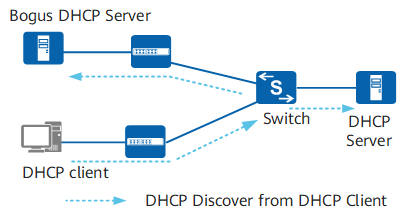
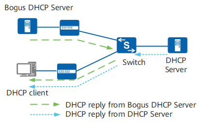
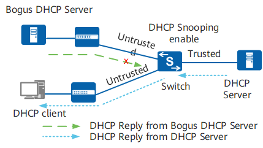

# DHCP

## 介绍

- DHCP（Dynamic Host Configuration Protocol，动态主机配置协议）
- 前身是BOOTP协议，局域网的网络协议，使用UDP协议工作。
- 端口号：67（服务器）、68（客户端）

## 工作原理

### 无中继状态下的工作原理

1. 发现阶段（DISCOVER）：
    - 客户端广播发送。
    - 目的IP为255.255.255.255。
    - 携带客户端的MAC地址（chaddr字段）。
    - 需要请求：参数列表选项（Option55）、广播标志位（flags）等信息。

2. 提供阶段（OFFER）：
    - 服务器发送。
    - DHCP服务器会选择客户端同一网段的地址池，并从中选择一个可用地址发送给客户端。
    - 地址池中会指定IP地址的租期。
    - DHCP服务器在地址池中为客户端分配IP地址的顺序如下：
        1. DHCP服务器上已配置的与客户端MAC地址静态绑定的IP地址。
        2. 客户端发送的DISCOVER报文中Option50（请求IP地址选项）指定的地址。
        3. 地址池内查找“Expired”状态的IP地址，即曾经分配给客户端的超过租期的IP地址。
        4. 在地址池内随机查找一个“Idle”状态的IP地址。
        5. 如果未找到可供分配的IP地址，则地址池依次自动回收超过租期的（“Expired”状态）和处于冲突状态（“Conflict”状态）的IP地址。回收后如果找到可用的IP地址，则进行分配；否则，DHCP客户端等待应答超时后，重新发送DISCOVER报文来申请IP地址。
    - 为了防止分配出去的IP地址跟网络中其他客户端的IP地址冲突，DHCP服务器在发送DHCP OFFER报文前通过发送源地址为DHCP服务器IP地址、目的地址为预分配出去IP地址的ICMP ECHO REQUEST报文对分配的IP地址进行地址冲突探测。如果在指定的时间内没有收到应答报文，表示网络中没有客户端使用这个IP地址，可以分配给客户端；如果指定时间内收到应答报文，表示网络中已经存在使用此IP地址的客户端，则把此地址列为冲突地址，然后等待重新接收到DISCOVER报文后按照前面介绍的选择IP地址的优先顺序重新选择可用的IP地址。
    - 此阶段DHCP服务器分配给客户端的IP地址不一定是最终确定使用的IP地址，因为OFFER报文发送给客户端等待16秒后如果没有收到客户端的响应，此地址就可以继续分配给其他客户端。通过下面的选择阶段和确认阶段后才能最终确定客户端可以使用的IP地址。

3. 选择阶段（REQUEST）：
    - 客户端发送。
    - 如果有多个DHCP服务器向DHCP客户端回应OFFER报文，则DHCP客户端一般只接收第一个收到的OFFER报文，然后以广播方式发送REQUEST报文，该报文中包含客户端想选择的DHCP服务器标识符（即Option54）和客户端IP地址（即Option50，填充了接收的OFFER报文中yiaddr字段的IP地址）。
    - DHCP客户端广播发送REQUEST报文通知所有的DHCP服务器，它将选择某个DHCP服务器提供的IP地址，其他DHCP服务器可以重新将曾经分配给客户端的IP地址分配给其他客户端。

4. 确认阶段（ACK）：
    - 服务器发送。
    - 当DHCP服务器收到DHCP客户端发送的REQUEST报文后，DHCP服务器回应ACK报文，表示REQUEST报文中请求的IP地址（Option50填充的）分配给客户端使用。
    - DHCP客户端收到ACK报文，会广播发送免费ARP报文，探测本网段是否有其他终端使用服务器分配的IP地址，如果在指定时间内没有收到回应，表示客户端可以使用此地址。如果收到了回应，说明有其他终端使用了此地址，客户端会向服务器发送DECLINE报文，并重新向服务器请求IP地址，同时，服务器会将此地址列为冲突地址。当服务器没有空闲地址可分配时，再选择冲突地址进行分配，尽量减少分配出去的地址冲突。
    - 当DHCP服务器收到DHCP客户端发送的REQUEST报文后，如果DHCP服务器由于某些原因（例如协商出错或者由于发送REQUEST过慢导致服务器已经把此地址分配给其他客户端）无法分配REQUEST报文中Option50填充的IP地址，则发送NAK报文作为应答，通知DHCP客户端无法分配此IP地址。DHCP客户端需要重新发送DISCOVER报文来申请新的IP地址。

### 有中继状态下的工作原理

> 有DHCP中继的场景中，首次接入网络的DHCP客户端和DHCP服务器的工作原理与无中继场景时DHCP客户端首次接入网络的工作原理相同。主要差异是DHCP中继在DHCP服务器和DHCP客户端之间转发DHCP报文，以保证DHCP服务器和DHCP客户端可以正常交互。

1. 发现阶段（DISCOVER）
    - 客户端发，DHCP中继收。
    - 检查DHCP报文中的hops字段，如果大于16，则丢弃DHCP报文；否则，将hops字段加1（表明经过一次DHCP中继）。
    - 检查DHCP报文中的giaddr字段。如果是0，将giaddr字段设置为接收DISCOVER报文的接口IP地址。如果不是0，则不修改该字段。
    - 将DHCP报文的目的IP地址改为DHCP服务器或下一跳中继的IP地址，源地址改为中继连接客户端的接口地址，通过路由转发将DHCP报文单播发送到DHCP服务器或下一跳中继。

2. 提供阶段（OFFER）：
    - DHCP服务器接收到DISCOVER报文后，选择与报文中giaddr字段为同一网段的地址池，并为客户端分配IP地址等参数，然后向giaddr字段标识的DHCP中继单播发送OFFER报文。
    - DHCP中继收到OFFER报文后，会进行如下处理：
        - 检查报文中的giaddr字段，如果不是接口的地址，则丢弃该报文。
        - DHCP中继检查报文的广播标志位。如果广播标志位为1，则将OFFER报文广播发送给客户端；否则将OFFER报文单播发送给DHCP客户端。

3. 选择阶段（REQUEST）：
中继接收到来自客户端的REQUEST报文的处理过程同无中继场景下的选择阶段。

4. 确认阶段（ACK）：
中继接收到来自服务器的ACK报文的处理过程同无中继场景下的确认阶段。

### 客户端重用曾经使用过的地址的工作原理

> DHCP客户端非首次接入网络时，可以重用曾经使用过的地址。如下图所示，DHCP客户端与DHCP服务器交互DHCP报文，以重新获取之前使用的IP地址等网络参数，该过程称为两步交互。

1. 选择阶段（DISCOVER）：
客户端广播发送包含前一次分配的IP地址的REQUEST报文，报文中的Option50（请求的IP地址选项）字段填入曾经使用过的IP地址。

2. 确认阶段（ACK）：
DHCP服务器收到REQUEST报文后，根据REQUEST报文中携带的MAC地址来查找有没有相应的租约记录，如果有则返回ACK报文，通知DHCP客户端可以继续使用这个IP地址。否则，保持沉默，等待客户端重新发送DISCOVER报文请求新的IP地址。

### 客户端更新租期的工作原理

> DHCP服务器采用动态分配机制给客户端分配IP地址时，分配出去的IP地址有租期限制。DHCP客户端向服务器申请地址时可以携带期望租期，服务器在分配租期时把客户端期望租期和地址池中租期配置比较，分配其中一个较短的租期给客户端。租期到期或者客户端下线释放地址后，服务器会收回该IP地址，收回的IP地址可以继续分配给其他客户端使用。这种机制可以提高IP地址的利用率，避免客户端下线后IP地址继续被占用。如果DHCP客户端希望继续使用该地址，需要更新IP地址的租期（如延长IP地址租期）。

- 当租期达到50%（T1）时，客户端会以单播的方式向DHCP服务器发送REQUEST报文，请求更新IP地址租期。如果收到DHCP服务器回应的ACK报文，则租期更新成功（即租期从0开始计算）；如果收到NAK报文，则重新发送DISCOVER报文请求新的IP地址。
- 当租期达到87.5%（T2）时，如果仍未收到DHCP服务器的应答，DHCP客户端会以广播的方式向DHCP服务器发送REQUEST报文，请求更新IP地址租期。如果收到DHCP服务器回应的ACK报文，则租期更新成功（即租期从0开始计算）；如果收到NAK报文，则重新发送DISCOVER报文请求新的IP地址。
- 如果租期时间到时都没有收到服务器的回应，客户端停止使用此IP地址，重新发送DISCOVER报文请求新的IP地址。

客户端在租期时间到之前，如果用户不想使用分配的IP地址（例如客户端网络位置需要变更），会触发DHCP客户端向DHCP服务器发送RELEASE报文，通知DHCP服务器释放IP地址的租期。DHCP服务器会保留这个DHCP客户端的配置信息，将IP地址列为曾经分配过的IP地址中，以便后续重新分配给该客户端或其他客户端。客户端可以通过发送INFORM报文向服务器请求更新配置信息。

## DHCP Snooping

> DHCP Snooping是DHCP（Dynamic Host Configuration Protocol，动态主机配置协议）的一种安全特性，用于保证DHCP客户端从合法的DHCP服务器获取IP地址，并记录DHCP客户端IP地址与MAC地址等参数的对应关系。DHCP Snooping可以抵御网络中针对DHCP的各种攻击，为用户提供更安全的网络环境和更稳定的网络服务。

### 作用

防止网络中存在一些针对DHCP的攻击如：

- DHCP Server仿冒者攻击
- DHCP Server的拒绝服务攻击
- 仿冒DHCP报文攻击
- ......

### DHCP Server仿冒者攻击导致用户获取到错误的IP地址和网络参数

#### 攻击原理

> DHCP Discover报文是以广播形式发送，无论是合法的DHCP Server，还是非法的DHCP Server都可以接收到DHCP Client发送的DHCP Discover报文。

#### 解决方法

- 为了防止DHCP Server仿冒者攻击，可配置设备接口的“信任（Trusted）/非信任（Untrusted）”工作模式。
- 将与合法DHCP服务器直接或间接连接的接口设置为信任接口，其他接口设置为非信任接口。此后，从“非信任（Untrusted）”接口上收到的DHCP回应报文将被直接丢弃，这样可以有效防止DHCP Server仿冒者的攻击。如下图所示。

### 非DHCP用户攻击导致合法用户无法正常使用网络

#### 攻击原理

> 在DHCP网络中，静态获取IP地址的用户（非DHCP用户）对网络可能存在多种攻击，譬如仿冒DHCP Server、构造虚假DHCP Request报文等。这将为合法DHCP用户正常使用网络带来了一定的安全隐患。

#### 解决方法

为了有效的防止非DHCP用户攻击，可开启设备根据DHCP Snooping绑定表生成接口的静态MAC表项功能。

之后，设备将根据接口下所有的DHCP用户对应的DHCP Snooping绑定表项自动执行命令生成这些用户的静态MAC表项，并同时关闭接口学习动态MAC表项的能力。此时，只有源MAC与静态MAC表项匹配的报文才能够通过该接口，否则报文会被丢弃。因此对于该接口下的非DHCP用户，只有管理员手动配置了此类用户的静态MAC表项其报文才能通过，否则报文将被丢弃。

动态MAC表项是设备自动学习并生成的，静态MAC表项则是根据命令配置而成的。MAC表项中包含用户的MAC、所属VLAN、连接的接口号等信息，设备可根据MAC表项对报文进行二层转发。

### DHCP报文泛洪攻击导致设备无法正常工作

#### 攻击原理

> 在DHCP网络环境中，若攻击者短时间内向设备发送大量的DHCP报文，将会对设备的性能造成巨大的冲击以致可能会导致设备无法正常工作。

#### 解决方法

为了有效的防止DHCP报文泛洪攻击，在使能设备的DHCP Snooping功能时，可同时使能设备对DHCP报文上送DHCP报文处理单元的速率进行检测的功能。此后，设备将会检测DHCP报文的上送速率，并仅允许在规定速率内的报文上送至DHCP报文处理单元，而超过规定速率的报文将会被丢弃。

### 仿冒DHCP报文攻击导致合法用户无法获得IP地址或异常下线

#### 攻击原理

> 已获取到IP地址的合法用户通过向服务器发送DHCP Request或DHCP Release报文用以续租或释放IP地址。如果攻击者冒充合法用户不断向DHCP Server发送DHCP Request报文来续租IP地址，会导致这些到期的IP地址无法正常回收，以致一些合法用户不能获得IP地址；而若攻击者仿冒合法用户的DHCP Release报文发往DHCP Server，将会导致用户异常下线。

#### 解决方法

为了有效的防止仿冒DHCP报文攻击，可利用DHCP Snooping绑定表的功能。设备通过将DHCP Request续租报文和DHCP Release报文与绑定表进行匹配操作能够有效的判别报文是否合法（主要是检查报文中的VLAN、IP、MAC、接口信息是否匹配动态绑定表），若匹配成功则转发该报文，匹配不成功则丢弃。

### DHCP Server服务拒绝攻击导致部分用户无法上线

#### 攻击原理

> 若设备接口下存在大量攻击者恶意申请IP地址，会导致DHCP Server中IP地址快速耗尽而不能为其他合法用户提供IP地址分配服务。

> 另一方面，DHCP Server通常仅根据DHCP Request报文中的CHADDR（Client Hardware Address）字段来确认客户端的MAC地址。如果某一攻击者通过不断改变CHADDR字段向DHCP Server申请IP地址，同样将会导致DHCP Server上的地址池被耗尽，从而无法为其他正常用户提供IP地址。

#### 解决方法

为了抑制大量DHCP用户恶意申请IP地址，在使能设备的DHCP Snooping功能后，可配置设备或接口允许接入的最大DHCP用户数，当接入的用户数达到该值时，则不再允许任何用户通过此设备或接口成功申请到IP地址。 而对通过改变DHCP Request报文中的CHADDR字段方式的攻击，可使能设备检测DHCP Request报文帧头MAC与DHCP数据区中CHADDR字段是否一致功能，此后设备将检查上送的DHCP Request报文中的帧头MAC地址是否与CHADDR值相等，相等则转发，否则丢弃。