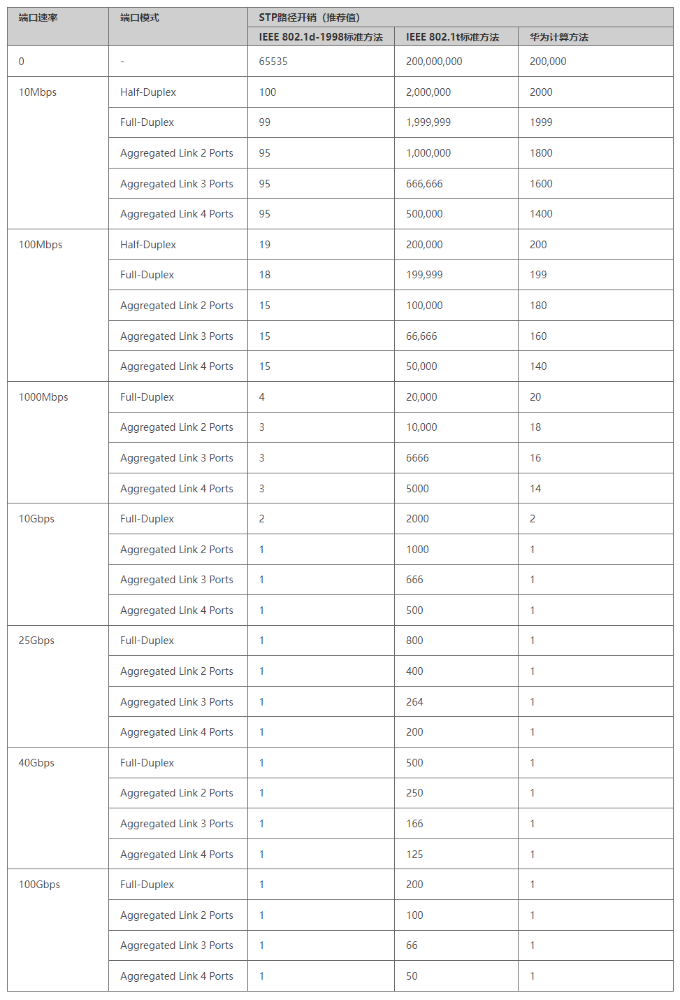

# STP

## 二层环路带来的问题

- 广播风暴
- MAC地址表漂移
- 重复数据帧接收

## 三层环路如何防范

1. 路由协议防环机制，保证路径没有环路。
2. IP报文转发TTL - 1，TTL = 0时报文会被路由器丢弃。

## 二层环路如何防范

- 基于数据帧转发，帧头中没有防环字段，无法自身防环，只能依赖STP来防环。

## STP的基本概念

### 桥ID（BID）

- BID：桥优先级.交换机MAC地址。
- 桥优先级取值范围：0 - 65535、0 - 61440（华为默认取值，保持4096的倍数，默认32768）。
- IEEE 802.1D标准规定。

### 根桥（Root Bridge）

- BID最小的交换机成为根桥，选举规则：
    1. 先比较桥优先级，越小越优。
    2. 如优先级相同，则比较桥MAC地址，越小越优。
    3. 根桥具有抢占性。
- 根桥在一个广播域中有且只有一个。

### 开销（Cost）



- 更改Cost计算方法：`stp pathcost-standard {dot1d-1998 | dot1t | legacy}`
- 手动设置Cost值：`stp cost {0 - 65535}`
- 查看端口Cost值：`dis stp int g0/0/1`

### 根路径开销（RPC: Root Path Cost）

一台设备从某个接口到达根桥的RPC等于从根桥到该设备沿途所有入方向接口的Cost累加。

### 接口ID（PID，Port ID）

- 交换机使用接口ID标识每个接口。
- 由 `接口优先级.接口编号` 组成高4bit是接口优先级，低12bit是接口编号。
- 默认接口优先级一般为128。
- 更改端口优先级：`stp port priority {0 - 240}`

### BPDU（网桥协议数据单元）


- STP协议发送的报文，用于STP的选举和维护。
- STP协议有两种BPDU：配置BPDU、TCN BPDU：
    - 配置BPDU：用于STP的选举和维护。
    - TCN BPDU：通知STP拓扑发生变化。
- 只有根桥每隔2s周期性发送配置BPDU，非根桥转发根桥的配置BPDU。

## STP协议选举规则

- 选举根桥，一个广播域有且只有一个，其他交换机为非根桥。
- 非根桥上选举根端口，每个非根桥有且只有一个根端口。
- 在每条链路上选举指定端口，每条链路有且只有一个指定端口。
- 即不是根端口，也不是指定端口的端口，将被阻塞，称为阻塞端口。

---

选举根桥：
- 交换机没有交互BPDU时，认为自身就是根桥，以自己为根发送BPDU。
- 非根桥开始计算根端口，根端口就是非根桥接收最好BPDU的端口。
- 根据根端口的BPDU，计算指定端口的BPDU参数。
- 根据计算出的指定端口的BPDU参数和端口本身的BPDU参数比较。
- 如果计算出的BPDU参数优于端口本身的BPDU参数，则该端口为指定端口。
- 如果计算出的BPDU参数不优于端口本身的BPDU参数，则该端口为阻塞端口。
- 根端口：非根桥上负责接收根桥最好BPDU的端口。
- 指定端口：链路上负责发送来自于根桥最好BPDU的端口。

### 分析STP命令

```
-------[CIST Global Info][Mode MSTP]-------     // 运行STP协议的模式
CIST Bridge         :0    .4c1f-ccfc-58c4     // 自身的BID
Config Times        :Hello 2s MaxAge 20s FwDly 15s MaxHop 20     // 管理员配置的STP协议的定时器
Active Times        :Hello 2s MaxAge 20s FwDly 15s MaxHop 20     // 设备执行的STP协议的定时器
CIST Root/ERPC      :0    .4c1f-ccfc-58c4 / 0     // 根桥的BID/根端口到根桥的开销
CIST RegRoot/IRPC   :0    .4c1f-ccfc-58c4 / 0     // MSTP使用的STP参数
CIST RootPortId     :0.0     // 根端口的Port ID，根交换机始终为0.0
BPDU-Protection     :Disabled
CIST Root Type      :Primary root
TC or TCN received  :8
TC count per hello  :0
STP Converge Mode   :Normal 
Time since last TC  :0 days 0h:0m:6s
Number of TC        :5
Last TC occurred    :GigabitEthernet0/0/1
----[Port23(GigabitEthernet0/0/1)][FORWARDING]----     // 描述端口的STP协议的工作状态
 Port Protocol       :Enabled     // 启用了STP协议
 Port Role           :Designated Port     // 端口角色
 Port Priority       :128     // 端口优先级
 Port Cost(Dot1T )   :Config=auto / Active=20000     // 描述Cost标准以及开销值
 Designated Bridge/Port   :0.4c1f-ccfa-5d97 / 128.23     // 如果端口角色为DP，则代表本交换机自身的BID，如果端口角色为RP/AP，则代表对端交换机的BID
 Port Edged          :Config=default / Active=disabled     // 是否为边缘端口
 Point-to-point      :Config=auto / Active=true     // true为全双工P2P链路，false为半双工链路
 Transit Limit       :147 packets/hello-time
 Protection Type     :None
 Port STP Mode       :MSTP 
 Port Protocol Type  :Config=auto / Active=dot1s
 BPDU Encapsulation  :Config=stp / Active=stp
 PortTimes           :Hello 2s MaxAge 20s FwDly 15s RemHop 20
 TC or TCN send      :4
 TC or TCN received  :4
 BPDU Sent           :19             
          TCN: 0, Config: 0, RST: 0, MST: 19
 BPDU Received       :7             
          TCN: 0, Config: 0, RST: 0, MST: 7
```

### STP的接口状态

| 状态名称 | 状态描述 |
| -- | -- |
| 禁用（Disable） | 该接口不能收发BPDU，也不能收发业务数据帧，例如接口为DOWN。 |
| 阻塞（Blocking） | 该接口被STP阻塞。处于阻塞状态的接口不能发送BPDU，但是会侦听BPDU，而且不能收发业务数据帧，也不会进行MAC地址学习。 |
| 侦听（Listening） | 当接口处于该状态时，表明STP初步认定该接口为根接口或指定接口，但接口依然处于STP计算的过程中，此时接口可以收发BPDU，但是不能收发业务数据帧，也不会进行MAC地址学习。 |
| 学习（Learning） | 当接口处于该状态时，会侦听业务数据帧（但是不能转发业务数据帧），并且在收到业务数据帧后进行MAC地址学习。 |
| 转发（Forwarding） | 处于该状态的接口可以正常地收发业务数据帧，也会进行BPDU处理。接口的角色需是根接口或指定接口才能进入转发状态。 |

#### STP的接口状态迁移


1. 端口Up或使能了STP，会从Disabled状态进入到Blocking状态。
2. 端口被选举为根端口或指定端口，会进入Listening状态。
3. 端口的Forward Delay定时器超时，会进入Learning/Forwarding状态。
4. 端口不再是根端口或指定端口时，会进入Blocking状态。
5. 端口Down或者去使能STP时，就进入Disabled状态。

## 拓扑故障变化

- STP协议完全依靠定时器老化机制完成收敛，所以收敛时间比较慢。
- 为了防止STP协议收敛过程产生的临时性环路，STP被动依赖定时器收敛。

### 根桥故障

1. SW1根桥发生故障，停止发送BPDU报文。
2. SW2等待Max Age计时器（20s）超时，从而导致已经收到的BPDU报文失效，又接收不到根桥发送的新的BPDU报文，从而得知上游出现故障。
3. 非根桥会互相发送配置BPDU，重新选举新的根桥。
4. 经过重新选举后，SW3的A端口经过两个Forward Delay（15s）时间恢复转发状态。
5. 非根桥会在BPDU老化之后开始根桥的重新选举。
6. 根桥故障会导致50s左右的恢复时间。

- 华为STP协议：AP端口收到次级BPDU，不会等待BPDU老化，立即处理次级BPDU，减少20s的老化时间。
- 标准STP（802.1D）：AP端口收到次级BPDU，会等待BPDU老化，才处理次级BPDU，增加20s的老化时间。

### 直连链路故障

1. RP失效，存在AP端口的交换机
    - RP失效后，AP成为该交换机唯一能收到根桥BPDU的端口，AP端口成为新的RP，进入到监听状态15s，再进入学习状态15s，到转发状态。所以故障恢复时间为30s。
2. RP失效，不存在AP端口的交换机
    - RP失效，代表该交换机没有去往根桥的备用路径。此交换机会发送以自己为根的次级BPDU。
    - 对端的AP端口等待BPDU老化时间，才处理次级BPDU，成为新的DP，进入监听状态15s，进入学习状态15s，到转发状态。所以故障恢复时间为50s。

### 直连链路间接故障

1. RP失效，存在AP端口的交换机
    - RP失效后，RP无法感知链路故障，AP成为该交换机唯一能收到根桥BPDU的端口，AP端口成为新的RP，进入到监听状态15s，再进入学习状态15s，到转发状态。所以故障恢复时间为30s。
2. RP失效，不存在AP端口的交换机
    - RP失效，代表该交换机没有去往根桥的备用路径，等待20s老化时间。此交换机会发送以自己为根的次级BPDU。
    - 对端的AP端口等待BPDU老化时间，才处理次级BPDU，成为新的DP，进入监听状态15s，进入学习状态15s，到转发状态。所以故障恢复时间为50s。

### 拓扑改变导致MAC地址表错误

- TCN BPDU在网络拓扑变化的时候产生。
- 报文格式：协议标识、版本号和类型。
- 拓扑变化：会使用到配置BPDU中Flags的TCA和TC位。
    1. 当DP端口进入到FORADING状态认为拓扑发生变化，连接终端设备的DP端口设置为边缘端口进行优化。
    2. RP失效后在新的RP立即发送TCN，新的RP过渡要转发再次发送TCN，或者RP进入FORWARDING状态。
    3. 非根桥DP端口失效不认为拓扑发生变化。
    4. 根桥的DP失效直接发送TC BPDU，除非该DP是边缘端口。
- TCN：配置BPDU
    - flags为TC = 0 TCA = 0 拓扑正常
    - flags为TC = 1 TCA = 0 通知全网交换机提前老化MAC地址表
    - flags为TC = 0 TCA = 1 TCN的确认
    - flags为TC = 1 TCA = 1 即对TCN的确认，同时通知拓扑发生改变

## RSTP

### STP的不足

- STP没有细致区分端口状态和端口角色。
    - Listening、Learning和Blocking状态都同样不转发用户流量。
    - 端口之间最本质的区别并不在于端口状态，而是在于端口扮演的角色。
- STP算法是被动的算法，依赖定时器等待的方式判断拓扑变化，收敛速度慢。
- STP算法要求在稳定的拓扑中，根桥主动发出配置BPDU报文，而其他设备再进行处理，最终传遍整个STP网络。

### RSTP对STP的改进

- 通过端口角色的增补，简化了生成树协议的理解及部署。
- 端口状态的重新划分。
- 配置BPDU格式的改变，充分利用了STP协议报文中的Flag字段，明确了端口角色。
- 配置BPDU的处理发生变化。
- 快速收敛。
- 增加保护功能。

#### 改进点1：端口角色

- Alternate端口（替代端口）：就是由于学习到其它网桥发送的配置BPDU报文而阻塞的端口，它提供了从指定桥到根的另一条可切换路径，作为根端口的备份端口。
- Backup端口（备份端口）：就是由于学习到自己发送的配置BPDU报文而阻塞的端口，它作为指定端口的备份，提供了另一条从根桥到相应网段的备份通路。

#### 改进点2：端口状态

RSTP的状态规范缩减为3种，根据端口是否转发用户流量和学习MAC地址来划分：

- Discarding：不转发用户流量也不学习MAC地址。
- Learning：不转发用户流量但是学习MAC地址。
- Forwarding：既转发用户流量又学习MAC地址。

| STP端口状态 | RSTP端口状态 | 端口在拓扑中的角色 |
| -- | -- | -- |
| Forwarding | Forwarding | 包括根端口、指定端口 |
| Learning | Learning | 包括根端口、指定端口 |
| Listening | Discarding | 包括根端口、指定端口 |
| Blocking | Discarding | 包括Alternate端口、Backup端口 |
| Disabled | Discarding | 包括Disable端口 |

#### 改进点3：配置BPDU  - RST BPDU

- RSTP的配置BPDU充分利用了STP报文中的Flag字段，明确了端口角色。
- 除了保证和STP格式基本一致之外，RSTP作了如下变化：
    - Type字段：配置BPDU类型不再是0而是2，所以运行STP的设备收到RSTP的配置BPDU时会丢弃。
    - Flag字段：使用了原来保留的中间6位，这样改变的配置BPDU叫做RST BPDU。

#### 改进点4：配置BPDU的处理

- 在拓扑稳定后，无论非根桥设备是否接收到根桥传来的配置BPDU报文，非根桥设备仍然按照Hello Time规定的时间间隔发送配置BPDU，该行为完全由每台设备自主进行。